# //first-meaningful-paint/samples/pages

[→ Parent](../..)


## Raw


```yaml
p90min: 2615.8235000000004
p90max: 4035.1994999999997
p90range: 1419.3759999999993
p90mean: 3085.28914893617
p90median: 2979.28025
p90stdev: 357.0097228676724
p90skewness: 1.0686235606758034
p90eccentricity: 1.0000000000000002
p90discretization: 1
outlandishness: 1.012049333541195
confidence: 159.67980518314172
p90confidence: 144.3424936324482

```

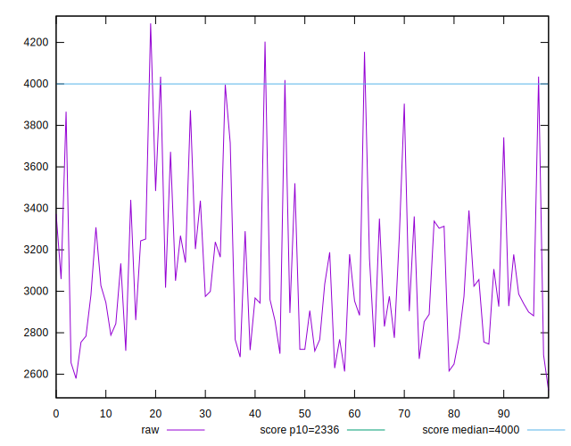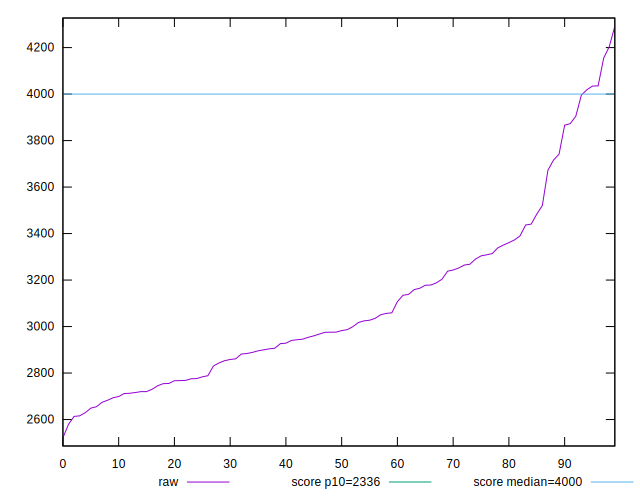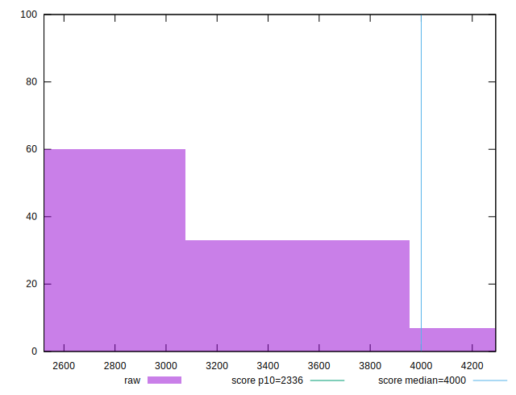
## Score


```yaml
p90min: 0.49
p90max: 0.84
p90range: 0.35
p90mean: 0.7307446808510641
p90median: 0.76
p90stdev: 0.09030962534056637
p90skewness: -1.101913933009821
p90eccentricity: 0.9999999999999992
p90discretization: 3.1333333333333333
outlandishness: 0.9865125219228099
confidence: 0.04016034596822145
p90confidence: 0.0365130574483014

```

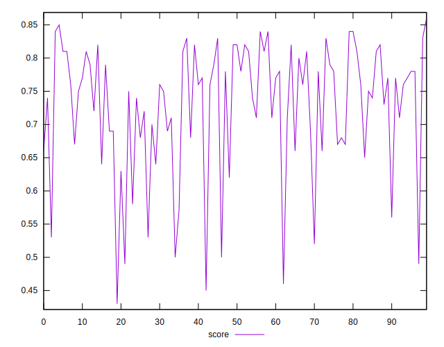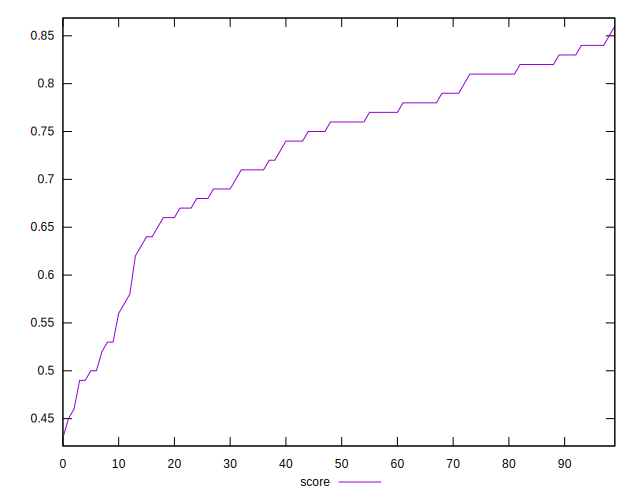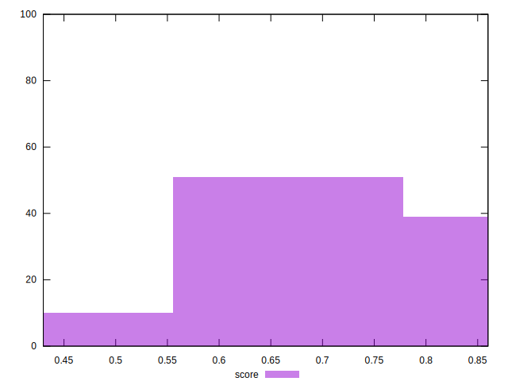
## Raw Estimate

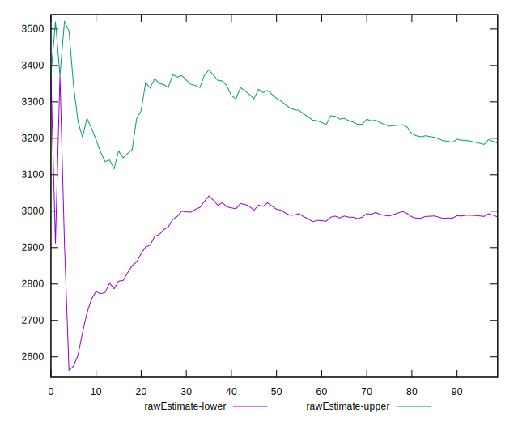
## Score Estimate

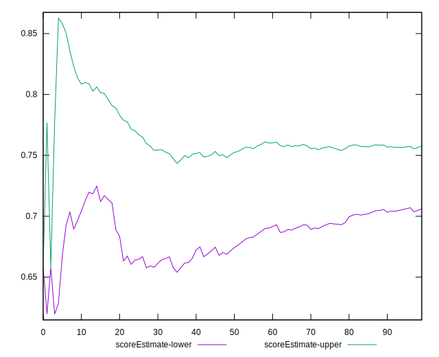
## P Score


```yaml
p90min: 0.4916723062314465
p90max: 0.8442247968778308
p90range: 0.35255249064638433
p90mean: 0.7304870171577208
p90median: 0.7586529400327477
p90stdev: 0.08979868940287573
p90skewness: -1.101646233788799
p90eccentricity: 1.0000000000000004
p90discretization: 1
outlandishness: 0.9871265792007765
confidence: 0.03993495296150317
p90confidence: 0.03630648109306853

```

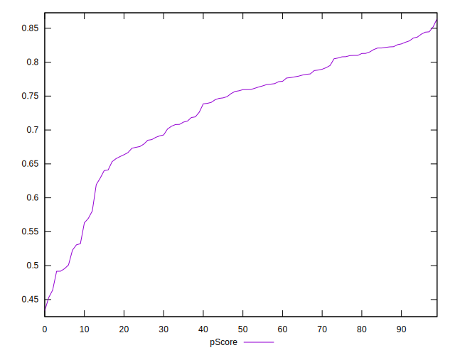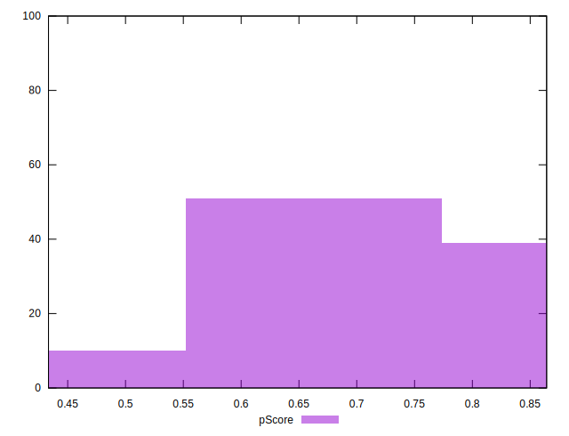
## Score Difference


```yaml
p90min: 0
p90max: 1.1102230246251565e-16
p90range: 1.1102230246251565e-16
p90mean: 1.6535236536970416e-17
p90median: 0
p90stdev: 3.9526775542196796e-17
p90skewness: 1.9721272054017511
p90eccentricity: 0.9999999999999997
p90discretization: 47
outlandishness: 1.3028591836734695
confidence: 1.6347517967638273e-17
p90confidence: 1.5981058726306695e-17

```

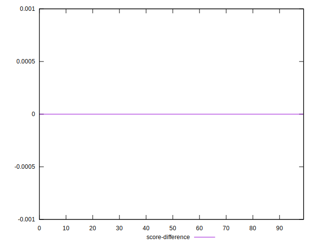
## P Score Difference


```yaml
p90min: -0.004897351245926274
p90max: 0.004439026495456466
p90range: 0.00933637774138274
p90mean: -0.00002645294824440862
p90median: -0.00014874330857234108
p90stdev: 0.002488270660654387
p90skewness: -0.12884482293412583
p90eccentricity: 1
p90discretization: 1
outlandishness: 1.2987854042268314
confidence: 0.0010545451820197745
p90confidence: 0.0010060319621167273

```

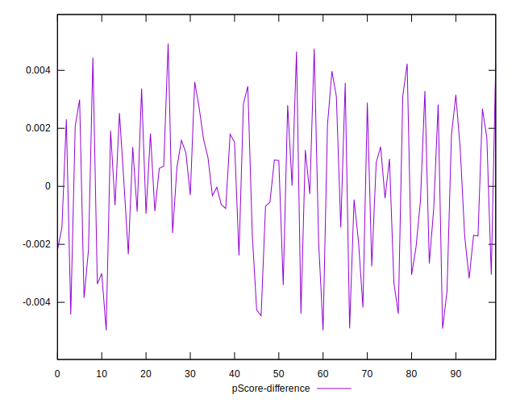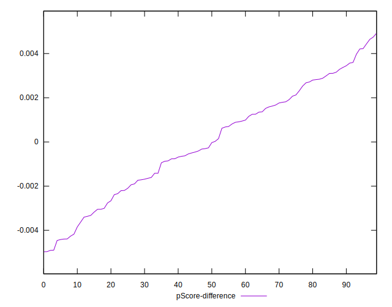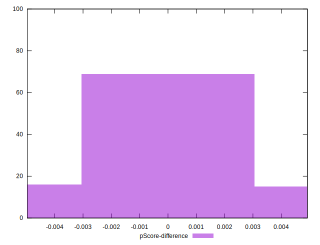