# //interactive/samples/pages+cached+noadtech+nomedia+nocss

[→ Parent](../..)


## Raw


```yaml
p90min: 4496.536999999999
p90max: 6187.024
p90range: 1690.487000000001
p90mean: 5026.924479787237
p90median: 4986.52175
p90stdev: 388.1387605016806
p90skewness: 0.8035097014097025
p90eccentricity: 1.000000000000001
p90discretization: 1
outlandishness: 1.0154196624321628
confidence: 203.3329024707271
p90confidence: 156.92826547187934

```

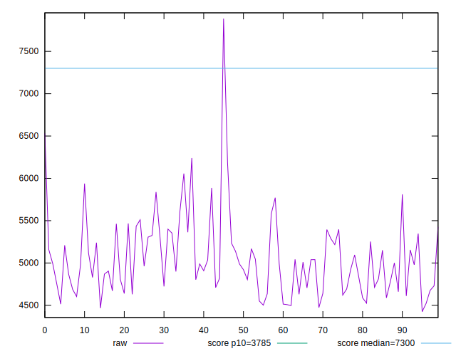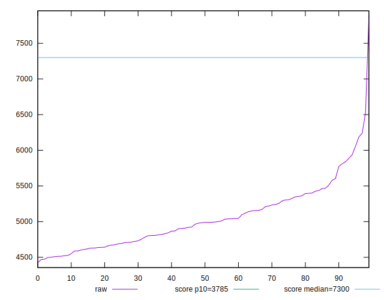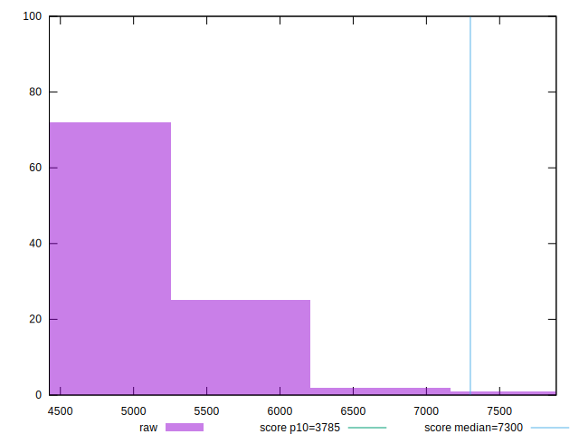
## Score


```yaml
p90min: 0.63
p90max: 0.83
p90range: 0.19999999999999996
p90mean: 0.7659574468085106
p90median: 0.77
p90stdev: 0.046272071189915616
p90skewness: -0.806293997156929
p90eccentricity: 0.9999999999999992
p90discretization: 4.947368421052632
outlandishness: 0.988394977044753
confidence: 0.02389147057355282
p90confidence: 0.018708247180052855

```

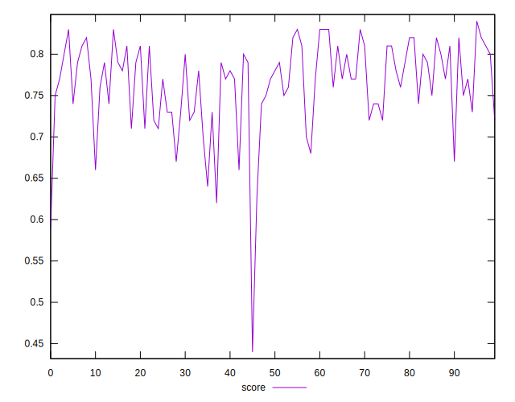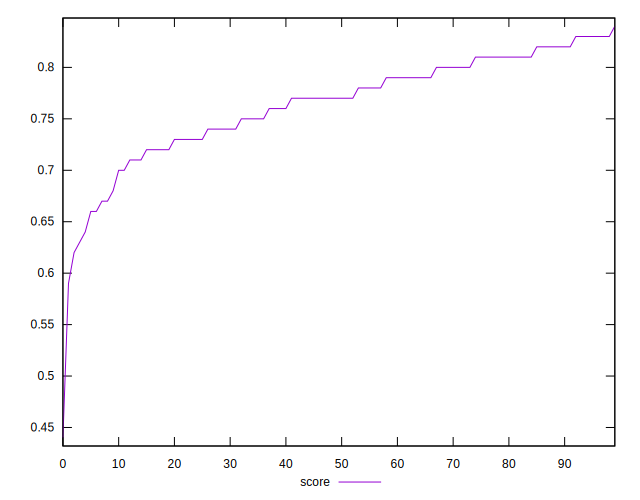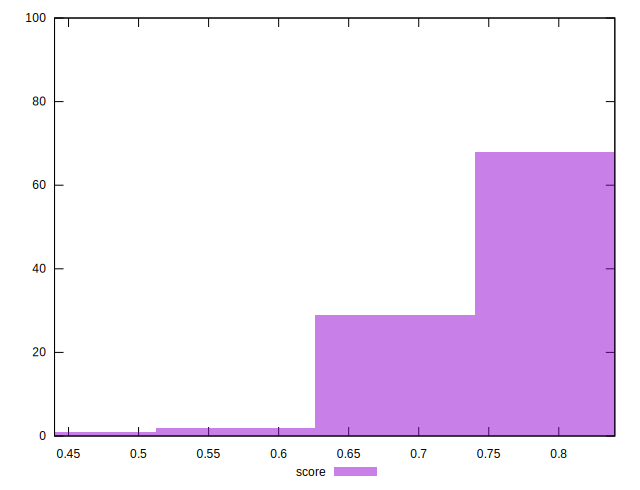
## Raw Estimate

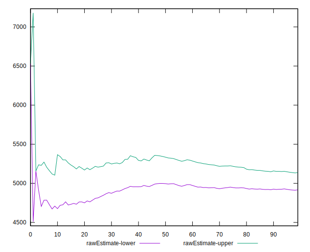
## Score Estimate

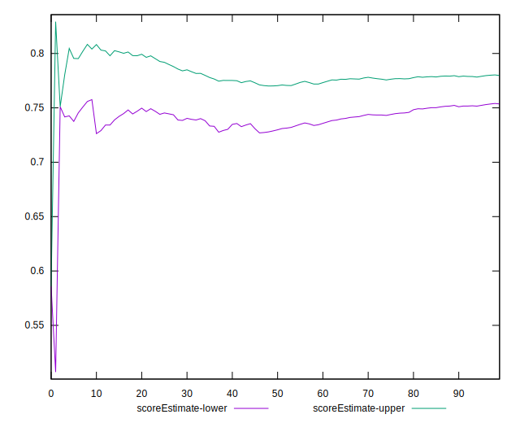
## P Score


```yaml
p90min: 0.6265594098950588
p90max: 0.827784982239786
p90range: 0.20122557234472727
p90mean: 0.7660416513246653
p90median: 0.7714534312023593
p90stdev: 0.0461710655203968
p90skewness: -0.849105432647707
p90eccentricity: 0.9999999999999997
p90discretization: 1
outlandishness: 0.9882112255376267
confidence: 0.02389216195542522
p90confidence: 0.018667409608201166

```

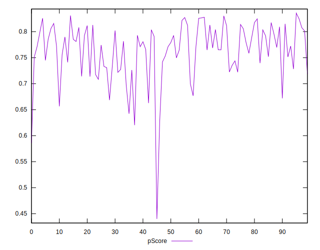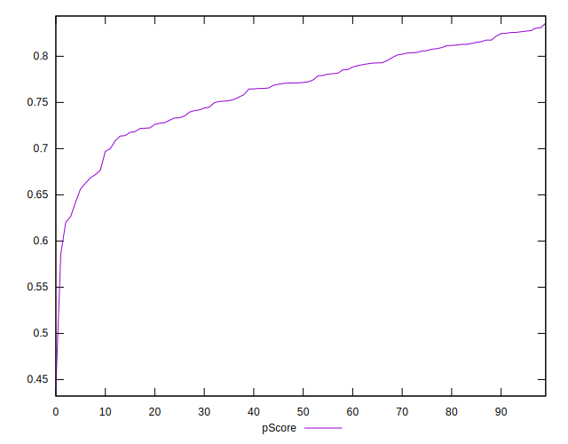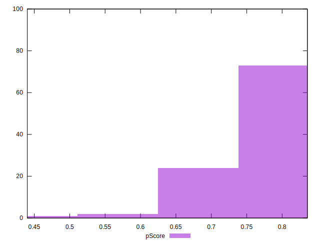
## Score Difference


```yaml
p90min: 0
p90max: 1.1102230246251565e-16
p90range: 1.1102230246251565e-16
p90mean: 1.5354148212901102e-17
p90median: 0
p90stdev: 3.832627061955377e-17
p90skewness: 2.095534074628634
p90eccentricity: 0.9999999999999972
p90discretization: 47
outlandishness: 1.3384710059171598
confidence: 1.5954674592219345e-17
p90confidence: 1.5495682942251222e-17

```

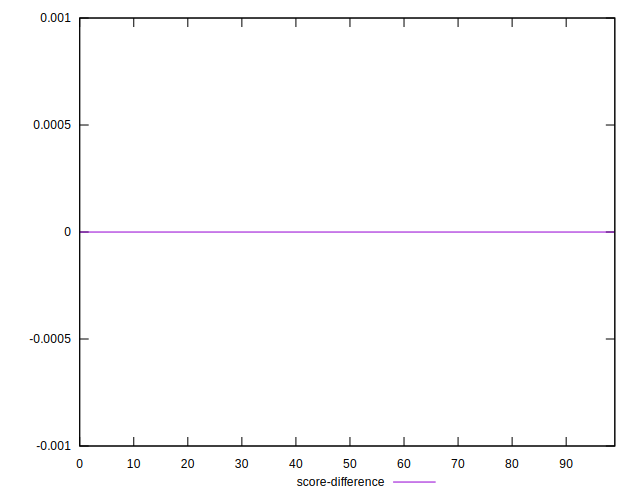
## P Score Difference


```yaml
p90min: -0.004696025867019782
p90max: 0.0046492934821079634
p90range: 0.009345319349127745
p90mean: 0.00001570851811826895
p90median: 0.0006745028110660134
p90stdev: 0.0027338170311639208
p90skewness: -0.2055952513199531
p90eccentricity: 1.0000000000000002
p90discretization: 1
outlandishness: 0.6763301435770165
confidence: 0.0011382944048057863
p90confidence: 0.0011053087412953163

```

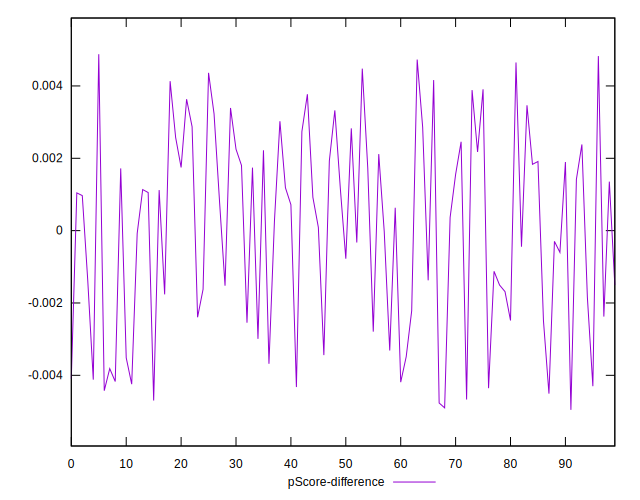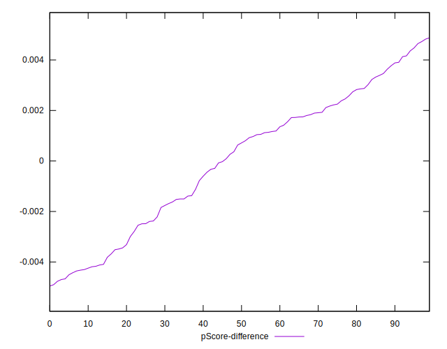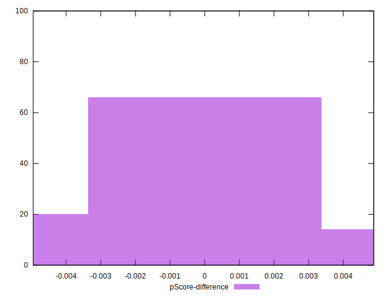