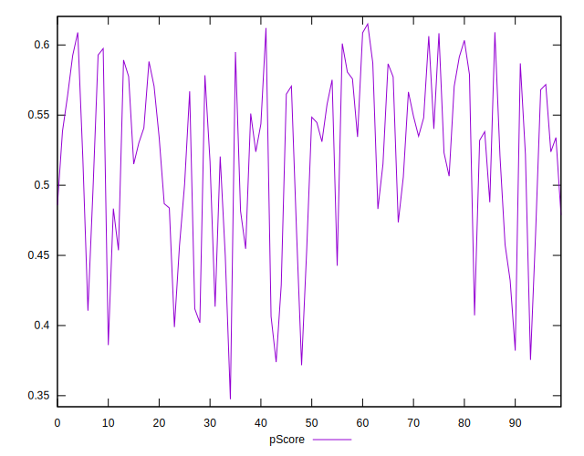
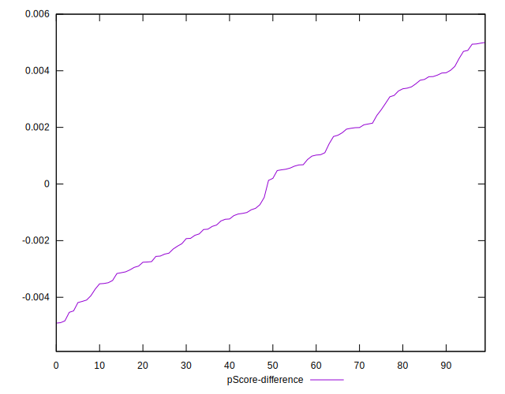

# //interactive/samples/pages+cached+noadtech+nomedia

[→ Parent](../..)


## Raw


```yaml
p90min: 6335.2570000000005
p90max: 8589.604
p90range: 2254.346999999999
p90mean: 7130.862795744682
p90median: 6996.635249999999
p90stdev: 587.5809012059102
p90skewness: 0.7206330238735803
p90eccentricity: 1
p90discretization: 1
outlandishness: 1.0064823929798645
confidence: 254.30246969618887
p90confidence: 237.5646573701261

```


## Score


```yaml
p90min: 0.38
p90max: 0.61
p90range: 0.22999999999999998
p90mean: 0.5207446808510638
p90median: 0.53
p90stdev: 0.06221512714906831
p90skewness: -0.5696859417459673
p90eccentricity: 1.0000000000000007
p90discretization: 4.086956521739131
outlandishness: 0.9921625059195089
confidence: 0.026641988773378446
p90confidence: 0.025154179337812988

```


## Raw Estimate


## Score Estimate


## P Score


```yaml
p90min: 0.3754682401174579
p90max: 0.6089407829215359
p90range: 0.23347254280407798
p90mean: 0.520693335892885
p90median: 0.5330014190467873
p90stdev: 0.06208904698465107
p90skewness: -0.5918260271265362
p90eccentricity: 1.0000000000000009
p90discretization: 1
outlandishness: 0.9925294350367493
confidence: 0.026609580006781007
p90confidence: 0.02510320390447355

```


## Score Difference


```yaml
p90min: 0
p90max: 1.1102230246251565e-16
p90range: 1.1102230246251565e-16
p90mean: 1.0039250754589182e-17
p90median: 0
p90stdev: 2.6809664329725205e-17
p90skewness: 2.695985987417059
p90eccentricity: 0.9999999999999974
p90discretization: 31.333333333333332
outlandishness: 1.6173854671280277
confidence: 1.2253395231476438e-17
p90confidence: 1.0839407318426975e-17

```


## P Score Difference


```yaml
p90min: -0.004531759882542119
p90max: 0.004938204993032769
p90range: 0.009469964875574888
p90mean: 0.000044663965958327854
p90median: 0.00016416473538860554
p90stdev: 0.002711940909377731
p90skewness: 0.0978014166602667
p90eccentricity: 1
p90discretization: 1
outlandishness: 1.003996249549113
confidence: 0.0011340738915717264
p90confidence: 0.0010964640130782192

```

