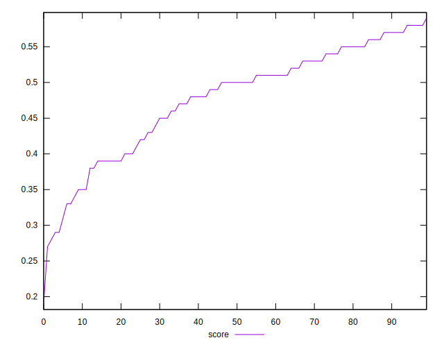
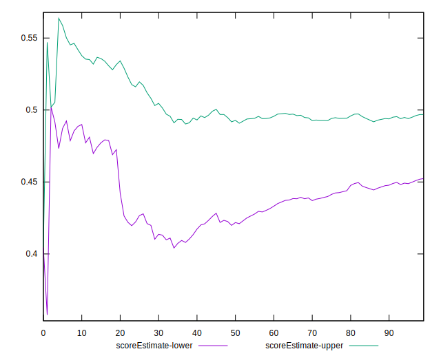
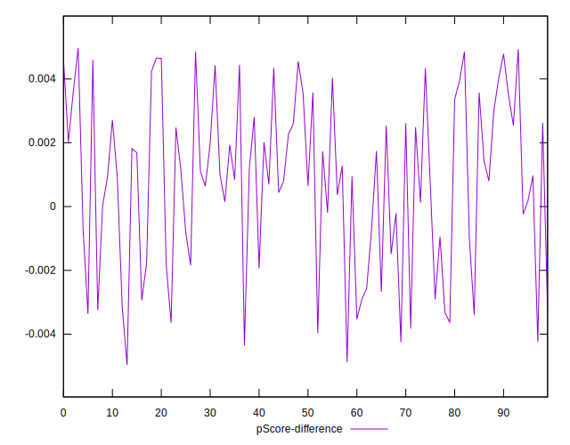

# //interactive/samples/pages+cached+noadtech

[→ Parent](../..)


## Raw


```yaml
p90min: 6558.186
p90max: 9684.567000000001
p90range: 3126.381000000001
p90mean: 7542.620972340429
p90median: 7316.21925
p90stdev: 761.649473463184
p90skewness: 0.9365659752150735
p90eccentricity: 1.0000000000000002
p90discretization: 1
outlandishness: 1.0145853323142089
confidence: 356.587747257579
p90confidence: 307.9422694442034

```


## Score


```yaml
p90min: 0.29
p90max: 0.58
p90range: 0.29
p90mean: 0.47840425531914915
p90median: 0.5
p90stdev: 0.07432394865448409
p90skewness: -0.7283815951622074
p90eccentricity: 0.9999999999999999
p90discretization: 3.6153846153846154
outlandishness: 0.9841592978374283
confidence: 0.033189639137625404
p90confidence: 0.03004989331726046

```


## Raw Estimate


## Score Estimate


## P Score


```yaml
p90min: 0.29064467601675
p90max: 0.5828081240846905
p90range: 0.29216344806794053
p90mean: 0.4790498226253613
p90median: 0.49827400980852815
p90stdev: 0.0741251067997231
p90skewness: -0.7182611896390636
p90eccentricity: 1
p90discretization: 1
outlandishness: 0.9846011501476009
confidence: 0.033037623048462
p90confidence: 0.029969499626791303

```


## Score Difference


```yaml
p90min: 0
p90max: 1.1102230246251565e-16
p90range: 1.1102230246251565e-16
p90mean: 7.677074106450551e-18
p90median: 0
p90stdev: 2.3746925540487778e-17
p90skewness: 3.2089714092315615
p90eccentricity: 0.9999999999999991
p90discretization: 31.333333333333332
outlandishness: 1.8874532544378695
confidence: 1.1388180367855129e-17
p90confidence: 9.601112320093787e-18

```


## P Score Difference


```yaml
p90min: -0.004249186780272918
p90max: 0.004852555678603765
p90range: 0.009101742458876683
p90mean: 0.0007889081745334056
p90median: 0.0009582294098423594
p90stdev: 0.002650140731005395
p90skewness: -0.3009264717915483
p90eccentricity: 1.0000000000000007
p90discretization: 1
outlandishness: 0.8968299778774127
confidence: 0.0011107971846787761
p90confidence: 0.0010714776015554733

```

