# //interactive/samples/pages+cached

[→ Parent](../..)


## Raw


```yaml
p90min: 14455.163000000004
p90max: 18600.353500000005
p90range: 4145.190500000001
p90mean: 15791.993750000003
p90median: 15645.13625
p90stdev: 932.59385432113
p90skewness: 0.8396277482271967
p90eccentricity: 1.0000000000000007
p90discretization: 1
outlandishness: 1.0058848321982925
confidence: 418.77842665290495
p90confidence: 377.0567406336523

```

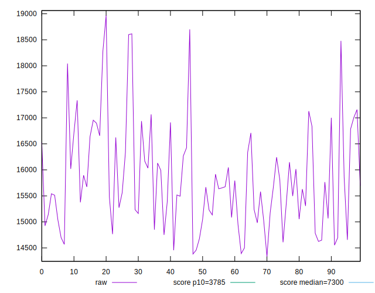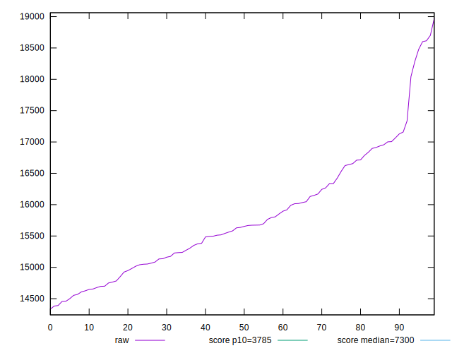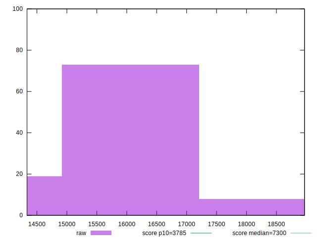
## Score


```yaml
p90min: 0.03
p90max: 0.09
p90range: 0.06
p90mean: 0.06787234042553192
p90median: 0.07
p90stdev: 0.014504022950769578
p90skewness: -0.31684673946543185
p90eccentricity: 1.0000000000000016
p90discretization: 13.428571428571429
outlandishness: 0.9861299358300326
confidence: 0.0062625680016873886
p90confidence: 0.0058641171551294825

```

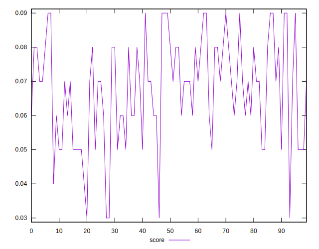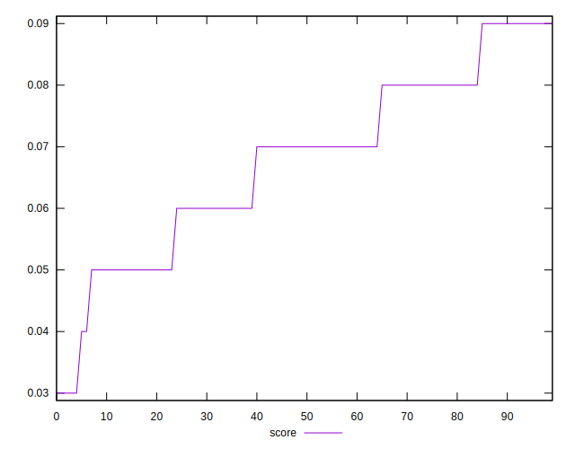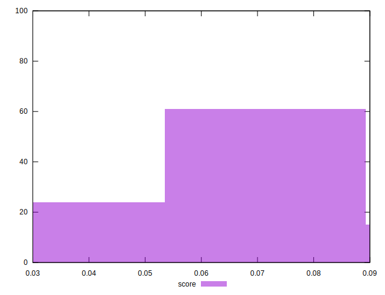
## Raw Estimate

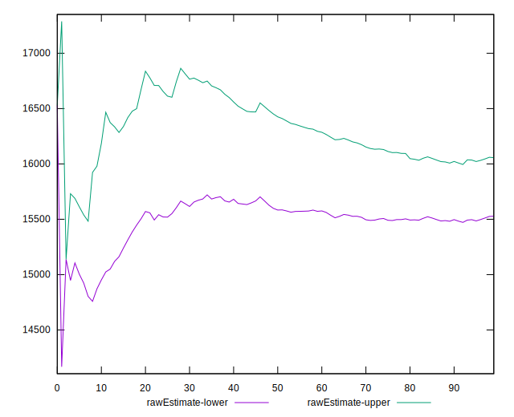
## Score Estimate

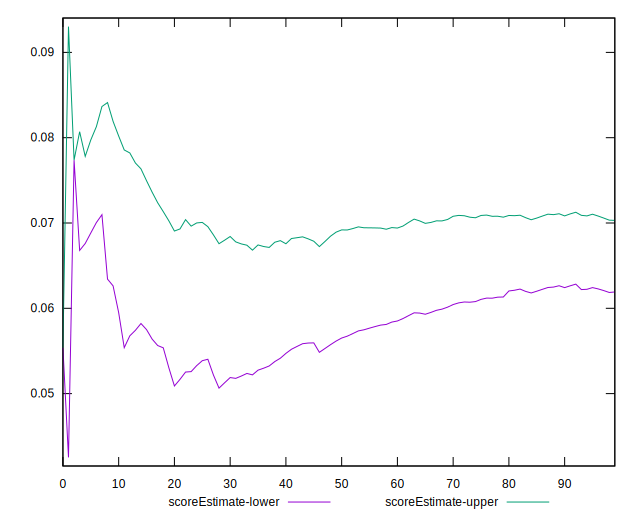
## P Score


```yaml
p90min: 0.034008358503269887
p90max: 0.09127231131365121
p90range: 0.057263952810381324
p90mean: 0.06772426097819706
p90median: 0.06846646161404679
p90stdev: 0.01391368541267314
p90skewness: -0.30967604394023185
p90eccentricity: 1.0000000000000004
p90discretization: 1
outlandishness: 0.9916263310466896
confidence: 0.0060479045298349665
p90confidence: 0.005625437962727588

```

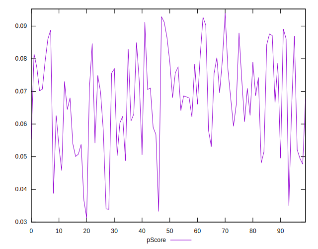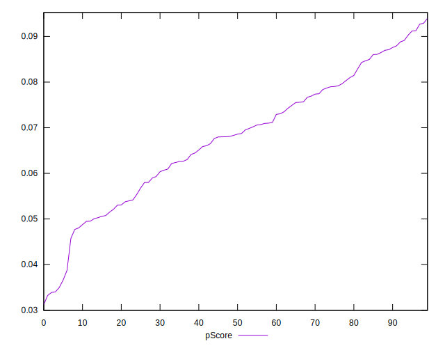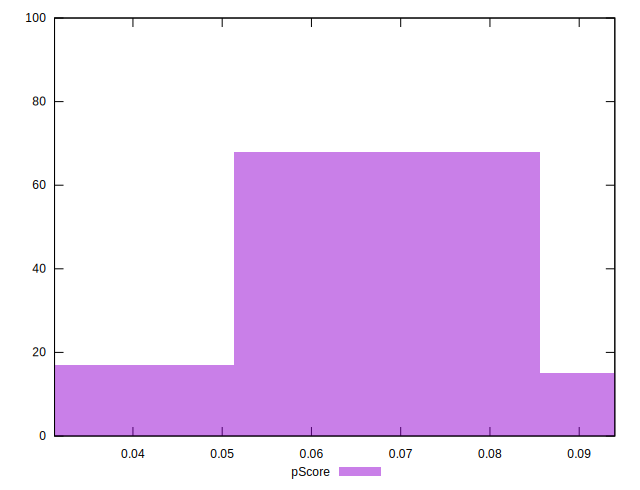
## Score Difference


```yaml
p90min: 0
p90max: 0
p90range: 0
p90mean: 0
p90median: 0
p90stdev: 0
p90skewness: .nan
p90eccentricity: .nan
p90discretization: 94
outlandishness: .nan
confidence: 0
p90confidence: 0

```


## P Score Difference


```yaml
p90min: -0.004420035862263014
p90max: 0.004670446944877074
p90range: 0.009090482807140088
p90mean: 0.00003333445724591087
p90median: -0.00004634378489005303
p90stdev: 0.0025584909372822844
p90skewness: 0.10674431910257161
p90eccentricity: 1
p90discretization: 1
outlandishness: 1.4481668099087859
confidence: 0.001076131632738362
p90confidence: 0.0010344227010316669

```

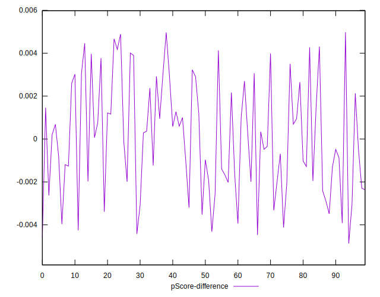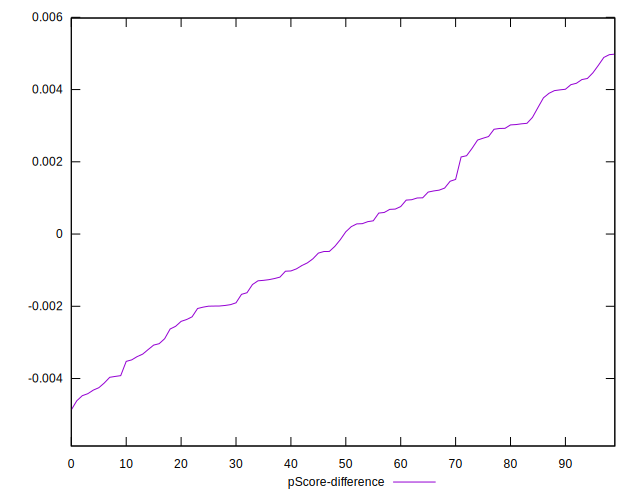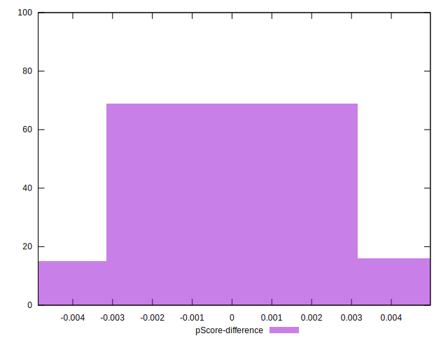