# //interactive/samples/pages

[→ Parent](../..)


## Raw


```yaml
p90min: 14881.126499999997
p90max: 18680.793499999996
p90range: 3799.6669999999995
p90mean: 16431.28884042553
p90median: 16330.414250000002
p90stdev: 957.3463688114002
p90skewness: 0.40109800484930036
p90eccentricity: 0.9999999999999992
p90discretization: 1
outlandishness: 1.0030505194982982
confidence: 413.3199589932249
p90confidence: 387.06442231946227

```

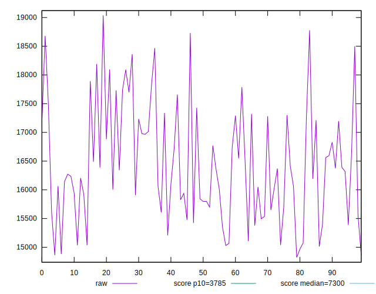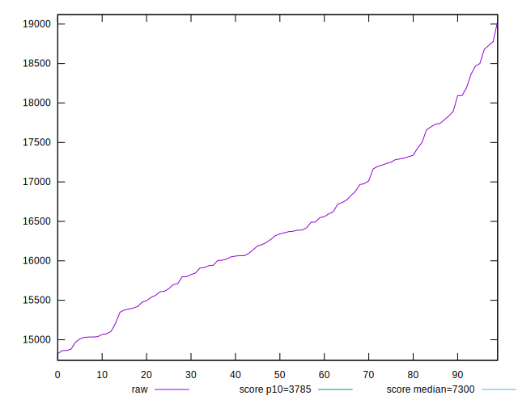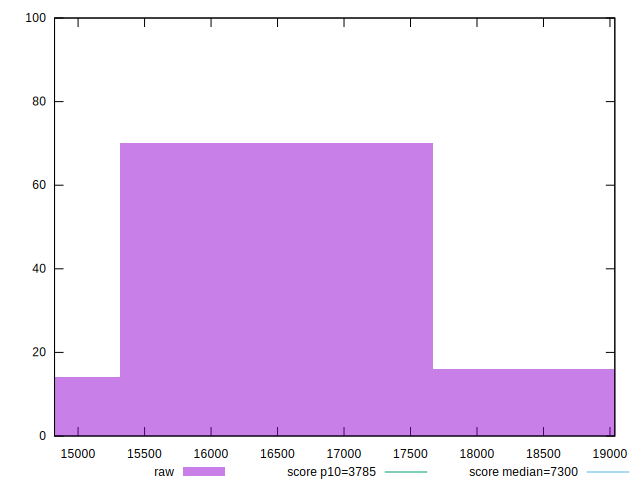
## Score


```yaml
p90min: 0.03
p90max: 0.08
p90range: 0.05
p90mean: 0.058404255319148904
p90median: 0.06
p90stdev: 0.01282477584635616
p90skewness: -0.03330831056060006
p90eccentricity: 0.9999999999999982
p90discretization: 15.666666666666666
outlandishness: 0.9930176953626564
confidence: 0.005442350970957315
p90confidence: 0.00518518126361052

```

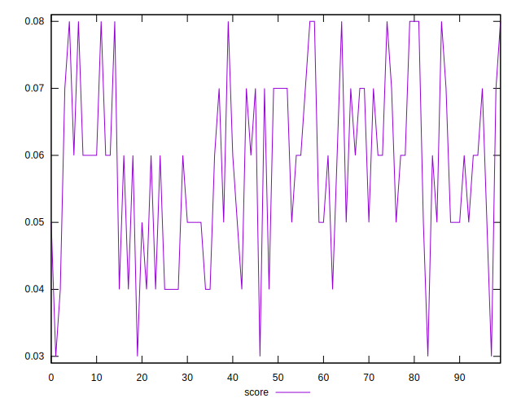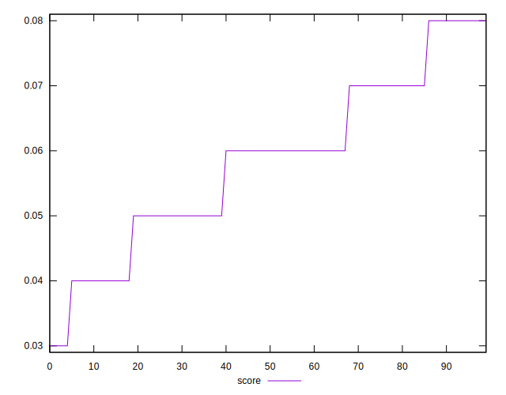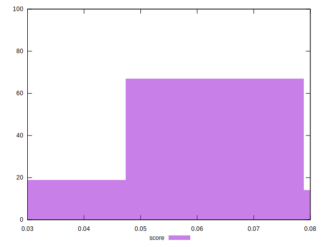
## Raw Estimate

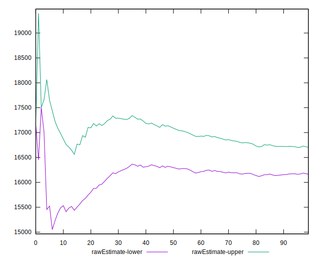
## Score Estimate

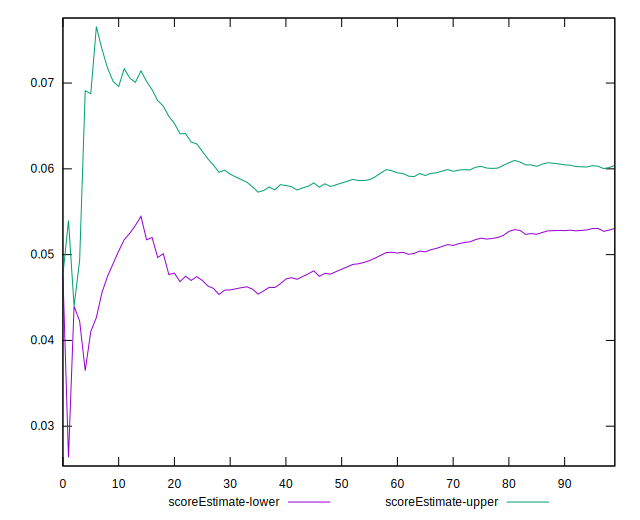
## P Score


```yaml
p90min: 0.033377810451111434
p90max: 0.08232130415201372
p90range: 0.048943493700902285
p90mean: 0.05822374195319642
p90median: 0.05809682788396353
p90stdev: 0.01271261346270544
p90skewness: -0.000198998777934935
p90eccentricity: 0.9999999999999996
p90discretization: 1
outlandishness: 0.9985935335631664
confidence: 0.0054138029439015556
p90confidence: 0.005139832924025088

```

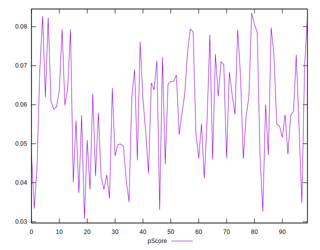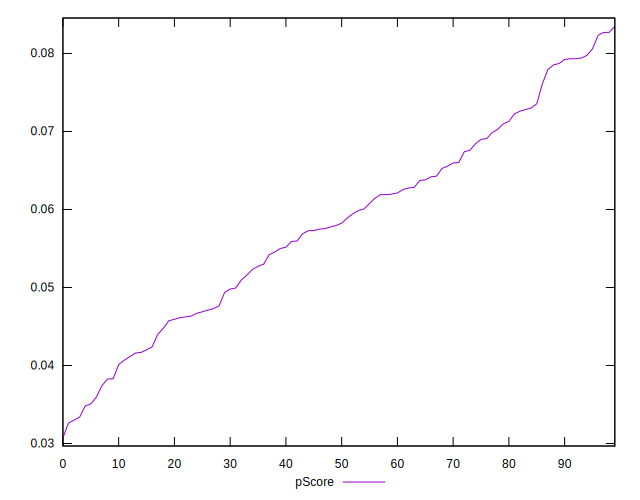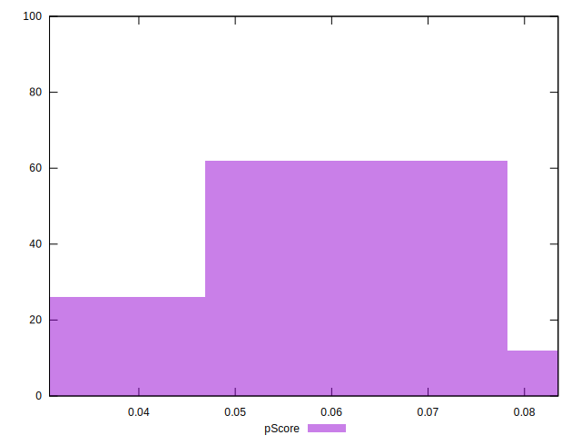
## Score Difference


```yaml
p90min: 0
p90max: 0
p90range: 0
p90mean: 0
p90median: 0
p90stdev: 0
p90skewness: .nan
p90eccentricity: .nan
p90discretization: 94
outlandishness: .nan
confidence: 0
p90confidence: 0

```


## P Score Difference


```yaml
p90min: -0.0044458190188769175
p90max: 0.0045410007236841715
p90range: 0.008986819742561089
p90mean: -0.00001897210360965049
p90median: -0.00010352806204026038
p90stdev: 0.0025926267686643342
p90skewness: -0.05849042647937571
p90eccentricity: 1.0000000000000004
p90discretization: 1
outlandishness: 0.8235695715832472
confidence: 0.0010896333088315283
p90confidence: 0.0010482241487466586

```

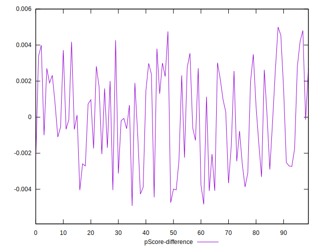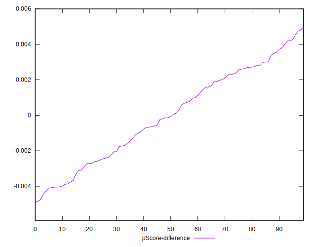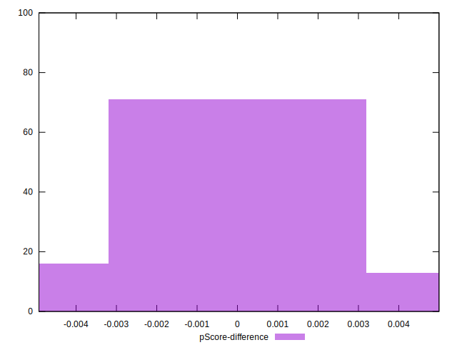