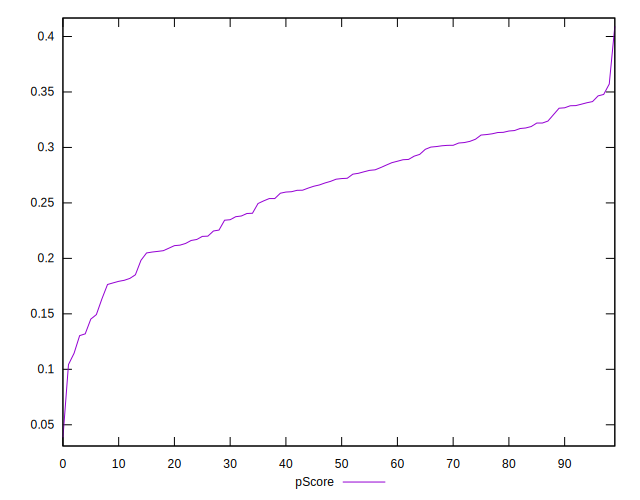

# //largest-contentful-paint/samples/pages+cached+noadtech+nomedia+nocss

[→ Parent](../..)


## Raw


```yaml
p90min: 4623.249
p90max: 6042.266
p90range: 1419.0169999999998
p90mean: 5073.81209042553
p90median: 4998.835499999999
p90stdev: 329.1333197201883
p90skewness: 0.9332529765338472
p90eccentricity: 0.9999999999999997
p90discretization: 1
outlandishness: 1.0131313985462866
confidence: 178.14115557189464
p90confidence: 133.07179346358274

```


## Score


```yaml
p90min: 0.13
p90max: 0.35
p90range: 0.21999999999999997
p90mean: 0.26340425531914885
p90median: 0.27
p90stdev: 0.05318680830466272
p90skewness: -0.5315296936646928
p90eccentricity: 0.9999999999999999
p90discretization: 4.476190476190476
outlandishness: 0.984086436315283
confidence: 0.024913324169221575
p90confidence: 0.021503942462350212

```


## Raw Estimate


## Score Estimate


## P Score


```yaml
p90min: 0.13035480912872777
p90max: 0.34648311402032034
p90range: 0.21612830489159257
p90mean: 0.26332731184378994
p90median: 0.2716578418602784
p90stdev: 0.05322427206548553
p90skewness: -0.552997994398982
p90eccentricity: 1
p90discretization: 1
outlandishness: 0.9842093119943972
confidence: 0.024827713309512972
p90confidence: 0.02151908942421606

```


## Score Difference


```yaml
p90min: 0
p90max: 0
p90range: 0
p90mean: 0
p90median: 0
p90stdev: 0
p90skewness: .nan
p90eccentricity: .nan
p90discretization: 94
outlandishness: .inf
confidence: 3.711973057415532e-18
p90confidence: 0

```


## P Score Difference


```yaml
p90min: -0.004749288374294697
p90max: 0.004682258174650872
p90range: 0.009431546548945569
p90mean: -0.00006358069943117986
p90median: -0.00018678010326882155
p90stdev: 0.002651522374542306
p90skewness: 0.028269823122368126
p90eccentricity: 0.9999999999999999
p90discretization: 1
outlandishness: 0.8911532642849977
confidence: 0.0011099037075360356
p90confidence: 0.0010720362134381608

```

