# //largest-contentful-paint/samples/pages+cached+noadtech+nomedia

[→ Parent](../..)


## Raw


```yaml
p90min: 7193.282000000001
p90max: 9398.747999999998
p90range: 2205.4659999999967
p90mean: 8048.412463297873
p90median: 7970.5825
p90stdev: 578.0518905069952
p90skewness: 0.5032895436221572
p90eccentricity: 0.9999999999999997
p90discretization: 1
outlandishness: 1.0137479525242155
confidence: 306.1095700871431
p90confidence: 233.71198592161912

```

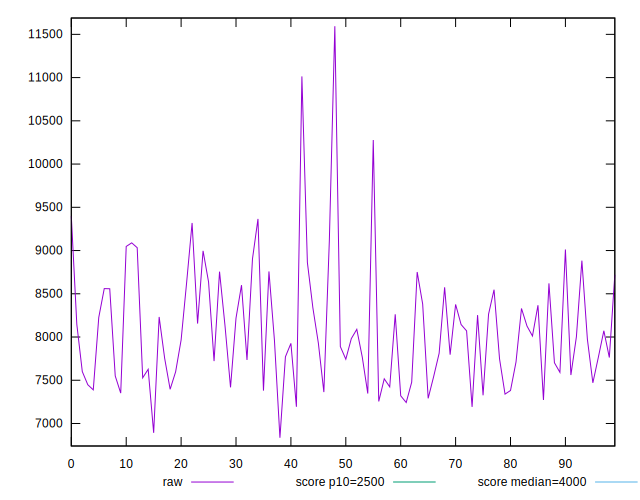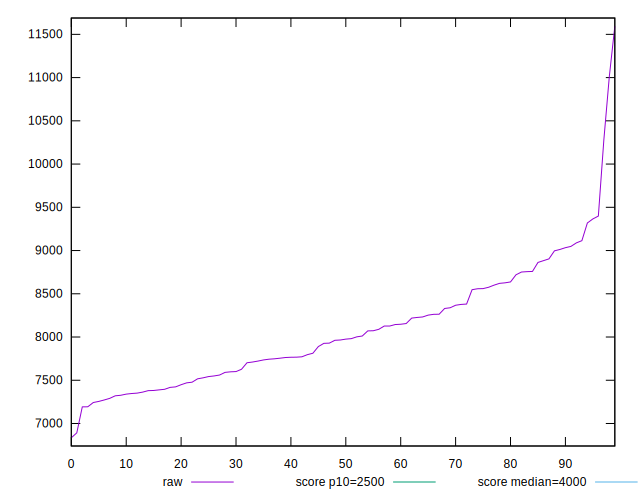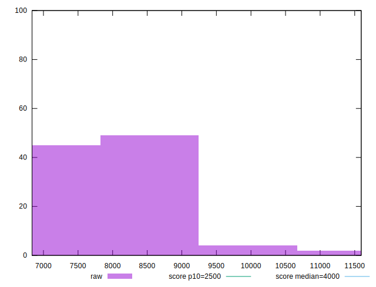
## Score


```yaml
p90min: 0.01
p90max: 0.05
p90range: 0.04
p90mean: 0.03127659574468084
p90median: 0.03
p90stdev: 0.013065631589654498
p90skewness: -0.036494154228518434
p90eccentricity: 1.0000000000000002
p90discretization: 18.8
outlandishness: 1.0079067240501638
confidence: 0.005788235244922748
p90confidence: 0.005282561576712708

```

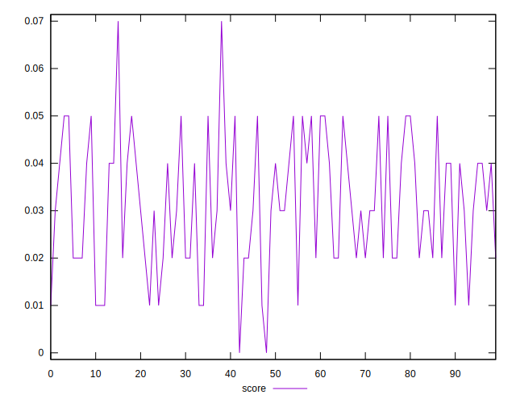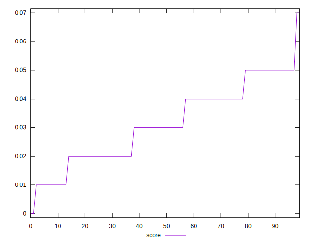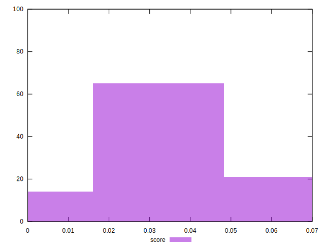
## Raw Estimate

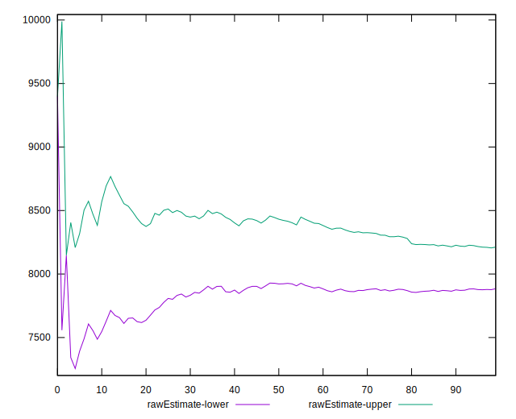
## Score Estimate

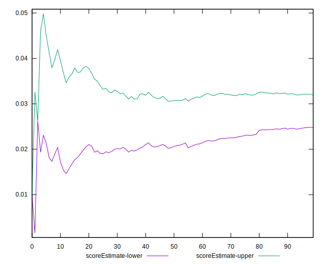
## P Score


```yaml
p90min: 0.00992003831408872
p90max: 0.05478116958044049
p90range: 0.04486113126635177
p90mean: 0.031001962370830992
p90median: 0.03005770935413768
p90stdev: 0.01237318668537293
p90skewness: 0.10149661968912119
p90eccentricity: 1.0000000000000004
p90discretization: 1
outlandishness: 1.012687240145722
confidence: 0.0055982088963523365
p90confidence: 0.005002599385811453

```

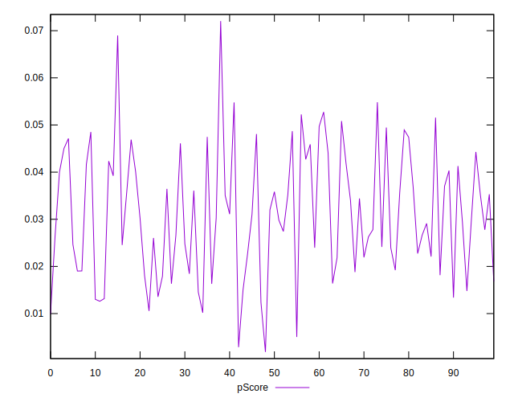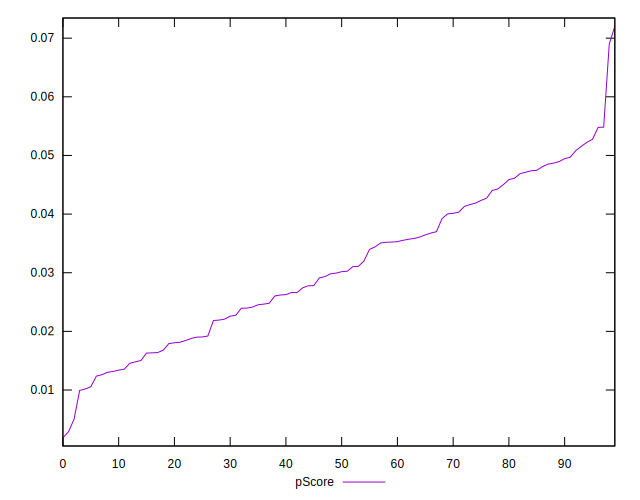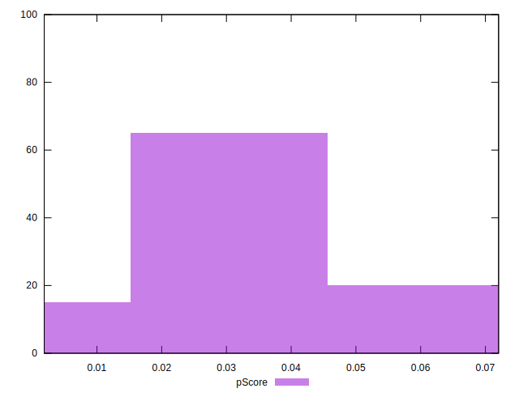
## Score Difference


```yaml
p90min: 0
p90max: 0
p90range: 0
p90mean: 0
p90median: 0
p90stdev: 0
p90skewness: .nan
p90eccentricity: .nan
p90discretization: 94
outlandishness: .nan
confidence: 0
p90confidence: 0

```


## P Score Difference


```yaml
p90min: -0.004920994348424489
p90max: 0.004781169580440489
p90range: 0.009702163928864978
p90mean: -0.00020962584701955347
p90median: -0.0002465226196277301
p90stdev: 0.0028479996362199902
p90skewness: 0.07095857393115332
p90eccentricity: 0.9999999999999992
p90discretization: 1
outlandishness: 0.9285005901822553
confidence: 0.0011797867901251291
p90confidence: 0.0011514738759892836

```

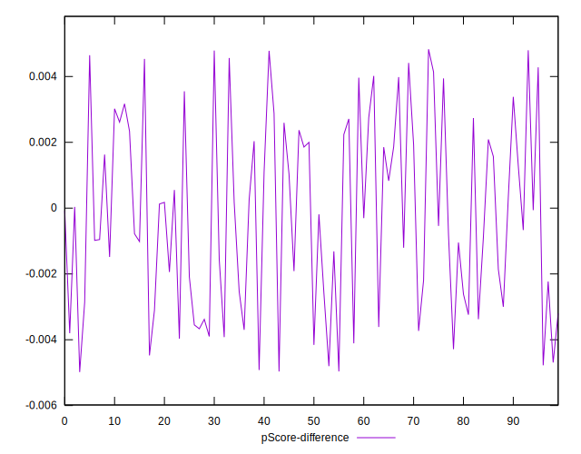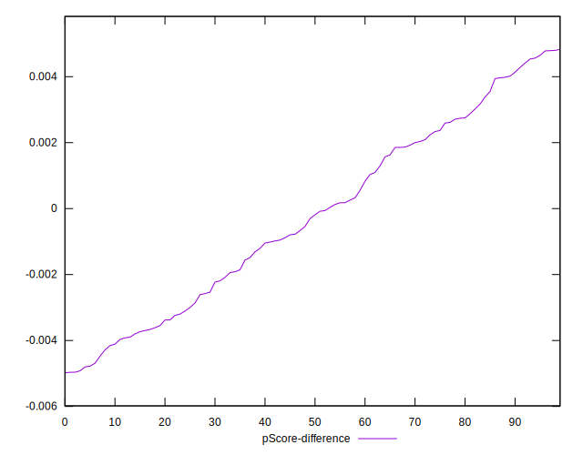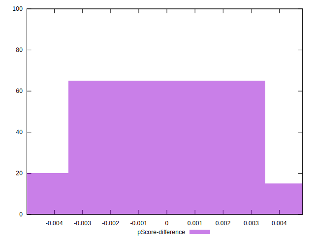