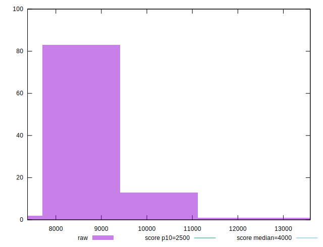

# //largest-contentful-paint/samples/pages+cached+noadtech

[→ Parent](../..)


## Raw


```yaml
p90min: 7774.221849999998
p90max: 11051.052
p90range: 3276.8301500000016
p90mean: 8637.789668085106
p90median: 8475.115249999999
p90stdev: 695.5737691864977
p90skewness: 1.436253019120202
p90eccentricity: 1.0000000000000004
p90discretization: 1
outlandishness: 1.0177446627966906
confidence: 371.6563877392665
p90confidence: 281.2272213295271

```


## Score


```yaml
p90min: 0
p90max: 0.03
p90range: 0.03
p90mean: 0.020000000000000014
p90median: 0.02
p90stdev: 0.008505317485662417
p90skewness: -0.41496531677453885
p90eccentricity: 1.0000000000000002
p90discretization: 23.5
outlandishness: 1.0100249999999997
confidence: 0.0038604823067545494
p90confidence: 0.003438782353474512

```


## Raw Estimate


## Score Estimate


## P Score


```yaml
p90min: 0.002794777274720661
p90max: 0.03499817276116041
p90range: 0.032203395486439745
p90mean: 0.02008838780653022
p90median: 0.02031409288196559
p90stdev: 0.008050893898184077
p90skewness: -0.22996172407369722
p90eccentricity: 0.9999999999999997
p90discretization: 1
outlandishness: 1.0048623327453554
confidence: 0.003599781452079639
p90confidence: 0.003255054489552053

```


## Score Difference


```yaml
p90min: 0
p90max: 0
p90range: 0
p90mean: 0
p90median: 0
p90stdev: 0
p90skewness: .nan
p90eccentricity: .nan
p90discretization: 94
outlandishness: .nan
confidence: 0
p90confidence: 0

```


## P Score Difference


```yaml
p90min: -0.004188928743577708
p90max: 0.004591064394290873
p90range: 0.008779993137868581
p90mean: 0.00003091762221540195
p90median: 0.0003140928819655893
p90stdev: 0.0025844025972792737
p90skewness: 0.0017486642370918432
p90eccentricity: 1.0000000000000007
p90discretization: 1
outlandishness: 1.4451006138103277
confidence: 0.0010805560060709533
p90confidence: 0.0010448990364885246

```

