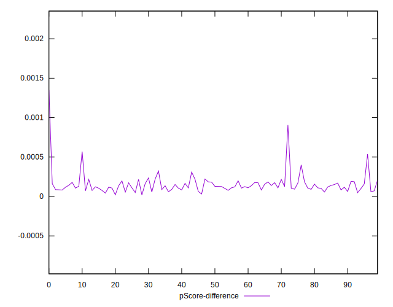

# //largest-contentful-paint/samples/pages+cached

[→ Parent](../..)


## Raw


```yaml
p90min: 13273.373500000002
p90max: 16895.088000000003
p90range: 3621.714500000002
p90mean: 15332.760867021274
p90median: 15340.848750000001
p90stdev: 670.792334616168
p90skewness: -0.11598270629460666
p90eccentricity: 1
p90discretization: 1
outlandishness: 0.9989886751843876
confidence: 360.1810057164677
p90confidence: 271.20784697484993

```


## Score


```yaml
p90min: 0
p90max: 0
p90range: 0
p90mean: 0
p90median: 0
p90stdev: 0
p90skewness: .nan
p90eccentricity: .nan
p90discretization: 94
outlandishness: .nan
confidence: 0
p90confidence: 0

```


## Raw Estimate


## Score Estimate


## P Score


```yaml
p90min: 0.00004277214149717157
p90max: 0.0005367258547682718
p90range: 0.0004939537132711003
p90mean: 0.0001395252957453806
p90median: 0.00012357484584551992
p90stdev: 0.00007385093226359235
p90skewness: 2.308372805122372
p90eccentricity: 0.9999999999999996
p90discretization: 1
outlandishness: 1.3172610782832406
confidence: 0.00006502034930506285
p90confidence: 0.00002985864820258429

```


## Score Difference


```yaml
p90min: 0
p90max: 0
p90range: 0
p90mean: 0
p90median: 0
p90stdev: 0
p90skewness: .nan
p90eccentricity: .nan
p90discretization: 94
outlandishness: .nan
confidence: 0
p90confidence: 0

```


## P Score Difference


```yaml
p90min: 0.00004277214149717157
p90max: 0.0005367258547682718
p90range: 0.0004939537132711003
p90mean: 0.0001395252957453806
p90median: 0.00012357484584551992
p90stdev: 0.00007385093226359235
p90skewness: 2.308372805122372
p90eccentricity: 0.9999999999999996
p90discretization: 1
outlandishness: 1.3172610782832406
confidence: 0.00006502034930506285
p90confidence: 0.00002985864820258429

```

