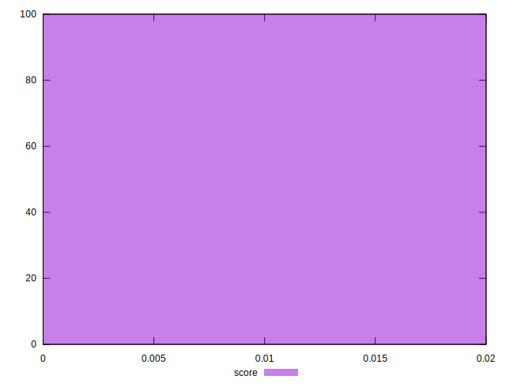

# //largest-contentful-paint/samples/pages

[→ Parent](../..)


## Raw


```yaml
p90min: 13237.809000000001
p90max: 18372.260000000002
p90range: 5134.451000000001
p90mean: 15509.313047872338
p90median: 15420.902999999998
p90stdev: 1081.3920709095214
p90skewness: 0.4369253193922856
p90eccentricity: 0.9999999999999999
p90discretization: 1
outlandishness: 0.9919465406980199
confidence: 611.080392825604
p90confidence: 437.21730281080744

```


## Score


```yaml
p90min: 0
p90max: 0
p90range: 0
p90mean: 0
p90median: 0
p90stdev: 0
p90skewness: .nan
p90eccentricity: .nan
p90discretization: 94
outlandishness: .inf
confidence: 0.0010975798313424304
p90confidence: 0

```


## Raw Estimate


## Score Estimate


## P Score


```yaml
p90min: 0.000016135015652674056
p90max: 0.0005507747819893383
p90range: 0.0005346397663366642
p90mean: 0.00014279385549637508
p90median: 0.0001168958715650481
p90stdev: 0.00010280528219101676
p90skewness: 1.5414257489363778
p90eccentricity: 0.9999999999999996
p90discretization: 1
outlandishness: 12.49092739817596
confidence: 0.0009925933672534752
p90confidence: 0.00004156517270970543

```


## Score Difference


```yaml
p90min: 0
p90max: 0
p90range: 0
p90mean: 0
p90median: 0
p90stdev: 0
p90skewness: .nan
p90eccentricity: .nan
p90discretization: 94
outlandishness: .nan
confidence: 0
p90confidence: 0

```


## P Score Difference


```yaml
p90min: 0.000012286405486117147
p90max: 0.0003934835356002586
p90range: 0.00038119713011414147
p90mean: 0.00013186710160998407
p90median: 0.00011201953595518788
p90stdev: 0.00008757465415523371
p90skewness: 0.9925533276044726
p90eccentricity: 0.9999999999999997
p90discretization: 1
outlandishness: 0.630036166874531
confidence: 0.0001187586324951961
p90confidence: 0.000035407282071281387

```

