# //mainthread-work-breakdown/samples/pages+cached+noadtech+nomedia+nocss

[→ Parent](../..)


## Raw


```yaml
p90min: 735.5360000000001
p90max: 2849.164
p90range: 2113.628
p90mean: 1549.2080425531913
p90median: 1494.8420000000006
p90stdev: 569.0486871095517
p90skewness: 0.4545747155565428
p90eccentricity: 1
p90discretization: 1
outlandishness: 1.0471445414013318
confidence: 265.37424503515734
p90confidence: 230.07190346496063

```

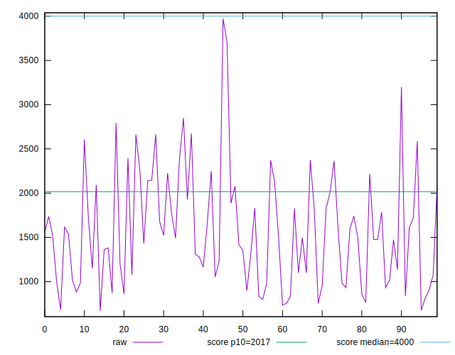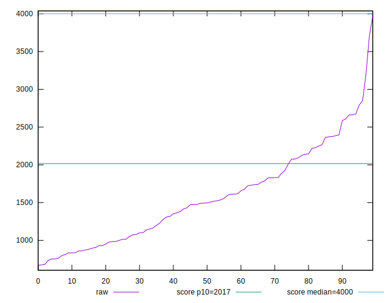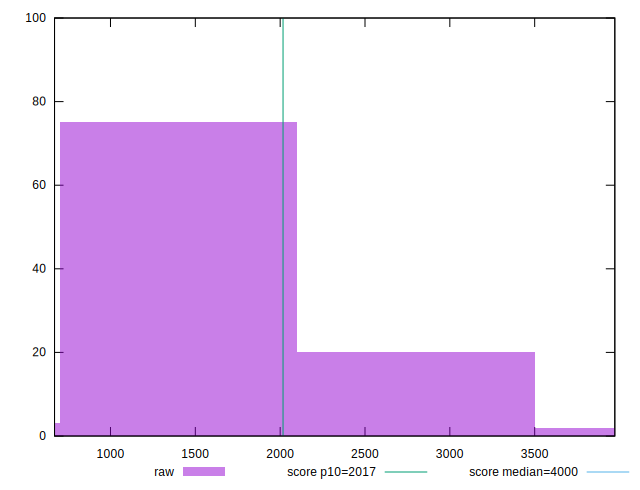
## Score


```yaml
p90min: 0.74
p90max: 1
p90range: 0.26
p90mean: 0.941382978723404
p90median: 0.97
p90stdev: 0.06775426600104213
p90skewness: -1.3070821295481367
p90eccentricity: 1.000000000000001
p90discretization: 4.2727272727272725
outlandishness: 0.980585606524944
confidence: 0.036014646208946954
p90confidence: 0.027393706900390412

```

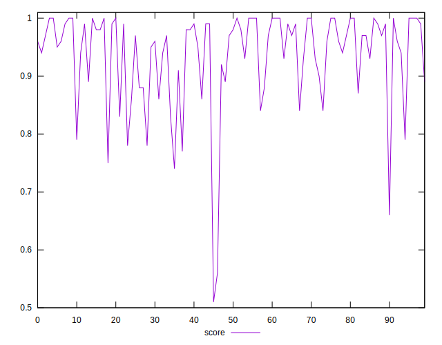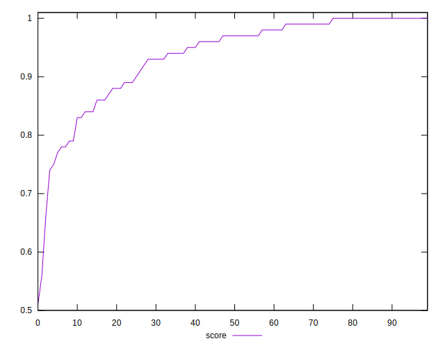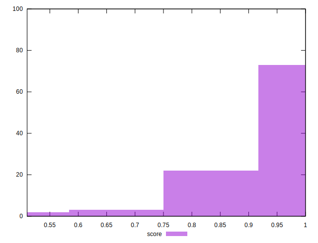
## Raw Estimate

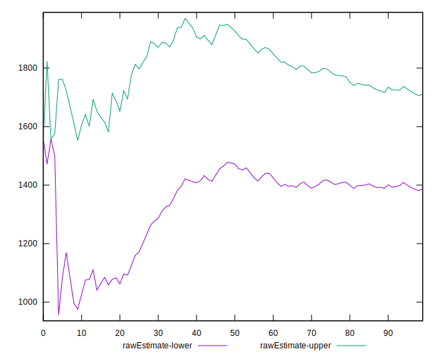
## Score Estimate

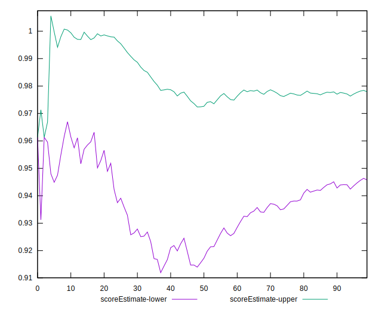
## P Score


```yaml
p90min: 0.7372937665767801
p90max: 0.9992369664803433
p90range: 0.2619431999035632
p90mean: 0.9407566471976933
p90median: 0.9672850503956085
p90stdev: 0.06767175632672294
p90skewness: -1.3218139627571657
p90eccentricity: 1.0000000000000007
p90discretization: 1
outlandishness: 0.9805071883697614
confidence: 0.0360732640107746
p90confidence: 0.027360347438792645

```

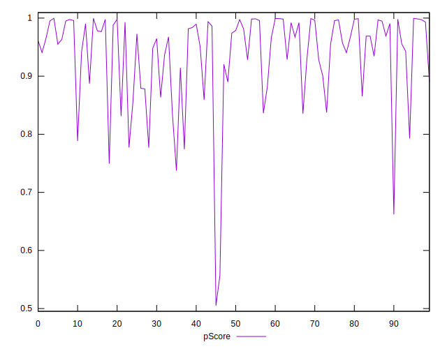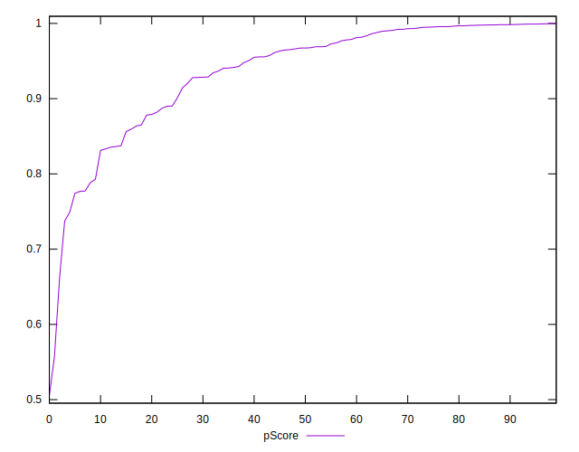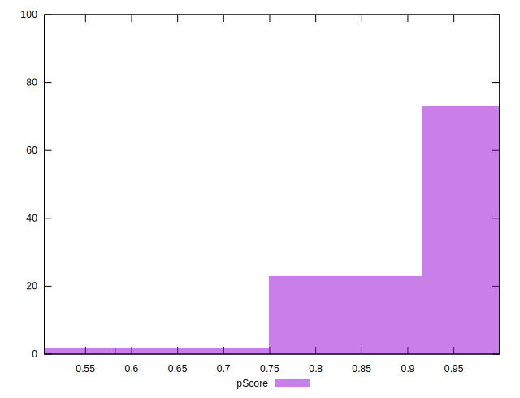
## Score Difference


```yaml
p90min: 0
p90max: 1.1102230246251565e-16
p90range: 1.1102230246251565e-16
p90mean: 8.267618268485208e-18
p90median: 0
p90stdev: 2.9146809503185686e-17
p90skewness: 3.2417635938924247
p90eccentricity: 0.9999999999999983
p90discretization: 47
outlandishness: 1.8032653061224493
confidence: 1.3055982858434593e-17
p90confidence: 1.178433778028828e-17

```

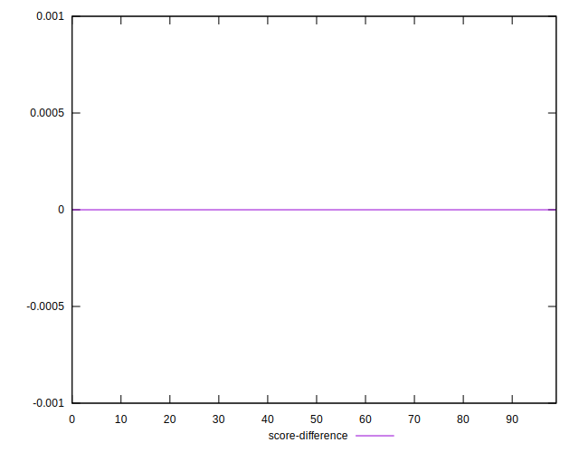
## P Score Difference


```yaml
p90min: -0.004699432398143855
p90max: 0.004651906297788999
p90range: 0.009351338695932854
p90mean: -0.0007018223985168717
p90median: -0.0011578676427963508
p90stdev: 0.0025045690849033356
p90skewness: 0.4711728656804665
p90eccentricity: 1.0000000000000002
p90discretization: 1
outlandishness: 0.8776072842172998
confidence: 0.0010629291321852287
p90confidence: 0.0010126215731208084

```

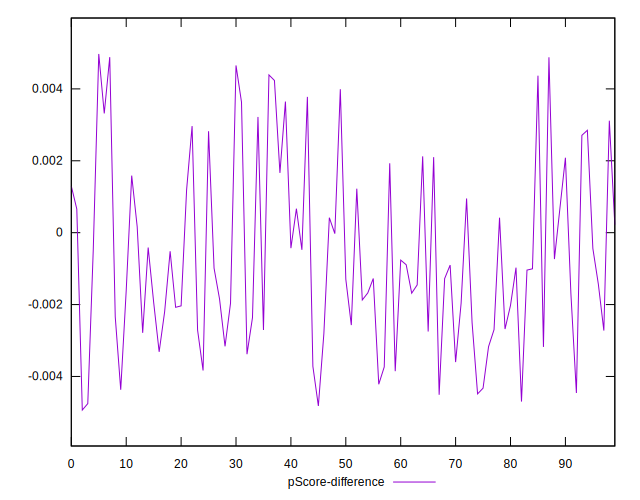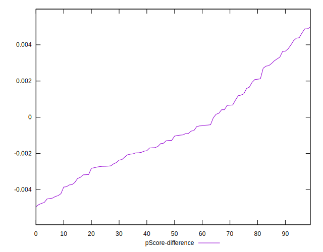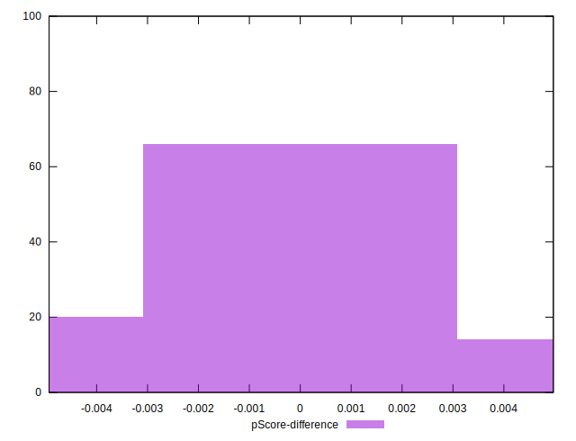