# //mainthread-work-breakdown/samples/pages+cached+noadtech+nomedia

[→ Parent](../..)


## Raw


```yaml
p90min: 1328.3160000000005
p90max: 4870.356
p90range: 3542.039999999999
p90mean: 2729.603361702127
p90median: 2592.6939999999995
p90stdev: 888.6341314481288
p90skewness: 0.6506205732008211
p90eccentricity: 1
p90discretization: 1
outlandishness: 1.020532910222406
confidence: 386.558042294936
p90confidence: 359.2833983058516

```

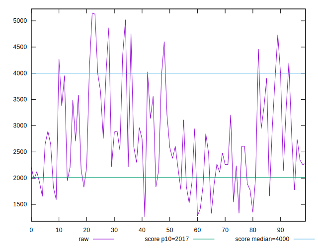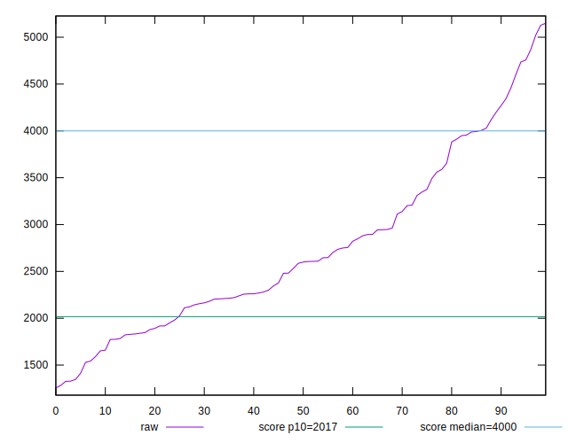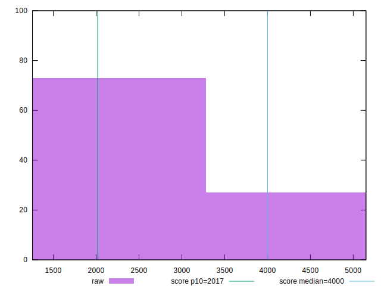
## Score


```yaml
p90min: 0.36
p90max: 0.98
p90range: 0.62
p90mean: 0.756063829787234
p90median: 0.79
p90stdev: 0.1716702559467483
p90skewness: -0.7302940938382106
p90eccentricity: 1.0000000000000007
p90discretization: 1.9583333333333333
outlandishness: 0.9837614123171283
confidence: 0.07302331327458653
p90confidence: 0.06940794952819494

```

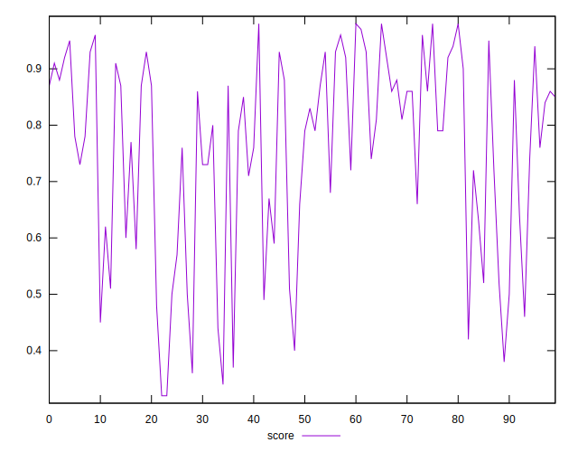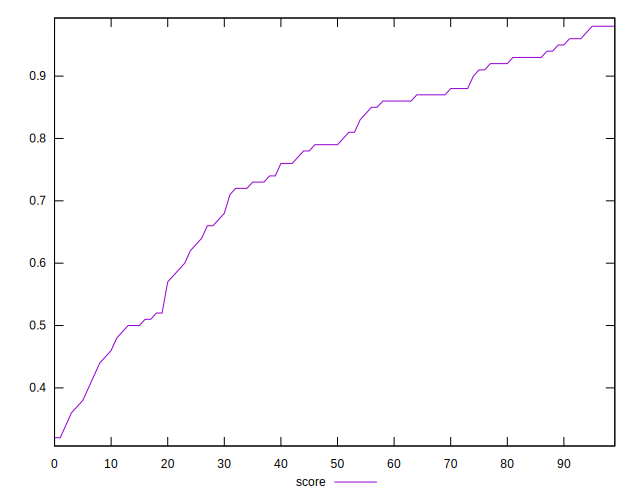
## Raw Estimate

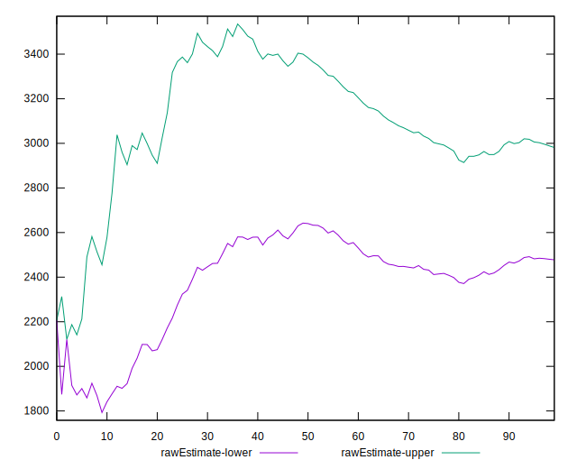
## Score Estimate

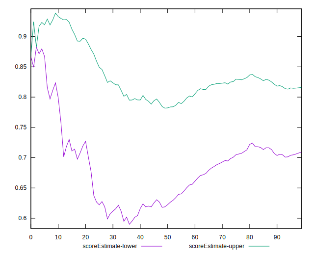
## P Score


```yaml
p90min: 0.3562520468414462
p90max: 0.9804616894166494
p90range: 0.6242096425752032
p90mean: 0.7558572842494075
p90median: 0.79148346193711
p90stdev: 0.1717034289567955
p90skewness: -0.7347024289378058
p90eccentricity: 1.0000000000000002
p90discretization: 1
outlandishness: 0.9838693759869477
confidence: 0.07312559298006531
p90confidence: 0.06942136169790573

```

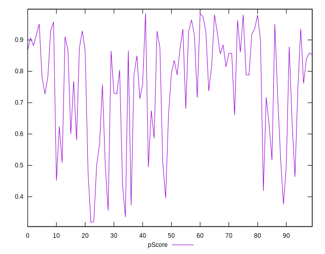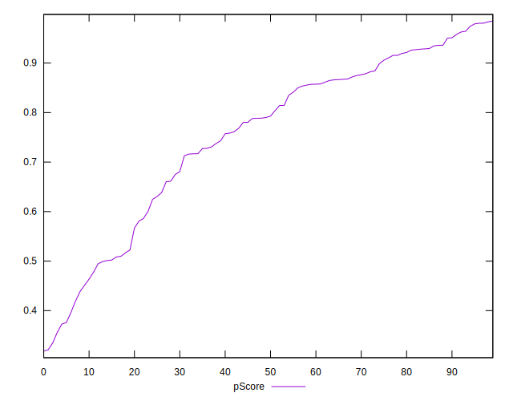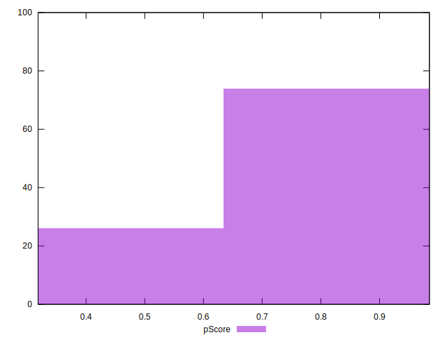
## Score Difference


```yaml
p90min: 0
p90max: 1.1102230246251565e-16
p90range: 1.1102230246251565e-16
p90mean: 3.543264972207946e-18
p90median: 0
p90stdev: 1.9514781802162948e-17
p90skewness: 5.326002287485502
p90eccentricity: 1.0000000000000056
p90discretization: 47
outlandishness: 3.5344000000000007
confidence: 1.0335413782903698e-17
p90confidence: 7.890015558655774e-18

```

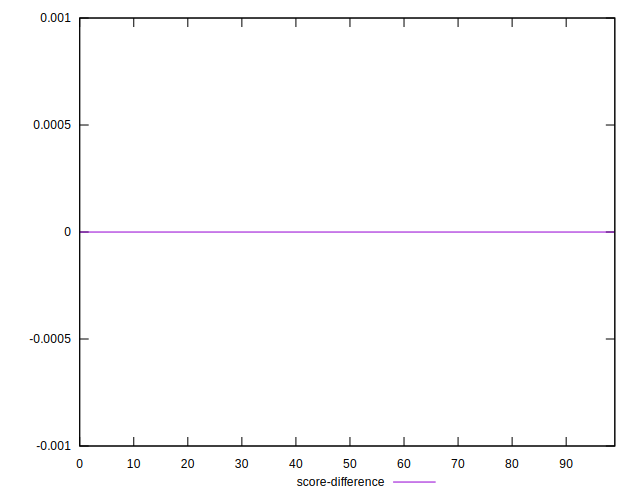
## P Score Difference


```yaml
p90min: -0.004396646397996307
p90max: 0.004886002571316772
p90range: 0.009282648969313079
p90mean: -0.0001851991151692429
p90median: -0.00042006057164878374
p90stdev: 0.002694883546970123
p90skewness: 0.29378589538391475
p90eccentricity: 1.0000000000000002
p90discretization: 1
outlandishness: 0.7815403891448917
confidence: 0.001122821181140064
p90confidence: 0.0010895675560155663

```

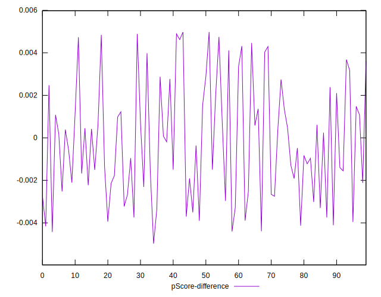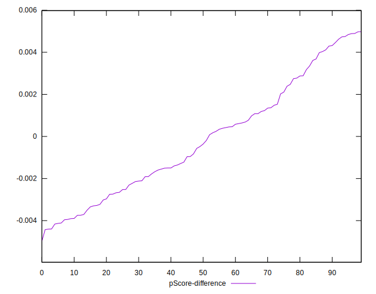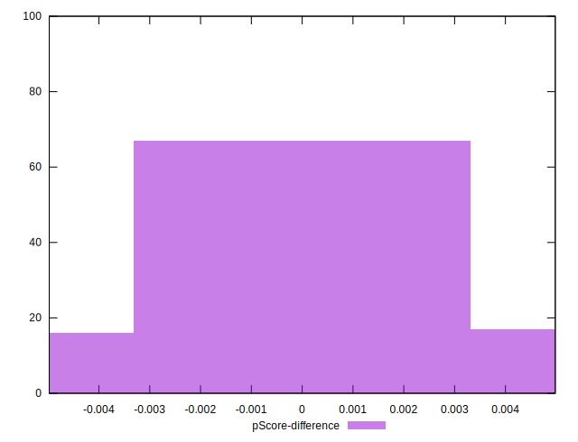