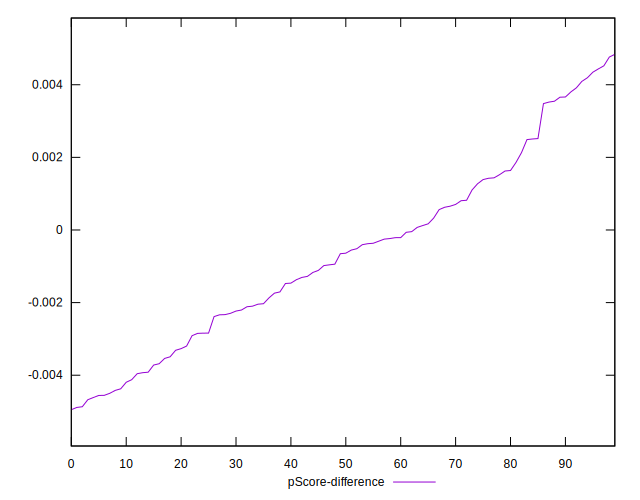

# //mainthread-work-breakdown/samples/pages+cached+noadtech

[→ Parent](../..)


## Raw


```yaml
p90min: 1434.8520000000003
p90max: 5177.815999999999
p90range: 3742.9639999999986
p90mean: 2900.3863404255317
p90median: 2700.783999999999
p90stdev: 902.9003361923773
p90skewness: 0.38734175651032904
p90eccentricity: 0.9999999999999999
p90discretization: 1
outlandishness: 1.0342270155227382
confidence: 419.51507860600015
p90confidence: 365.0513632534594

```


## Score


```yaml
p90min: 0.31
p90max: 0.97
p90range: 0.6599999999999999
p90mean: 0.7226595744680854
p90median: 0.77
p90stdev: 0.17314472812192305
p90skewness: -0.42043728510276074
p90eccentricity: 1.0000000000000009
p90discretization: 2.186046511627907
outlandishness: 0.9797356882108335
confidence: 0.0760414600465422
p90confidence: 0.07000409292968787

```


## Raw Estimate


## Score Estimate


## P Score


```yaml
p90min: 0.31452070400073473
p90max: 0.9725062033910459
p90range: 0.6579854993903111
p90mean: 0.7219610711100456
p90median: 0.7688699572596107
p90stdev: 0.17310803037334652
p90skewness: -0.41585714123947776
p90eccentricity: 0.9999999999999994
p90discretization: 1
outlandishness: 0.979934123378334
confidence: 0.07602172705884191
p90confidence: 0.06998925567400283

```


## Score Difference


```yaml
p90min: 0
p90max: 1.1102230246251565e-16
p90range: 1.1102230246251565e-16
p90mean: 2.0078501509178364e-17
p90median: 0
p90stdev: 4.1957736737306396e-17
p90skewness: 1.6575179067685262
p90eccentricity: 1.0000000000000016
p90discretization: 31.333333333333332
outlandishness: 1.222975778546713
confidence: 1.7133818638379525e-17
p90confidence: 1.696391991565278e-17

```


## P Score Difference


```yaml
p90min: -0.0046752849777554895
p90max: 0.004436147849862904
p90range: 0.009111432827618393
p90mean: -0.0006523278371048575
p90median: -0.0006460557529437971
p90stdev: 0.0025045191000786973
p90skewness: 0.28199105487207554
p90eccentricity: 1
p90discretization: 1
outlandishness: 0.9005023834047817
confidence: 0.0010590374691645582
p90confidence: 0.001012601363771399

```

