# //mainthread-work-breakdown/samples/pages+cached

[→ Parent](../..)


## Raw


```yaml
p90min: 3442.5080000000003
p90max: 10613.523999999985
p90range: 7171.015999999985
p90mean: 6141.641787234035
p90median: 5956.85399999999
p90stdev: 1776.291431725947
p90skewness: 0.4481141825713237
p90eccentricity: 0.9999999999999989
p90discretization: 1
outlandishness: 1.0265190810322362
confidence: 795.7677835422481
p90confidence: 718.1718542951525

```

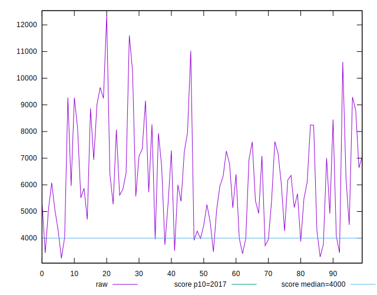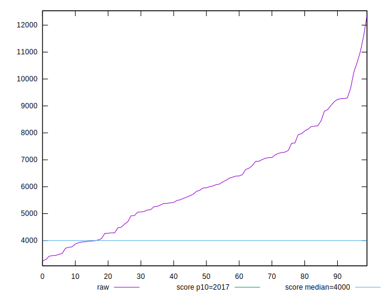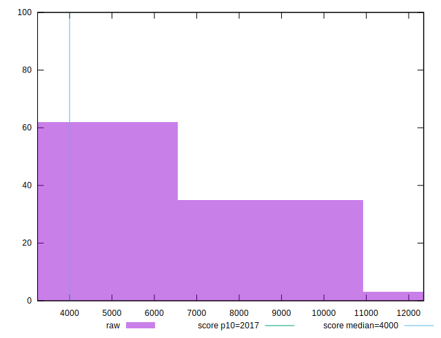
## Score


```yaml
p90min: 0.03
p90max: 0.61
p90range: 0.58
p90mean: 0.26340425531914896
p90median: 0.23
p90stdev: 0.1627329962453793
p90skewness: 0.5409808515157433
p90eccentricity: 1.0000000000000004
p90discretization: 2.186046511627907
outlandishness: 1.0305693744927067
confidence: 0.06878467285612686
p90confidence: 0.06579452874745462

```

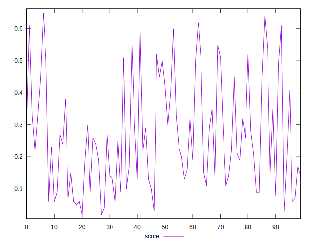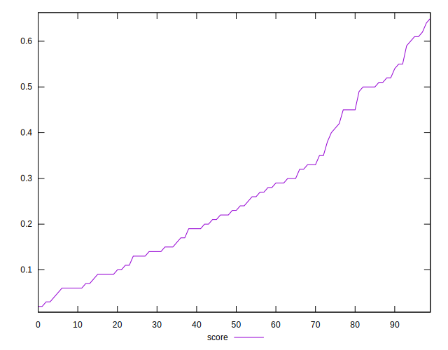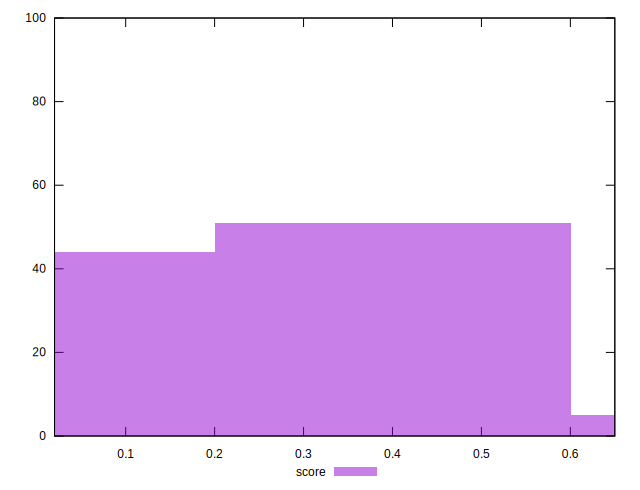
## Raw Estimate

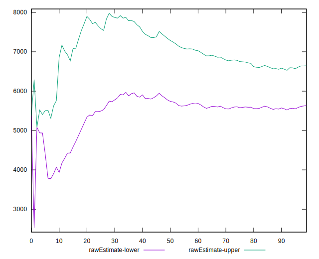
## Score Estimate

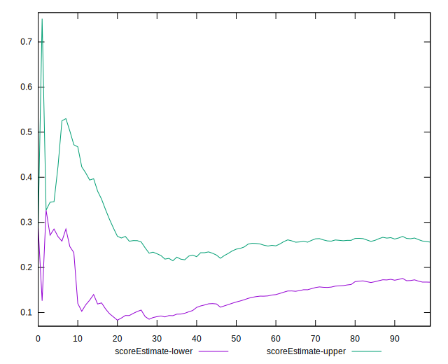
## P Score


```yaml
p90min: 0.03388646986621108
p90max: 0.6106208507337476
p90range: 0.5767343808675365
p90mean: 0.26351125414632975
p90median: 0.22800947823576767
p90stdev: 0.16279176551395022
p90skewness: 0.5459733878919562
p90eccentricity: 0.9999999999999996
p90discretization: 1
outlandishness: 1.0304365505222486
confidence: 0.06880753542688983
p90confidence: 0.06581828973274752

```

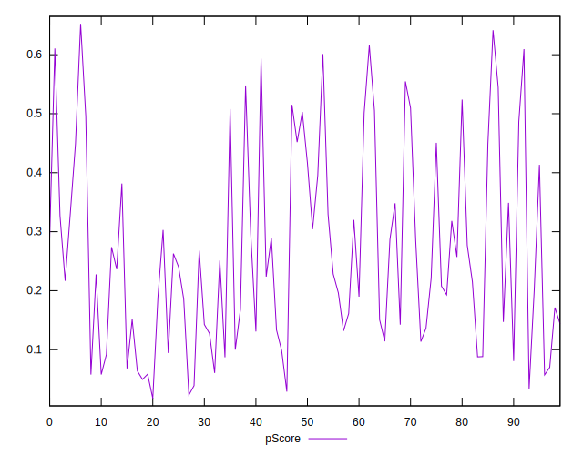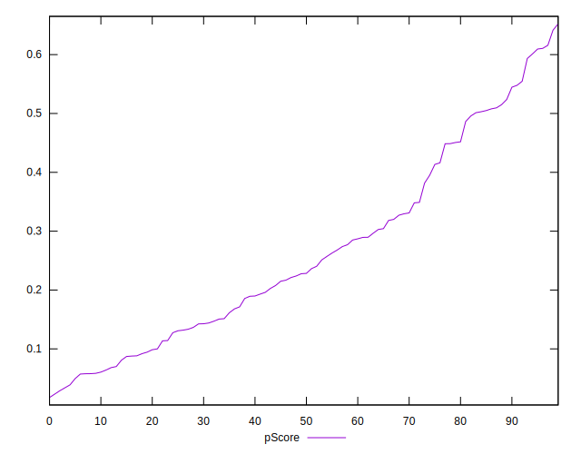
## Score Difference


```yaml
p90min: 0
p90max: 0
p90range: 0
p90mean: 0
p90median: 0
p90stdev: 0
p90skewness: .nan
p90eccentricity: .nan
p90discretization: 94
outlandishness: .inf
confidence: 3.7119730574155385e-18
p90confidence: 0

```

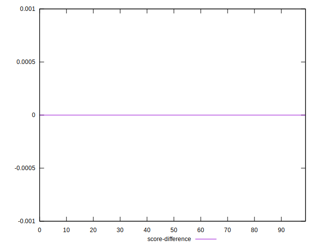
## P Score Difference


```yaml
p90min: -0.004291666665498961
p90max: 0.004730379007262253
p90range: 0.009022045672761214
p90mean: 0.00008966819380012404
p90median: -0.00007411105393682893
p90stdev: 0.002550805569623018
p90skewness: 0.15258679053250315
p90eccentricity: 1.0000000000000004
p90discretization: 1
outlandishness: 1.0386045547200071
confidence: 0.001075068952039992
p90confidence: 0.001031315432345789

```

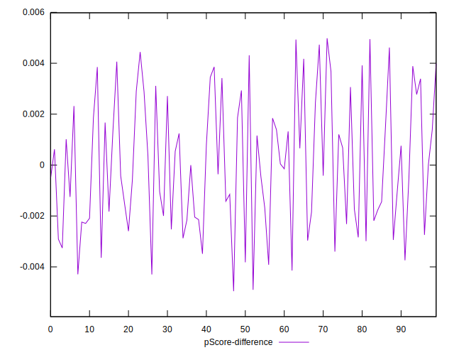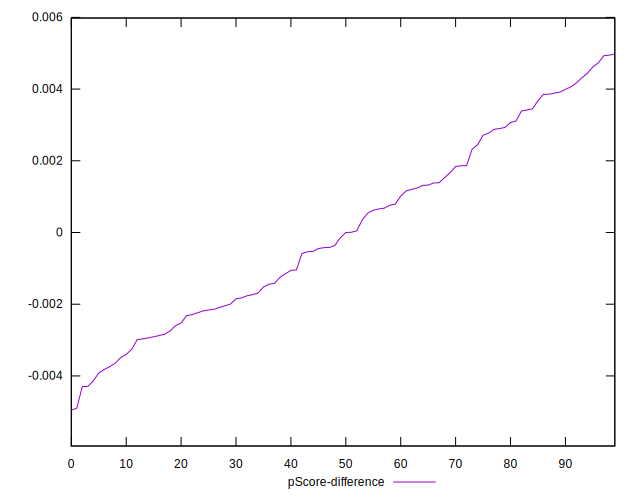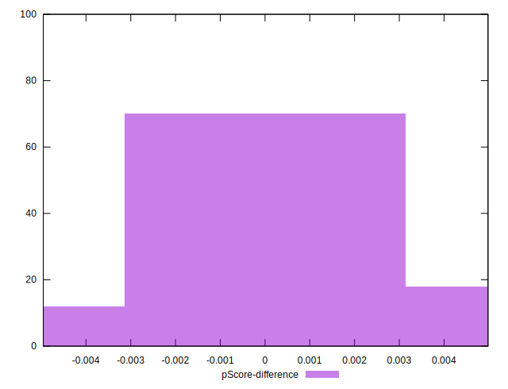