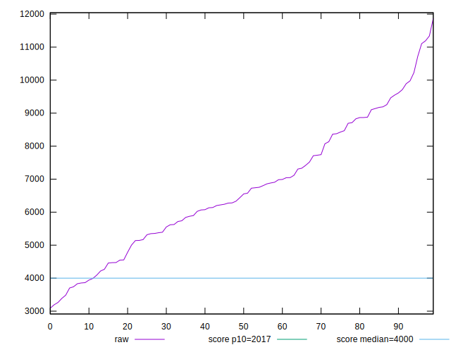
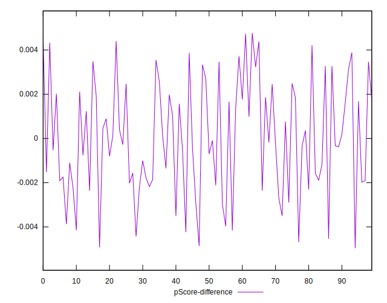

# //mainthread-work-breakdown/samples/pages

[→ Parent](../..)


## Raw


```yaml
p90min: 3388.0359999999987
p90max: 11106.131999999992
p90range: 7718.095999999994
p90mean: 6688.542553191482
p90median: 6495.427999999986
p90stdev: 1890.4939495798628
p90skewness: 0.24314703635050863
p90eccentricity: 1.0000000000000004
p90discretization: 1
outlandishness: 1.011440090569519
confidence: 823.5810268539941
p90confidence: 764.3450399264256

```


## Score


```yaml
p90min: 0.03
p90max: 0.62
p90range: 0.59
p90mean: 0.21946808510638297
p90median: 0.185
p90stdev: 0.1543301725941137
p90skewness: 0.8866942971780104
p90eccentricity: 1.0000000000000002
p90discretization: 2.238095238095238
outlandishness: 1.070758473005795
confidence: 0.0672751349505682
p90confidence: 0.062397185645325835

```


## Raw Estimate


## Score Estimate


## P Score


```yaml
p90min: 0.027974557046189508
p90max: 0.6220204799550024
p90range: 0.5940459229088129
p90mean: 0.21959433344393345
p90median: 0.18214173616990878
p90stdev: 0.1541013045294477
p90skewness: 0.8926564682273409
p90eccentricity: 1
p90discretization: 1
outlandishness: 1.0697486936459857
confidence: 0.06719394008002699
p90confidence: 0.06230465206696455

```


## Score Difference


```yaml
p90min: 0
p90max: 0
p90range: 0
p90mean: 0
p90median: 0
p90stdev: 0
p90skewness: .nan
p90eccentricity: .nan
p90discretization: 94
outlandishness: .inf
confidence: 4.8216875792918765e-18
p90confidence: 0

```


## P Score Difference


```yaml
p90min: -0.004691583381784298
p90max: 0.004399163169311798
p90range: 0.009090746551096096
p90mean: 0.00003168755983349899
p90median: -0.00019885926033880175
p90stdev: 0.0024892423589845947
p90skewness: -0.011666210972915427
p90eccentricity: 0.9999999999999999
p90discretization: 1
outlandishness: 0.5485119610263
confidence: 0.0010528617038318509
p90confidence: 0.0010064248291762406

```

