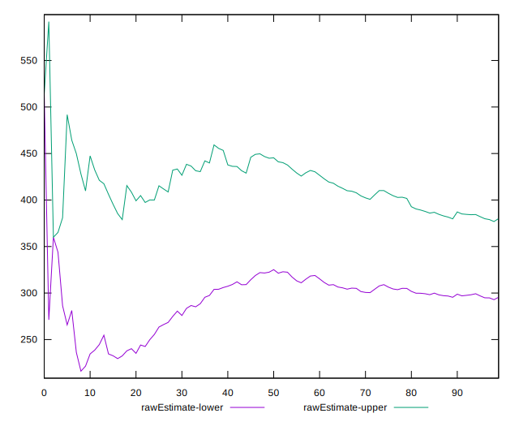

# //max-potential-fid/samples/pages+cached+noadtech+nomedia+nocss

[→ Parent](../..)


## Raw


```yaml
p90min: 132
p90max: 797
p90range: 665
p90mean: 337.74468085106383
p90median: 308.5
p90stdev: 149.21182545189032
p90skewness: 0.9547987434824572
p90eccentricity: 0.9999999999999994
p90discretization: 1.0930232558139534
outlandishness: 1.093243211547393
confidence: 77.65156711201485
p90confidence: 60.32778825230617

```


## Score


```yaml
p90min: 0.01
p90max: 0.89
p90range: 0.88
p90mean: 0.3801063829787235
p90median: 0.34
p90stdev: 0.2572170814322684
p90skewness: 0.3938166739577211
p90eccentricity: 0.9999999999999996
p90discretization: 1.492063492063492
outlandishness: 1.026447430862858
confidence: 0.10755398755671088
p90confidence: 0.10399536080017509

```


## Raw Estimate


## Score Estimate


## P Score


```yaml
p90min: 0.011538513191273303
p90max: 0.8946476982014011
p90range: 0.8831091850101278
p90mean: 0.3805471764053802
p90median: 0.3401612751713876
p90stdev: 0.2572090679375609
p90skewness: 0.39650782400352574
p90eccentricity: 1.0000000000000002
p90discretization: 1.0930232558139534
outlandishness: 1.0261605734622004
confidence: 0.10750563314755046
p90confidence: 0.10399212086654105

```


## Score Difference


```yaml
p90min: 0
p90max: 1.1102230246251565e-16
p90range: 1.1102230246251565e-16
p90mean: 4.724353296277262e-18
p90median: 0
p90stdev: 2.0895585513599446e-17
p90skewness: 4.496043588324042
p90eccentricity: 1.0000000000000002
p90discretization: 31.333333333333332
outlandishness: 2.706025000000001
confidence: 1.066904513733501e-17
p90confidence: 8.448287891758474e-18

```


## P Score Difference


```yaml
p90min: -0.004432318653087408
p90max: 0.004849595691950093
p90range: 0.0092819143450375
p90mean: 0.0004095041310016839
p90median: 0.0010428417489083408
p90stdev: 0.0025394378437885515
p90skewness: -0.2837146715072515
p90eccentricity: 1
p90discretization: 1.0930232558139534
outlandishness: 0.9196456955239289
confidence: 0.0010690356993761571
p90confidence: 0.0010267193505340759

```

