# //max-potential-fid/samples/pages+cached+noadtech+nomedia

[→ Parent](../..)


## Raw


```yaml
p90min: 121
p90max: 502
p90range: 381
p90mean: 267.8723404255319
p90median: 246
p90stdev: 96.74689879493451
p90skewness: 0.6282496246255035
p90eccentricity: 0.9999999999999999
p90discretization: 1.146341463414634
outlandishness: 1.0286309625918173
confidence: 42.60548340901055
p90confidence: 39.11570954173433

```

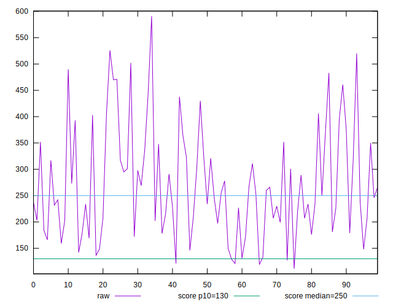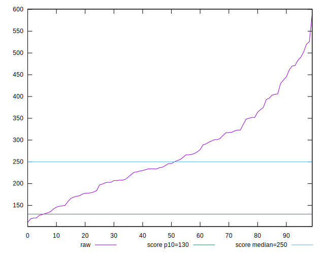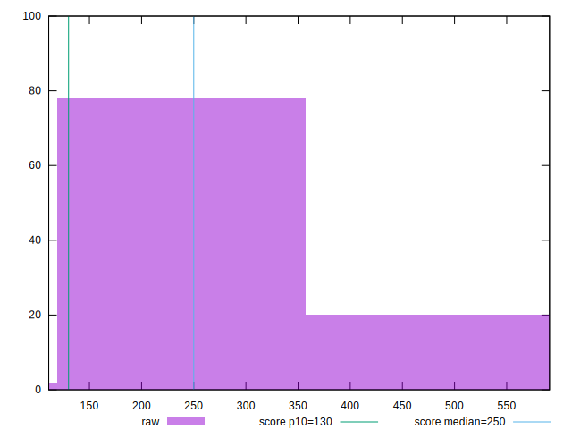
## Score


```yaml
p90min: 0.09
p90max: 0.92
p90range: 0.8300000000000001
p90mean: 0.49670212765957444
p90median: 0.51
p90stdev: 0.23979773523797157
p90skewness: 0.007273809996519615
p90eccentricity: 0.9999999999999992
p90discretization: 1.5666666666666667
outlandishness: 1.000394127496421
confidence: 0.10012309454106336
p90confidence: 0.09695255018164282

```

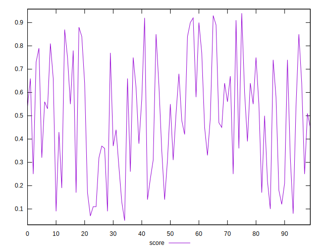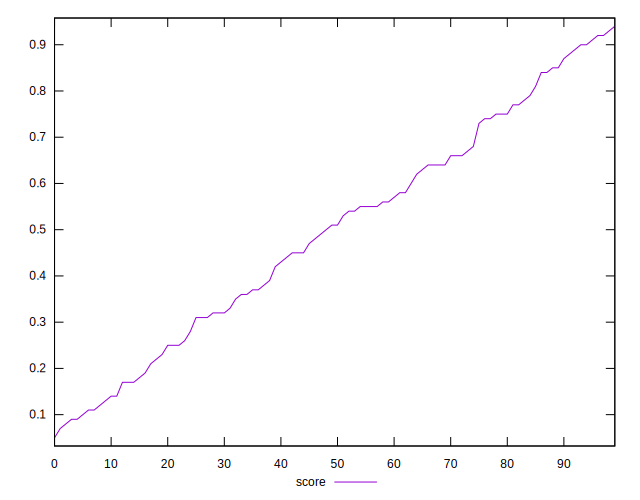
## Raw Estimate

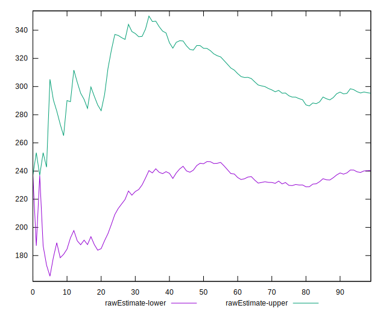
## Score Estimate

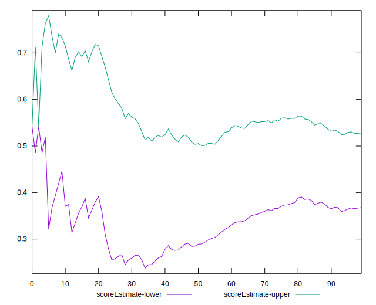
## P Score


```yaml
p90min: 0.08593204249031211
p90max: 0.9225091444925659
p90range: 0.8365771020022539
p90mean: 0.497013311491546
p90median: 0.512608532205872
p90stdev: 0.23990038312948528
p90skewness: 0.006240420155773279
p90eccentricity: 1.0000000000000004
p90discretization: 1.146341463414634
outlandishness: 1.0002306737351971
confidence: 0.10022532742789349
p90confidence: 0.09699405171977515

```

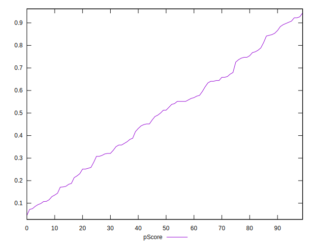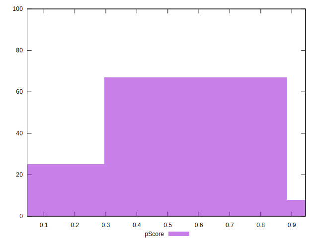
## Score Difference


```yaml
p90min: 0
p90max: 5.551115123125783e-17
p90range: 5.551115123125783e-17
p90mean: 5.905441620346577e-19
p90median: 0
p90stdev: 5.695001657605475e-18
p90skewness: 9.5399555915199
p90eccentricity: 1.0000000000000009
p90discretization: 47
outlandishness: 31.809599999999996
confidence: 6.756111957523837e-18
p90confidence: 2.302544406624999e-18

```

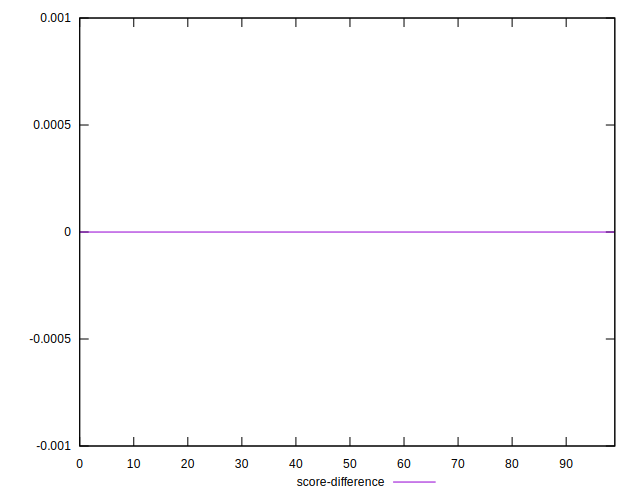
## P Score Difference


```yaml
p90min: -0.004589242775370428
p90max: 0.004701745187188605
p90range: 0.009290987962559033
p90mean: 0.000287408917457857
p90median: 0.0008142601572812408
p90stdev: 0.0026326756842125895
p90skewness: -0.129399510704319
p90eccentricity: 1.0000000000000002
p90discretization: 1.1604938271604939
outlandishness: 0.8866623764284272
confidence: 0.0011026804112181164
p90confidence: 0.001064416313741709

```

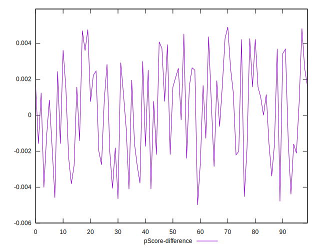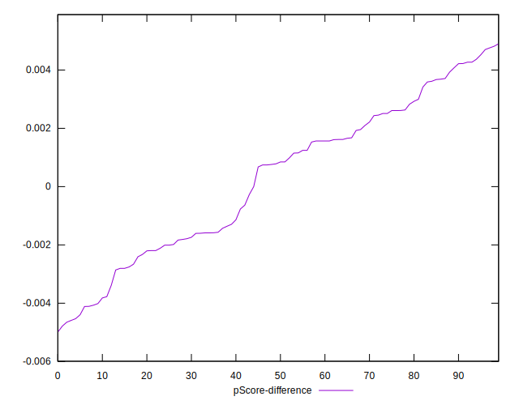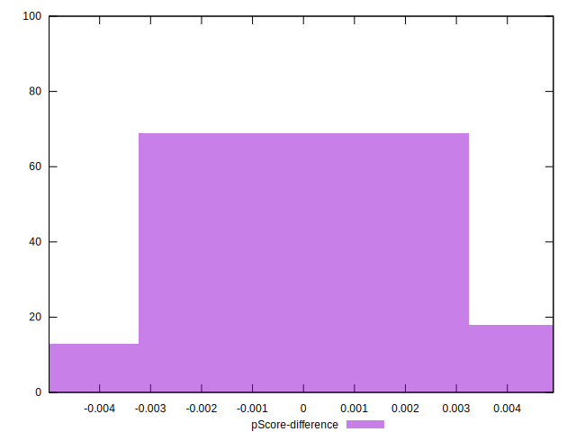