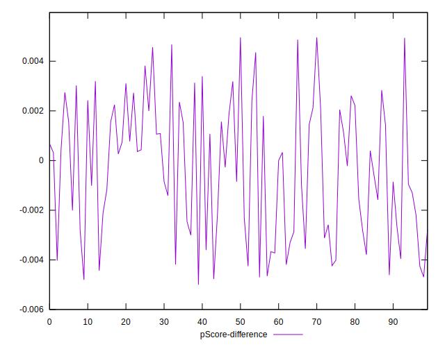

# //max-potential-fid/samples/pages+cached+noadtech

[→ Parent](../..)


## Raw


```yaml
p90min: 125
p90max: 705
p90range: 580
p90mean: 310.18617021276594
p90median: 280.5
p90stdev: 137.0439435666949
p90skewness: 0.912474357013377
p90eccentricity: 0.9999999999999997
p90discretization: 1.0561797752808988
outlandishness: 1.0761176054157877
confidence: 67.36095042586389
p90confidence: 55.4081955884806

```


## Score


```yaml
p90min: 0.02
p90max: 0.91
p90range: 0.89
p90mean: 0.42882978723404225
p90median: 0.41
p90stdev: 0.2684544273023871
p90skewness: 0.30714420889555194
p90eccentricity: 0.9999999999999996
p90discretization: 1.6206896551724137
outlandishness: 1.0124922578126685
confidence: 0.11138304778723157
p90confidence: 0.10853872872773274

```


## Raw Estimate


## Score Estimate


## P Score


```yaml
p90min: 0.0210881261205908
p90max: 0.9128340001026993
p90range: 0.8917458739821085
p90mean: 0.4284718082584636
p90median: 0.410759731828578
p90stdev: 0.2676827413841856
p90skewness: 0.30802398172214
p90eccentricity: 1.0000000000000007
p90discretization: 1.0561797752808988
outlandishness: 1.012637944600516
confidence: 0.11113675405359665
p90confidence: 0.10822672862633623

```


## Score Difference


```yaml
p90min: 0
p90max: 1.1102230246251565e-16
p90range: 1.1102230246251565e-16
p90mean: 5.9054416203465774e-18
p90median: 0
p90stdev: 2.2127682659233752e-17
p90skewness: 3.8832217811649765
p90eccentricity: 1.0000000000000029
p90discretization: 31.333333333333332
outlandishness: 2.262016
confidence: 1.0975311983529905e-17
p90confidence: 8.946436717985808e-18

```


## P Score Difference


```yaml
p90min: -0.004699671560898677
p90max: 0.004870350682723568
p90range: 0.009570022243622245
p90mean: -0.0003533329514985559
p90median: -0.00010922261593887539
p90stdev: 0.002692972282038399
p90skewness: -0.010167583524839341
p90eccentricity: 1
p90discretization: 1.0561797752808988
outlandishness: 0.8680154490242346
confidence: 0.0011272812016293147
p90confidence: 0.0010887948130660985

```

