# //max-potential-fid/samples/pages+cached

[→ Parent](../..)


## Raw


```yaml
p90min: 475
p90max: 2038.9999999999982
p90range: 1563.9999999999982
p90mean: 963.3617021276596
p90median: 926
p90stdev: 357.879715055445
p90skewness: 0.9914651126101609
p90eccentricity: 1.0000000000000002
p90discretization: 1.0444444444444445
outlandishness: 1.0620281631849133
confidence: 174.94576863663474
p90confidence: 144.69423991211573

```

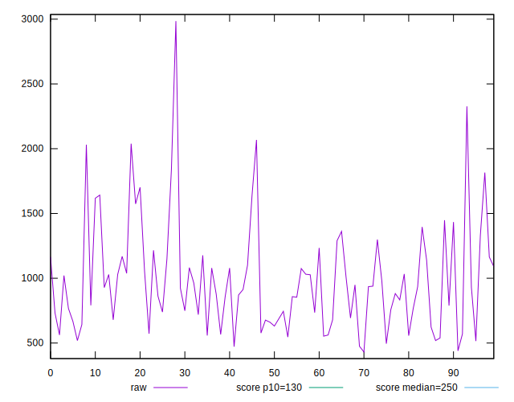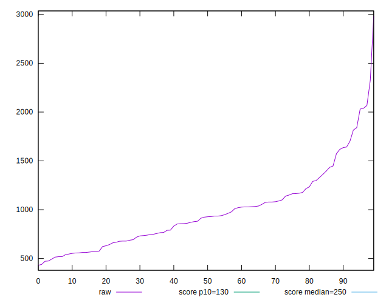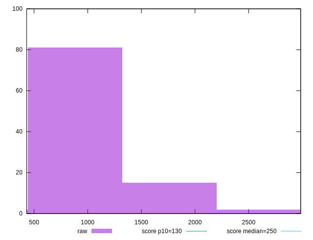
## Score


```yaml
p90min: 0
p90max: 0.1
p90range: 0.1
p90mean: 0.017446808510638307
p90median: 0.01
p90stdev: 0.024837179158225663
p90skewness: 1.5301082357223965
p90eccentricity: 1.000000000000001
p90discretization: 8.545454545454545
outlandishness: 1.3405121356335519
confidence: 0.012043560052380572
p90confidence: 0.010041912432236432

```

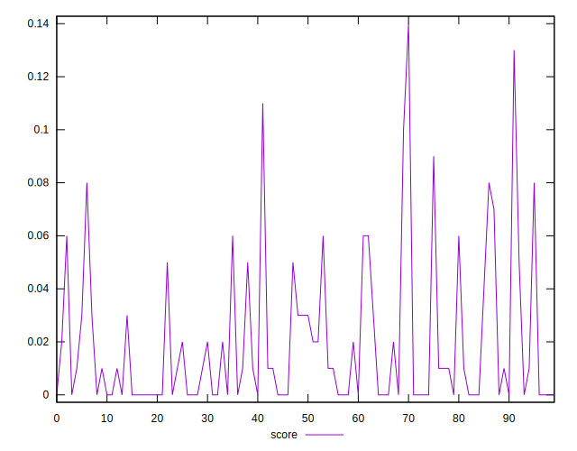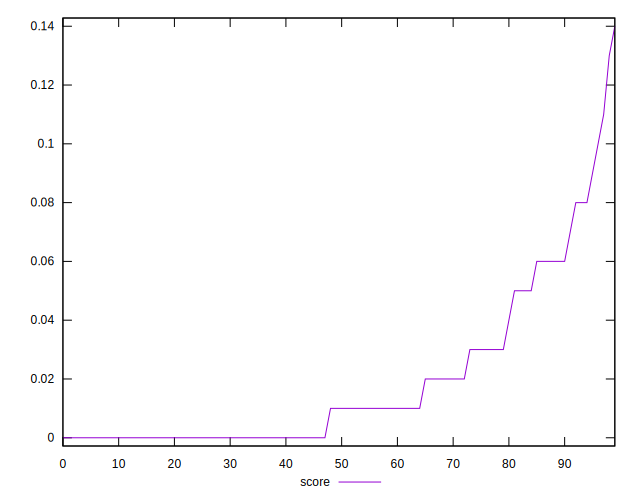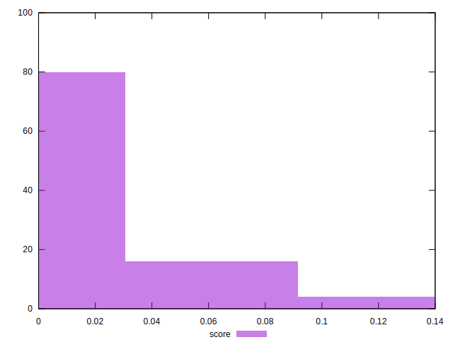
## Raw Estimate

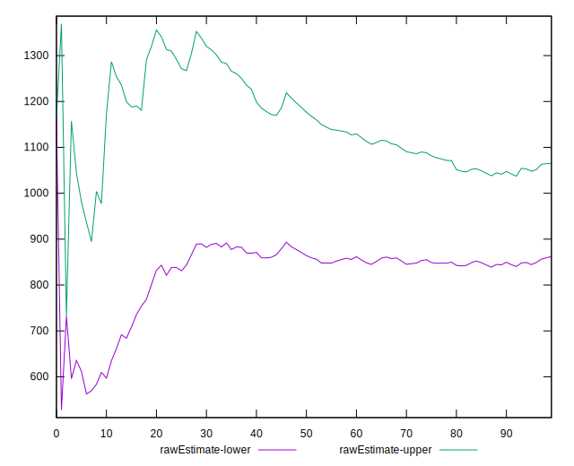
## Score Estimate

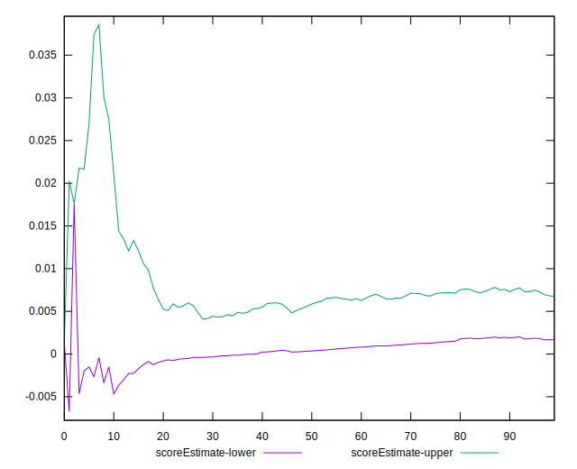
## P Score


```yaml
p90min: 0.00001953032922619169
p90max: 0.10421548269386727
p90range: 0.10419595236464108
p90mean: 0.017707596202664582
p90median: 0.00514198865845189
p90stdev: 0.02418223443465501
p90skewness: 1.6277270502606007
p90eccentricity: 0.9999999999999997
p90discretization: 1.0681818181818181
outlandishness: 1.3374742161324298
confidence: 0.011903142287203955
p90confidence: 0.009777111928115027

```

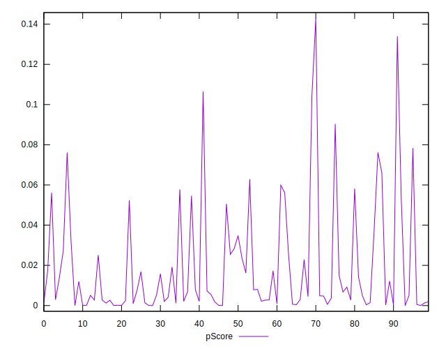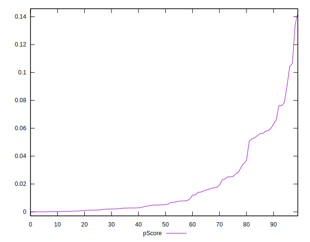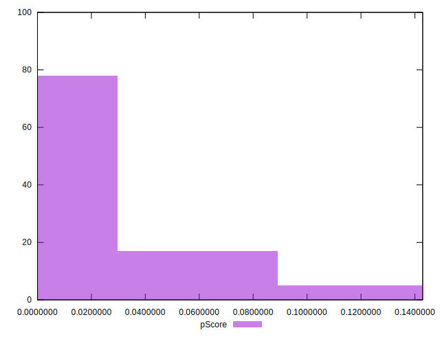
## Score Difference


```yaml
p90min: 0
p90max: 0
p90range: 0
p90mean: 0
p90median: 0
p90stdev: 0
p90skewness: .nan
p90eccentricity: .nan
p90discretization: 94
outlandishness: .nan
confidence: 0
p90confidence: 0

```


## P Score Difference


```yaml
p90min: -0.004892894893849059
p90max: 0.004804045665204509
p90range: 0.009696940559053568
p90mean: 0.0002976027644951806
p90median: 0.000410729362692569
p90stdev: 0.0026497006034695847
p90skewness: -0.27416012766641085
p90eccentricity: 0.9999999999999999
p90discretization: 1.0444444444444445
outlandishness: 0.8769816335138563
confidence: 0.0011124921055685176
p90confidence: 0.0010712996537238992

```

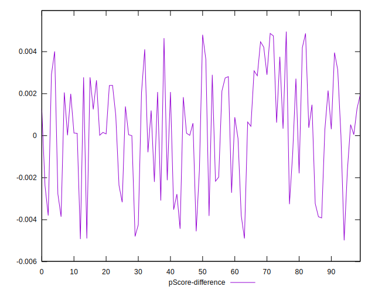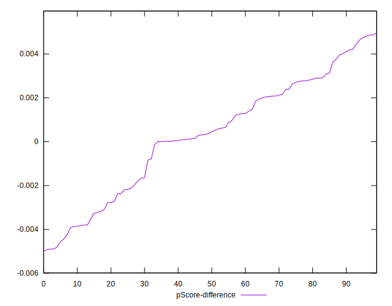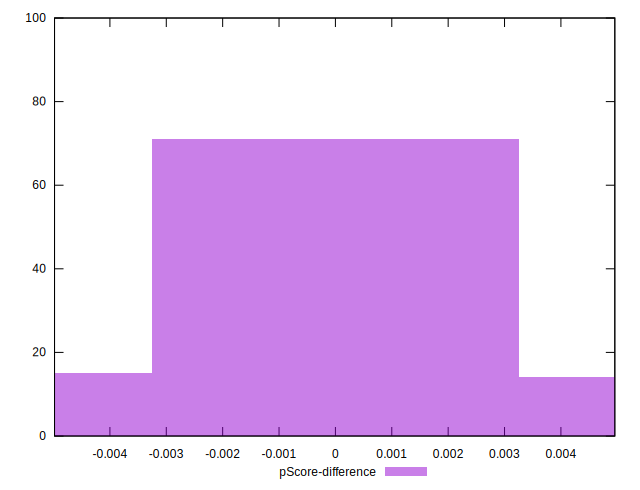