# //max-potential-fid/samples/pages

[→ Parent](../..)


## Raw


```yaml
p90min: 506.9999999999991
p90max: 2336.999999999998
p90range: 1829.999999999999
p90mean: 1170.5531914893618
p90median: 1120.4999999999995
p90stdev: 440.9144418625975
p90skewness: 0.5320933061625515
p90eccentricity: 1.0000000000000002
p90discretization: 1
outlandishness: 1.0369447813192116
confidence: 199.094079119432
p90confidence: 178.26598532330712

```

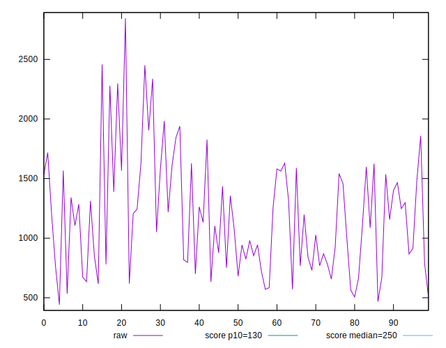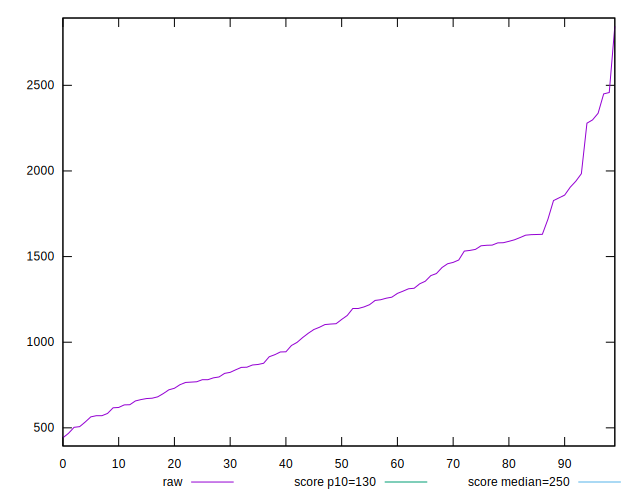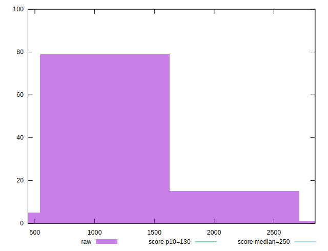
## Score


```yaml
p90min: 0
p90max: 0.08
p90range: 0.08
p90mean: 0.009468085106382982
p90median: 0
p90stdev: 0.016718382116356293
p90skewness: 2.2013486791576256
p90eccentricity: 0.9999999999999989
p90discretization: 10.444444444444445
outlandishness: 1.6603335942431514
confidence: 0.009351801328912553
p90confidence: 0.006759404043092265

```

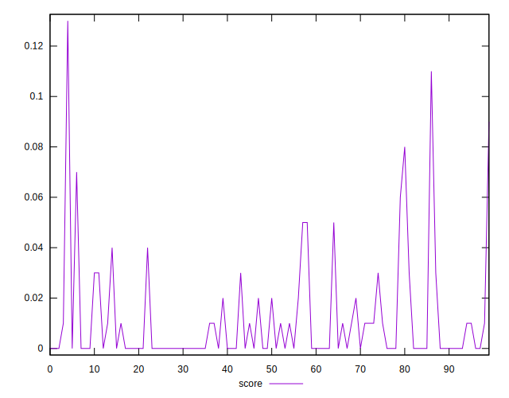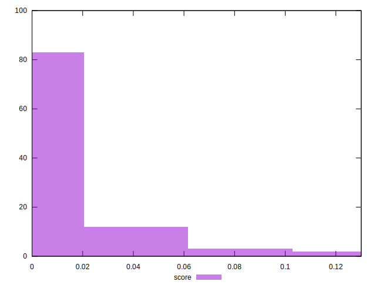
## Raw Estimate

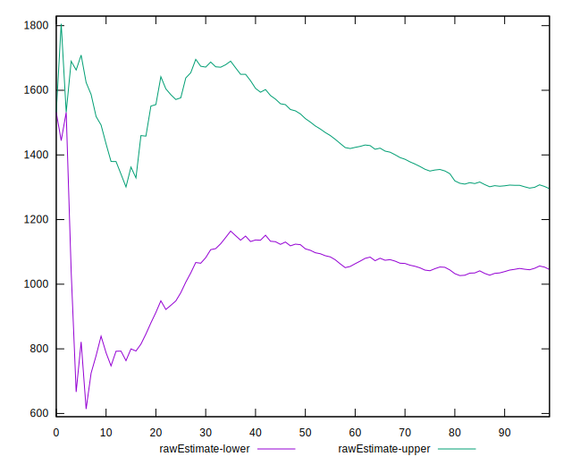
## Score Estimate

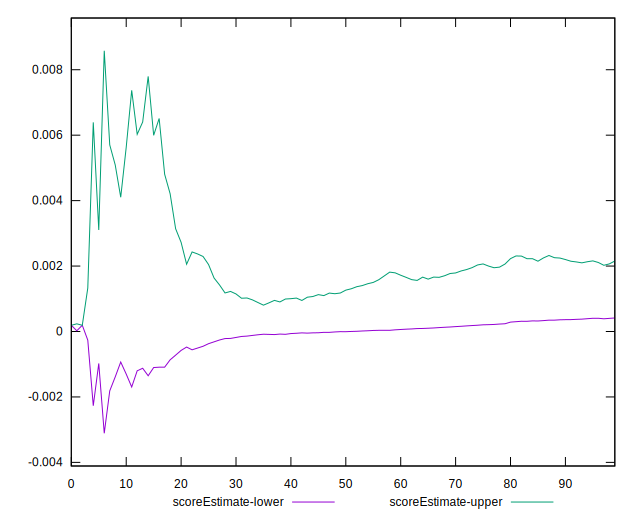
## P Score


```yaml
p90min: 0.000005927107692149658
p90max: 0.0829251052116533
p90range: 0.08291917810396116
p90mean: 0.009889101031127102
p90median: 0.0016465348744479358
p90stdev: 0.016455083037500675
p90skewness: 2.279207354316117
p90eccentricity: 0.9999999999999994
p90discretization: 1.010752688172043
outlandishness: 1.6144642213232987
confidence: 0.00924127338038214
p90confidence: 0.006652949671743859

```

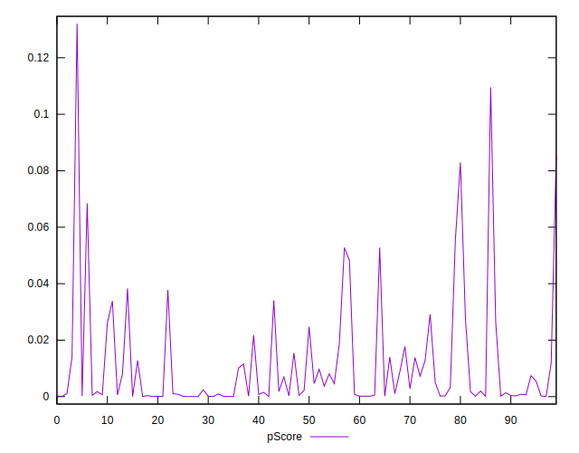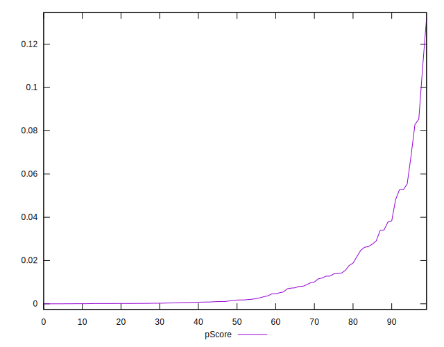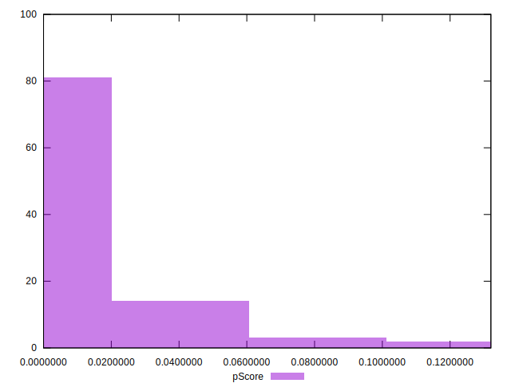
## Score Difference


```yaml
p90min: 0
p90max: 0
p90range: 0
p90mean: 0
p90median: 0
p90stdev: 0
p90skewness: .nan
p90eccentricity: .nan
p90discretization: 94
outlandishness: .nan
confidence: 0
p90confidence: 0

```


## P Score Difference


```yaml
p90min: -0.004546117692208123
p90max: 0.004195249530410847
p90range: 0.00874136722261897
p90mean: 0.0003900023339624185
p90median: 0.0001842518353120104
p90stdev: 0.001833564563182237
p90skewness: -0.2887043511192735
p90eccentricity: 1.0000000000000002
p90discretization: 1.010752688172043
outlandishness: 0.8770788549478464
confidence: 0.000830883435457751
p90confidence: 0.0007413279368414088

```

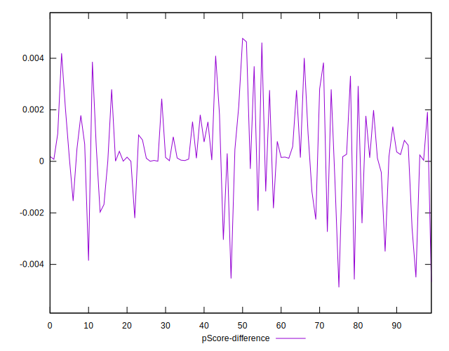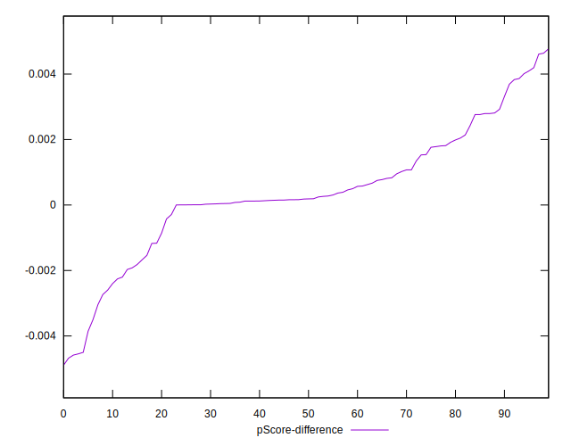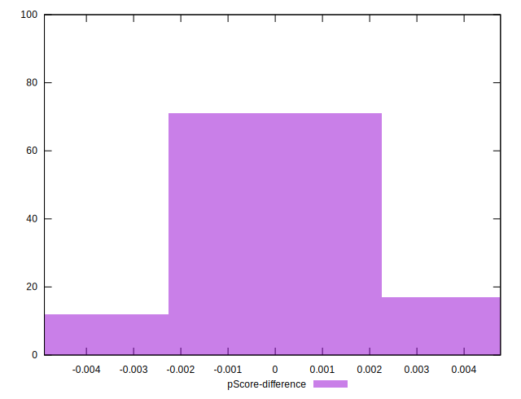