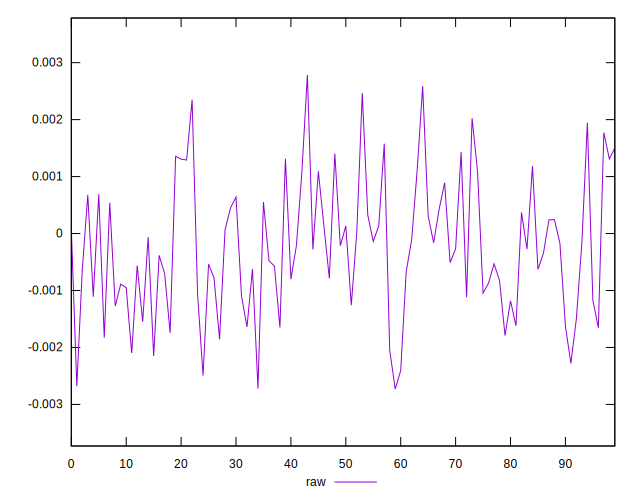
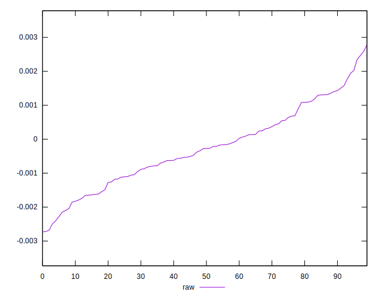
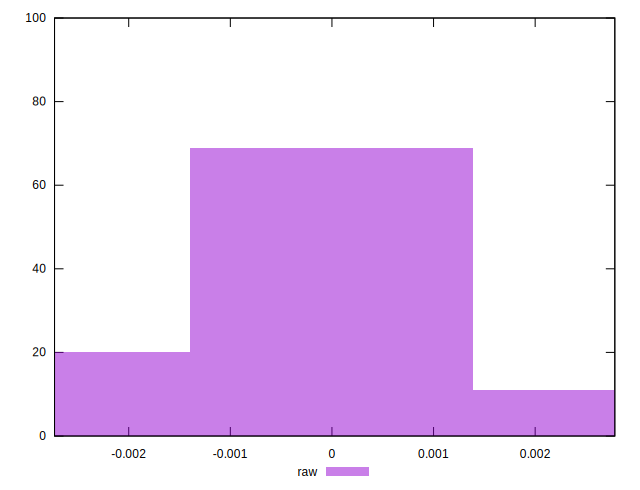

# //meta/pScore-difference/samples/pages+cached+noadtech+nomedia+nocss

[→ Parent](../..)


## Raw


```yaml
p90min: -0.002495173123216365
p90max: 0.0023500869686723914
p90range: 0.004845260091888756
p90mean: -0.0002581999578180776
p90median: -0.0002769284764517384
p90stdev: 0.0011319491129902514
p90skewness: 0.1510751503150312
p90eccentricity: 1.0000000000000002
p90discretization: 1
outlandishness: 0.9051695539486847
confidence: 0.0005008385305740128
p90confidence: 0.00045765800528242624

```

