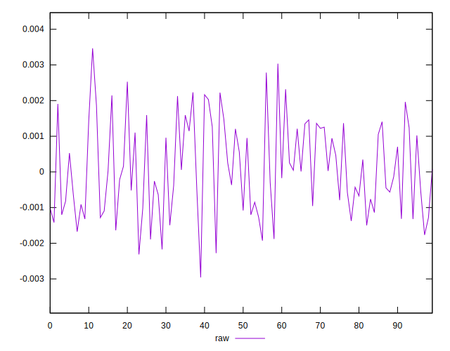
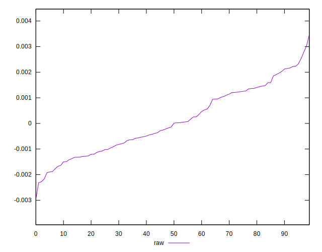
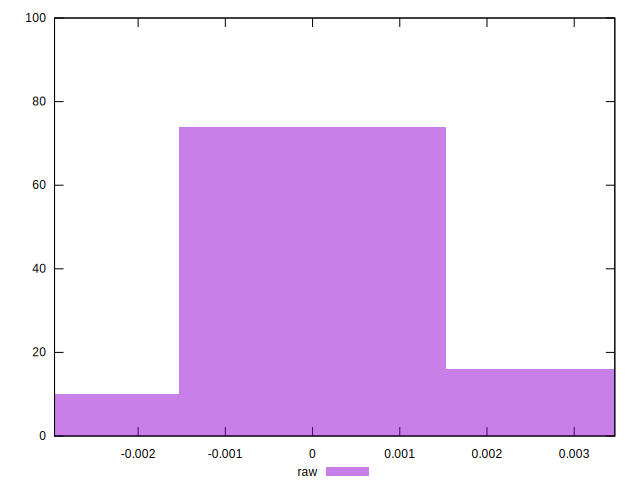

# //meta/pScore-difference/samples/pages+cached+noadtech+nomedia

[→ Parent](../..)


## Raw


```yaml
p90min: -0.002173286379412742
p90max: 0.0025289159992659843
p90range: 0.004702202378678726
p90mean: 0.00008389988426149143
p90median: -0.0000624670656884448
p90stdev: 0.0012475061222454549
p90skewness: 0.18641631643960171
p90eccentricity: 1.0000000000000002
p90discretization: 1
outlandishness: 1.3156404509723165
confidence: 0.000546392511080471
p90confidence: 0.0005043788249246029

```

