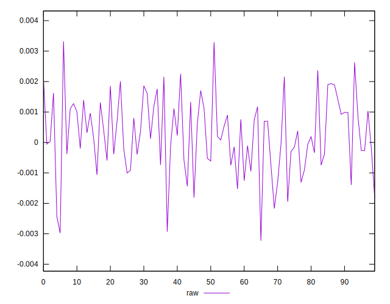
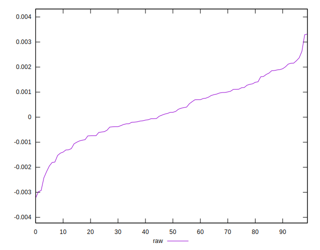
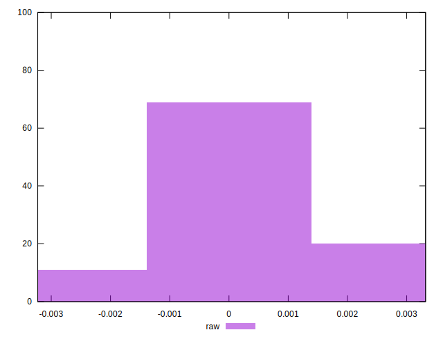

# //meta/pScore-difference/samples/pages+cached+noadtech

[→ Parent](../..)


## Raw


```yaml
p90min: -0.0024219413506415296
p90max: 0.002367688238436205
p90range: 0.004789629589077735
p90mean: 0.00026313226113151237
p90median: 0.00019149348709745123
p90stdev: 0.001130324375074104
p90skewness: -0.13786172380995518
p90eccentricity: 0.9999999999999994
p90discretization: 1
outlandishness: 0.8912033566035806
confidence: 0.0005216099662055387
p90confidence: 0.0004570011079844139

```

