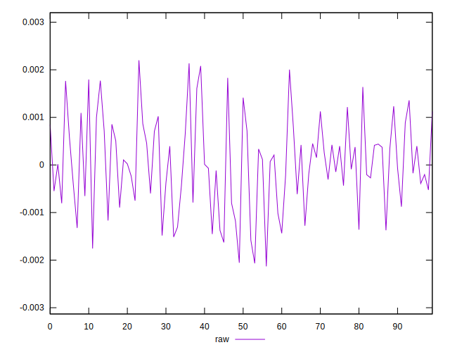
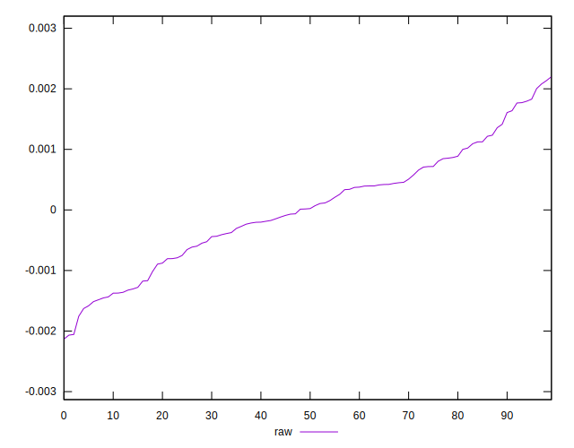
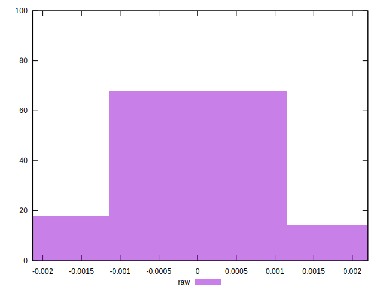

# //meta/pScore-difference/samples/pages+cached

[→ Parent](../..)


## Raw


```yaml
p90min: -0.00175615018012887
p90max: 0.002003649809955832
p90range: 0.003759799990084702
p90mean: 0.00003077169185318777
p90median: 0.000019267337454899162
p90stdev: 0.0009316282653723667
p90skewness: 0.040307205060508514
p90eccentricity: 1.0000000000000002
p90discretization: 1
outlandishness: 0.9845781482712647
confidence: 0.00040803945843771597
p90confidence: 0.0003766663436563125

```

