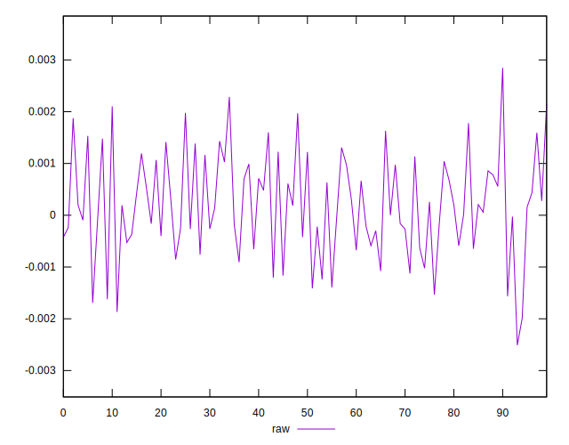
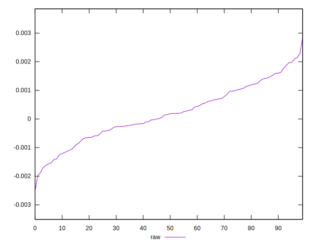
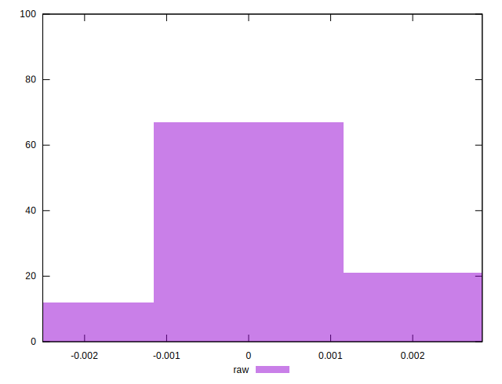

# //meta/pScore-difference/samples/pages

[→ Parent](../..)


## Raw


```yaml
p90min: -0.0016922831711761396
p90max: 0.0021049348795512263
p90range: 0.0037972180507273657
p90mean: 0.00019363017516862478
p90median: 0.00016987566517354027
p90stdev: 0.000937227645443486
p90skewness: 0.02030266215709623
p90eccentricity: 0.9999999999999999
p90discretization: 1
outlandishness: 0.9740934393396905
confidence: 0.0004187257019105915
p90confidence: 0.00037893022732807675

```

