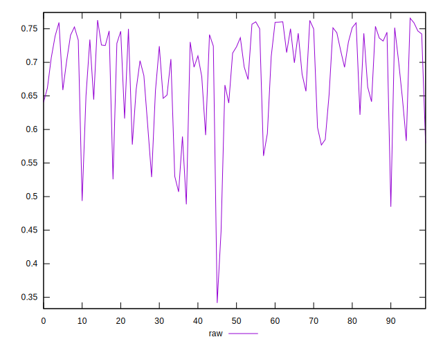
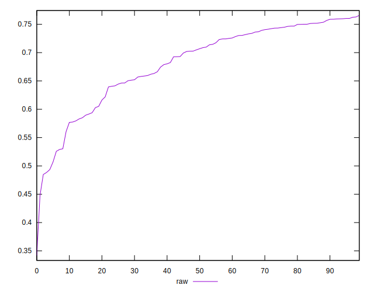
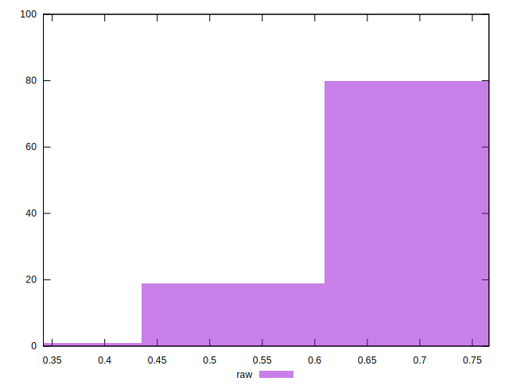

# //meta/pScore/samples/pages+cached+noadtech+nomedia+nocss

[→ Parent](../..)


## Raw


```yaml
p90min: 0.48842814363695203
p90max: 0.7603984002627335
p90range: 0.2719702566257815
p90mean: 0.6837081844690875
p90median: 0.7058734769318353
p90stdev: 0.0707488507673678
p90skewness: -0.9893312073209373
p90eccentricity: 1
p90discretization: 1
outlandishness: 0.9843711196186589
confidence: 0.032771387396575584
p90confidence: 0.02860444656622691

```

