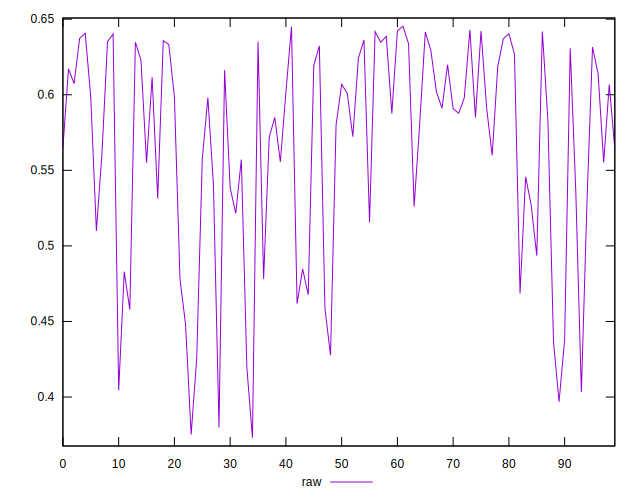
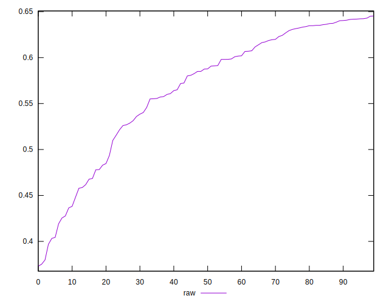
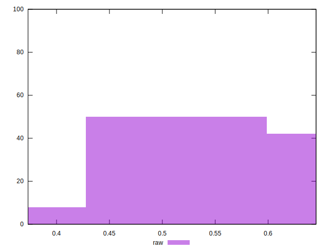

# //meta/pScore/samples/pages+cached+noadtech+nomedia

[→ Parent](../..)


## Raw


```yaml
p90min: 0.39686299156387717
p90max: 0.642325909660261
p90range: 0.24546291809638388
p90mean: 0.5664172959274052
p90median: 0.5876452558664083
p90stdev: 0.06950330075940081
p90skewness: -0.8600911525353865
p90eccentricity: 1.0000000000000002
p90discretization: 1
outlandishness: 0.9881323183068249
confidence: 0.029852547193392684
p90confidence: 0.028100858617277666

```

