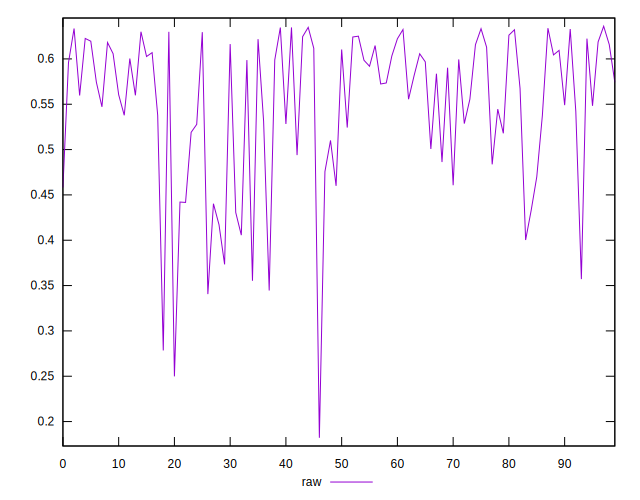
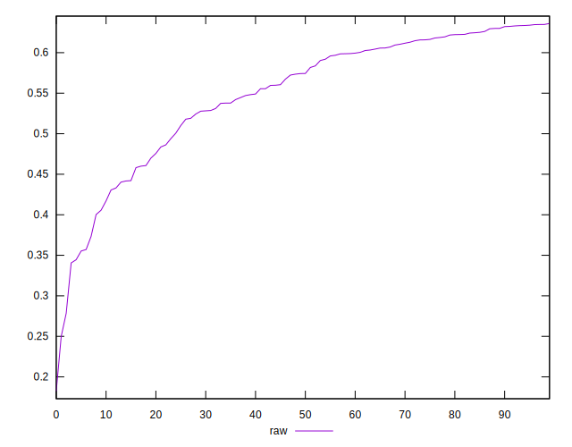
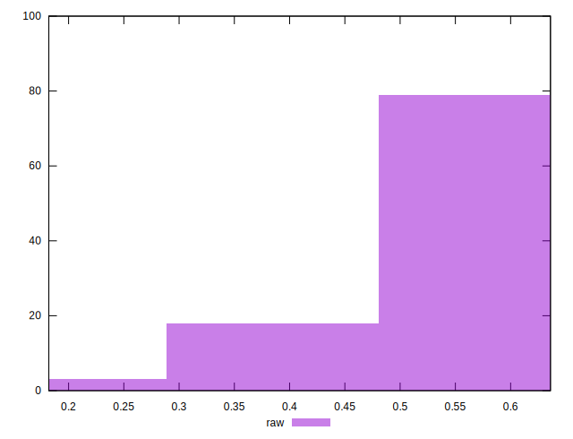

# //meta/pScore/samples/pages+cached+noadtech

[→ Parent](../..)


## Raw


```yaml
p90min: 0.34057989180717646
p90max: 0.6346115269780015
p90range: 0.29403163517082503
p90mean: 0.552067550042329
p90median: 0.5742621968250441
p90stdev: 0.07811186814279582
p90skewness: -1.0642541551858902
p90eccentricity: 1.0000000000000013
p90discretization: 1
outlandishness: 0.9749298119375459
confidence: 0.0370326951757784
p90confidence: 0.03158138590583772

```

