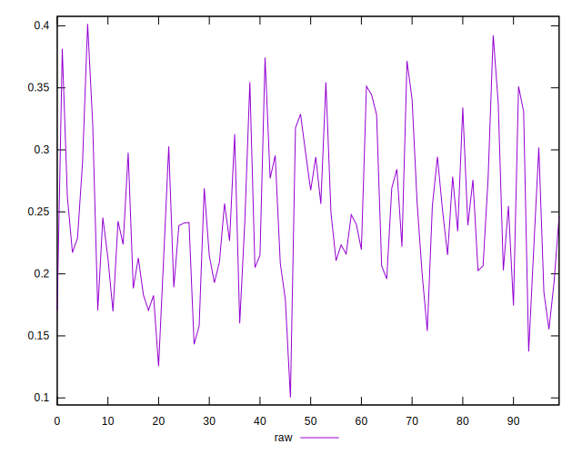
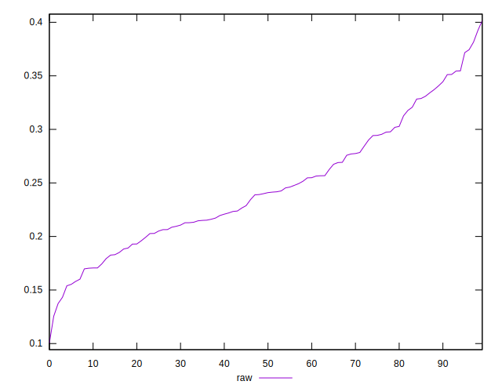
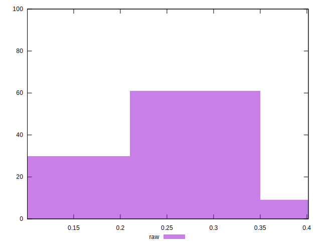

# //meta/pScore/samples/pages+cached

[→ Parent](../..)


## Raw


```yaml
p90min: 0.143207429955603
p90max: 0.37443068261075474
p90range: 0.23122325265515173
p90mean: 0.24654711421809597
p90median: 0.24046996037962598
p90stdev: 0.05695031284871081
p90skewness: 0.40577104133058906
p90eccentricity: 1.0000000000000007
p90discretization: 1
outlandishness: 1.0048196340236057
confidence: 0.02529157912052341
p90confidence: 0.02302556385215842

```

