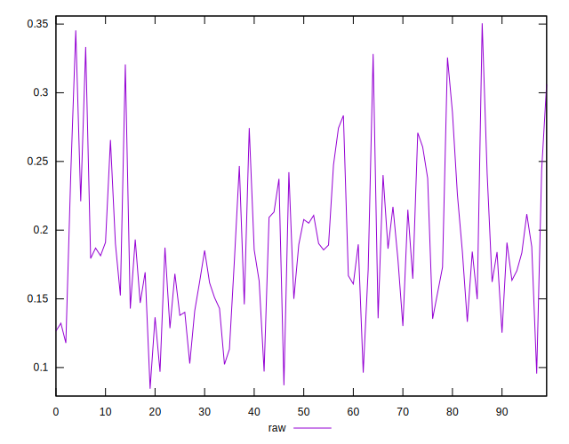
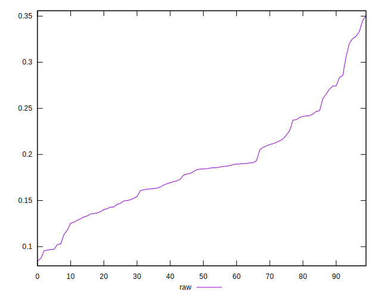
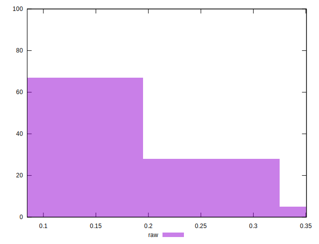

# //meta/pScore/samples/pages

[→ Parent](../..)


## Raw


```yaml
p90min: 0.09628948584063281
p90max: 0.32820015289818877
p90range: 0.23191066705755597
p90mean: 0.18742624692004428
p90median: 0.18420531408025465
p90stdev: 0.05280487981294746
p90skewness: 0.6469607644742139
p90eccentricity: 1.0000000000000002
p90discretization: 1
outlandishness: 1.0184365802899196
confidence: 0.023641306160997515
p90confidence: 0.02134952506878277

```

