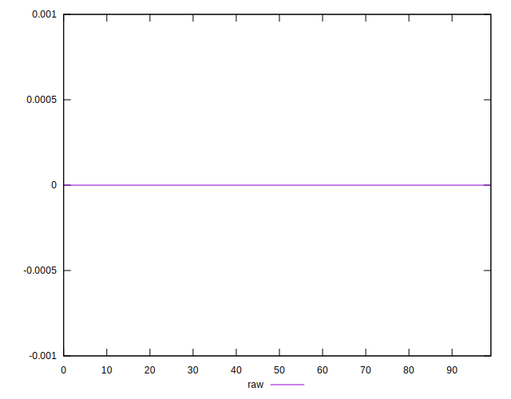

# //meta/score-difference/samples/pages+cached+noadtech+nomedia+nocss

[→ Parent](../..)


## Raw


```yaml
p90min: 0
p90max: 3.053113317719181e-17
p90range: 3.053113317719181e-17
p90mean: 7.293220401128025e-18
p90median: 0
p90stdev: 1.0741939869676342e-17
p90skewness: 1.01531924633909
p90eccentricity: 0.9999999999999982
p90discretization: 18.8
outlandishness: 1.1599377206641643
confidence: 4.470217932750425e-18
p90confidence: 4.343070476580849e-18

```

