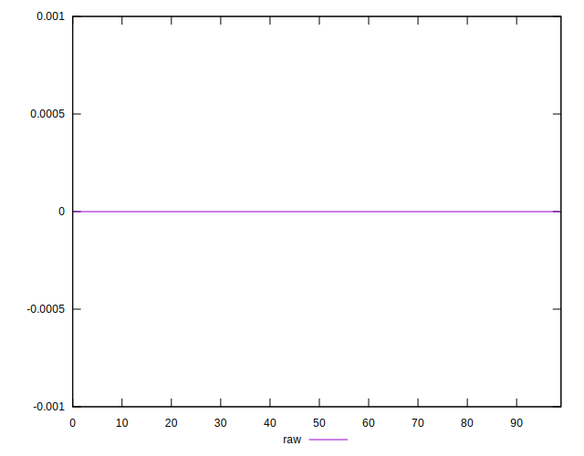

# //meta/score-difference/samples/pages+cached+noadtech+nomedia

[→ Parent](../..)


## Raw


```yaml
p90min: 0
p90max: 4.4408920985006264e-17
p90range: 4.4408920985006264e-17
p90mean: 6.791257863398567e-18
p90median: 0
p90stdev: 1.0110212637897567e-17
p90skewness: 1.3932573831809647
p90eccentricity: 0.9999999999999992
p90discretization: 11.75
outlandishness: 1.2908911606805293
confidence: 4.622598520310536e-18
p90confidence: 4.0876570295799386e-18

```

