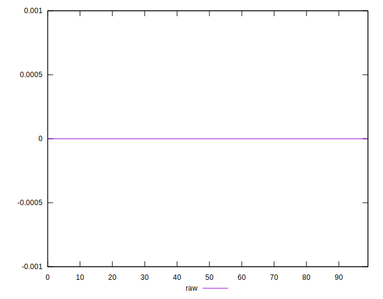
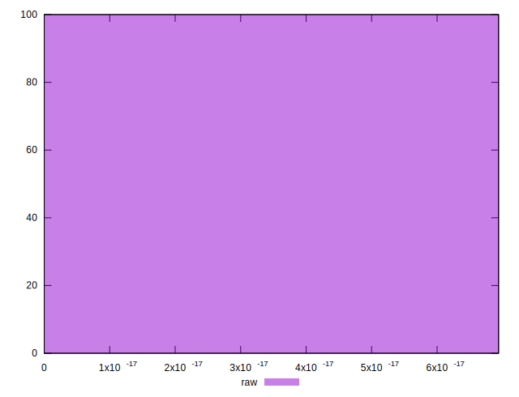

# //meta/score-difference/samples/pages+cached+noadtech

[→ Parent](../..)


## Raw


```yaml
p90min: 0
p90max: 2.7755575615628914e-17
p90range: 2.7755575615628914e-17
p90mean: 7.706601314552286e-18
p90median: 0
p90stdev: 9.959427059025186e-18
p90skewness: 0.7983626891725406
p90eccentricity: 1.0000000000000016
p90discretization: 18.8
outlandishness: 1.2626526093275203
confidence: 4.795297390686488e-18
p90confidence: 4.026692957555718e-18

```

