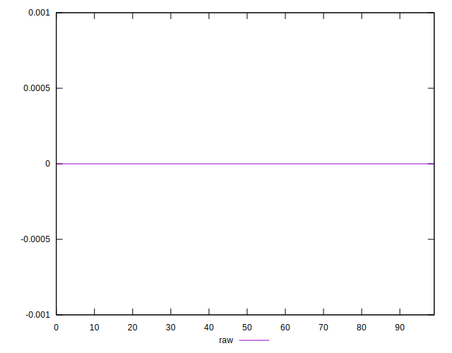
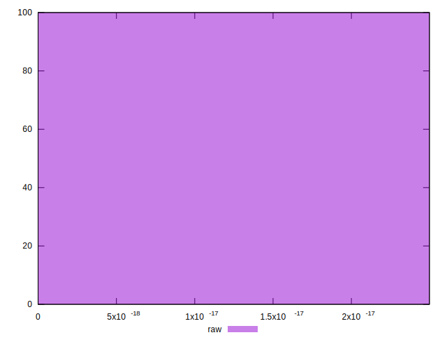

# //meta/score-difference/samples/pages+cached

[→ Parent](../..)


## Raw


```yaml
p90min: 0
p90max: 1.6653345369377347e-17
p90range: 1.6653345369377347e-17
p90mean: 3.631846596513143e-18
p90median: 0
p90stdev: 6.490682141304935e-18
p90skewness: 1.357989136596322
p90eccentricity: 1.0000000000000002
p90discretization: 31.333333333333332
outlandishness: 1.211073408685307
confidence: 2.7104924773975517e-18
p90confidence: 2.624245743578286e-18

```

