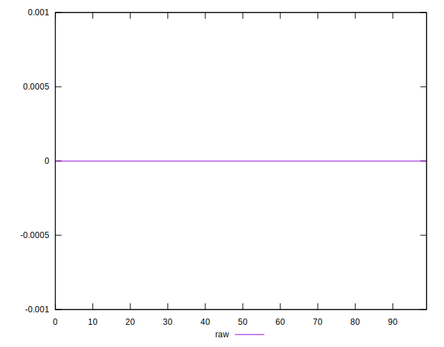
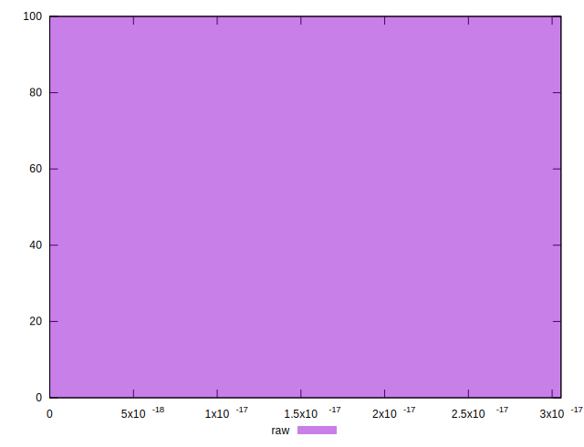

# //meta/score-difference/samples/pages

[→ Parent](../..)


## Raw


```yaml
p90min: 0
p90max: 1.6653345369377347e-17
p90range: 1.6653345369377347e-17
p90mean: 3.188938474987151e-18
p90median: 0
p90stdev: 6.085757443134222e-18
p90skewness: 1.553942010316812
p90eccentricity: 1.000000000000001
p90discretization: 31.333333333333332
outlandishness: 1.4218354252400558
confidence: 2.818966296328369e-18
p90confidence: 2.4605307606981385e-18

```

