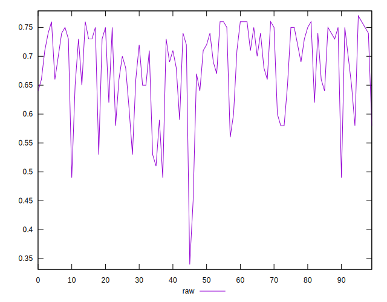
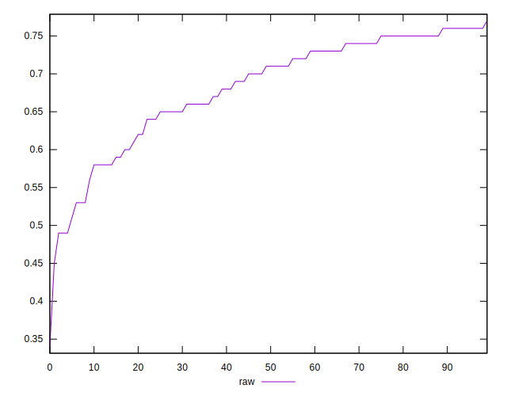
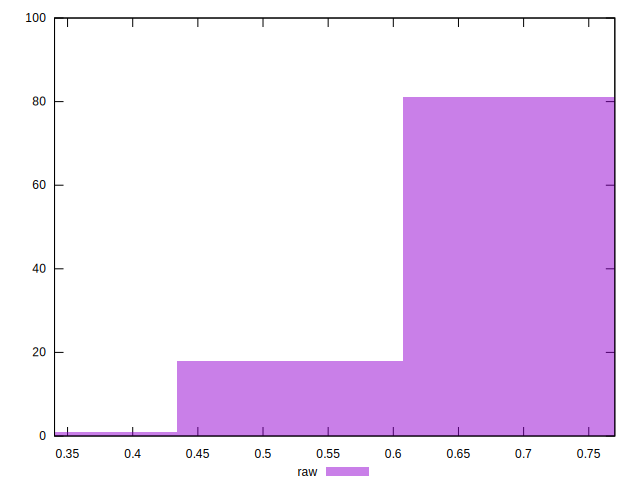

# //meta/score/samples/pages+cached+noadtech+nomedia+nocss

[→ Parent](../..)


## Raw


```yaml
p90min: 0.49
p90max: 0.76
p90range: 0.27
p90mean: 0.6838297872340424
p90median: 0.71
p90stdev: 0.07054659517966898
p90skewness: -0.9831243585324316
p90eccentricity: 1.0000000000000002
p90discretization: 4.2727272727272725
outlandishness: 0.9844726945720901
confidence: 0.0326667850545569
p90confidence: 0.02852267267042082

```

