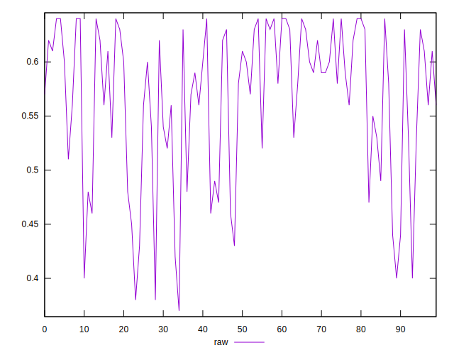
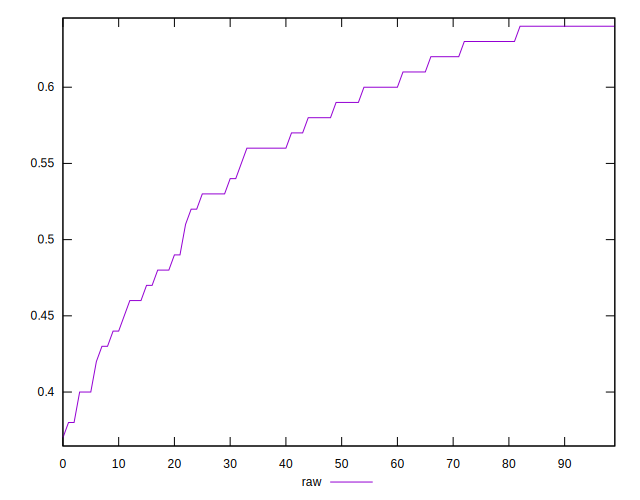
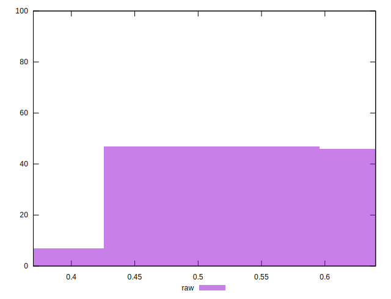

# //meta/score/samples/pages+cached+noadtech+nomedia

[→ Parent](../..)


## Raw


```yaml
p90min: 0.4
p90max: 0.64
p90range: 0.24
p90mean: 0.5669148936170215
p90median: 0.59
p90stdev: 0.0691902495243658
p90skewness: -0.867398318282395
p90eccentricity: 0.9999999999999996
p90discretization: 4.086956521739131
outlandishness: 0.9876383654043923
confidence: 0.02968407998893766
p90confidence: 0.027974288966634227

```

