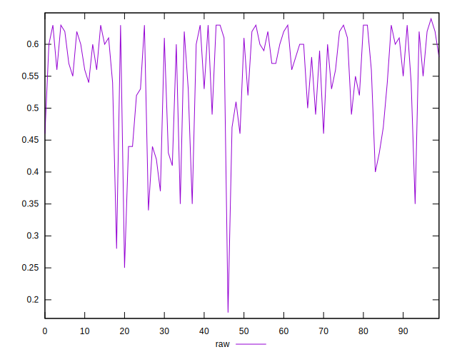
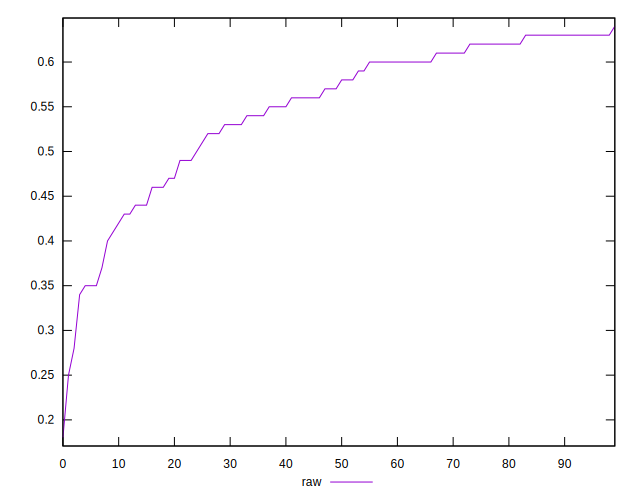
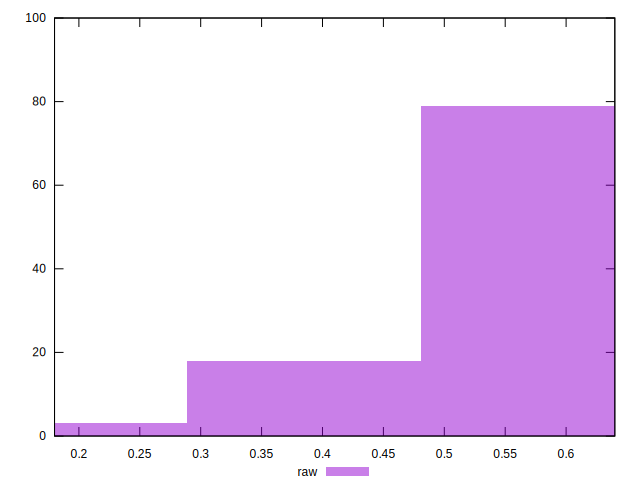

# //meta/score/samples/pages+cached+noadtech

[→ Parent](../..)


## Raw


```yaml
p90min: 0.34
p90max: 0.63
p90range: 0.29
p90mean: 0.5519148936170214
p90median: 0.575
p90stdev: 0.07820154805760371
p90skewness: -1.0831604888389683
p90eccentricity: 1.0000000000000004
p90discretization: 3.76
outlandishness: 0.974741346185284
confidence: 0.037049001730504114
p90confidence: 0.03161764436521002

```

