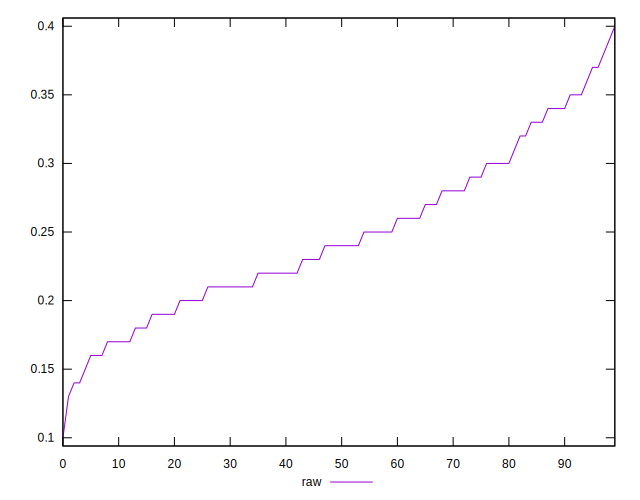

# //meta/score/samples/pages+cached

[→ Parent](../..)


## Raw


```yaml
p90min: 0.14
p90max: 0.37
p90range: 0.22999999999999998
p90mean: 0.24670212765957455
p90median: 0.24
p90stdev: 0.05704399753740555
p90skewness: 0.3730185267670807
p90eccentricity: 1.0000000000000004
p90discretization: 3.9166666666666665
outlandishness: 1.0048527899250261
confidence: 0.025227134924328664
p90confidence: 0.02306344148045593

```

