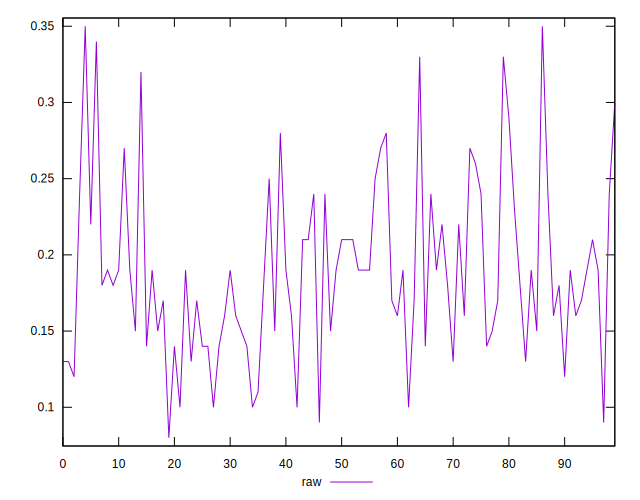
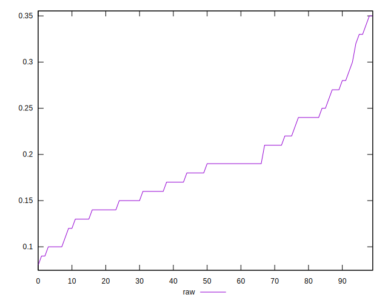
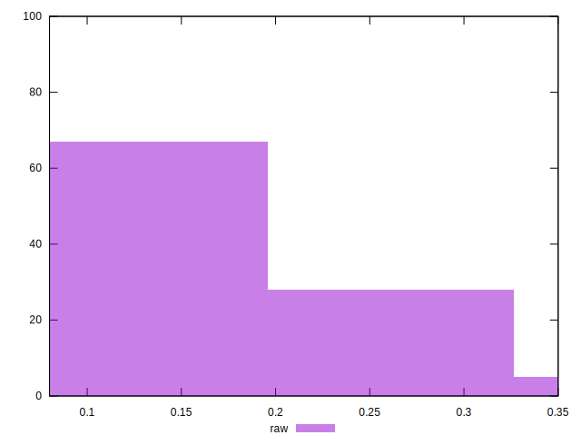

# //meta/score/samples/pages

[→ Parent](../..)


## Raw


```yaml
p90min: 0.1
p90max: 0.33
p90range: 0.23
p90mean: 0.1877659574468086
p90median: 0.185
p90stdev: 0.0530586639468803
p90skewness: 0.6419531308792883
p90eccentricity: 1.0000000000000007
p90discretization: 4.2727272727272725
outlandishness: 1.0185555425370556
confidence: 0.023872168231016927
p90confidence: 0.021452132455612387

```

