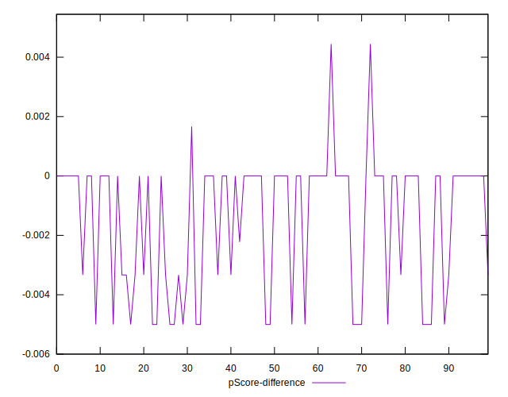

# //offscreen-images/samples/pages+cached+noadtech

[→ Parent](../..)


## Raw


```yaml
p90min: 0
p90max: 310
p90range: 310
p90mean: 73.61702127659575
p90median: 0
p90stdev: 91.38242141855669
p90skewness: 0.7972370524433247
p90eccentricity: 1.0000000000000016
p90discretization: 15.666666666666666
outlandishness: 1.1868402185171574
confidence: 40.4607210105418
p90confidence: 36.94679930780148

```


## Score


```yaml
p90min: 0.74
p90max: 1
p90range: 0.26
p90mean: 0.9402127659574467
p90median: 1
p90stdev: 0.07486127202897563
p90skewness: -0.8615411546454506
p90eccentricity: 0.9999999999999983
p90discretization: 15.666666666666666
outlandishness: 0.9893653791991737
confidence: 0.03261549678132319
p90confidence: 0.030267138369126617

```


## Raw Estimate


## Score Estimate


## P Score


```yaml
p90min: 0.7444444444444445
p90max: 1
p90range: 0.25555555555555554
p90mean: 0.9386820330969265
p90median: 1
p90stdev: 0.07607607276365204
p90skewness: -0.7930890224557888
p90eccentricity: 1.0000000000000016
p90discretization: 15.666666666666666
outlandishness: 0.9895191855108034
confidence: 0.03300849034440587
p90confidence: 0.030758294088643855

```


## Score Difference


```yaml
p90min: 0
p90max: 0
p90range: 0
p90mean: 0
p90median: 0
p90stdev: 0
p90skewness: .nan
p90eccentricity: .nan
p90discretization: 94
outlandishness: .nan
confidence: 0
p90confidence: 0

```


## P Score Difference


```yaml
p90min: -0.0050000000000000044
p90max: 0
p90range: 0.0050000000000000044
p90mean: -0.0014952718676122907
p90median: 0
p90stdev: 0.0020991739712566755
p90skewness: -0.7994282631422205
p90eccentricity: 1.0000000000000002
p90discretization: 18.8
outlandishness: 0.9403633176584533
confidence: 0.0009036404686888559
p90confidence: 0.0008487163967011237

```

