# //offscreen-images/samples/pages+cached

[→ Parent](../..)


## Raw


```yaml
p90min: 0
p90max: 330
p90range: 330
p90mean: 186.80851063829786
p90median: 160
p90stdev: 79.65634654307411
p90skewness: 0.24806499758126227
p90eccentricity: 0.9999999999999987
p90discretization: 8.545454545454545
outlandishness: 0.9892318787262417
confidence: 34.442674124367386
p90confidence: 32.20583350313819

```

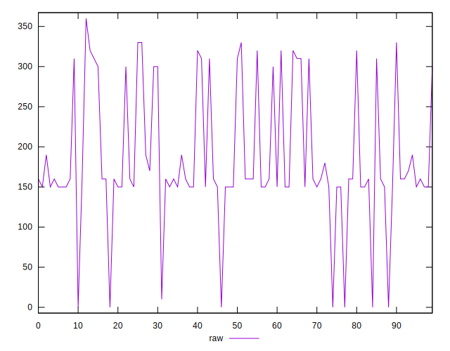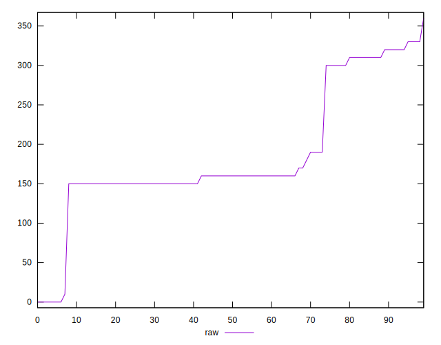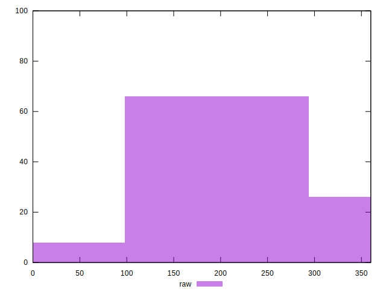
## Score


```yaml
p90min: 0.73
p90max: 1
p90range: 0.27
p90mean: 0.8473404255319151
p90median: 0.87
p90stdev: 0.06687835148754238
p90skewness: -0.3095772861010349
p90eccentricity: 1.0000000000000002
p90discretization: 9.4
outlandishness: 1.002266191429942
confidence: 0.028645287684348302
p90confidence: 0.02703956616699008

```

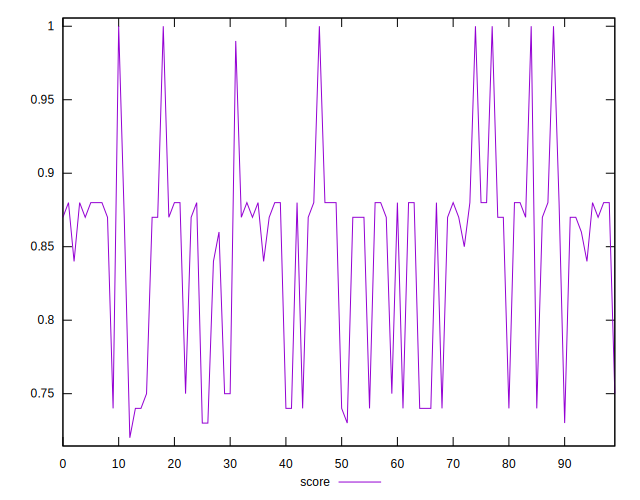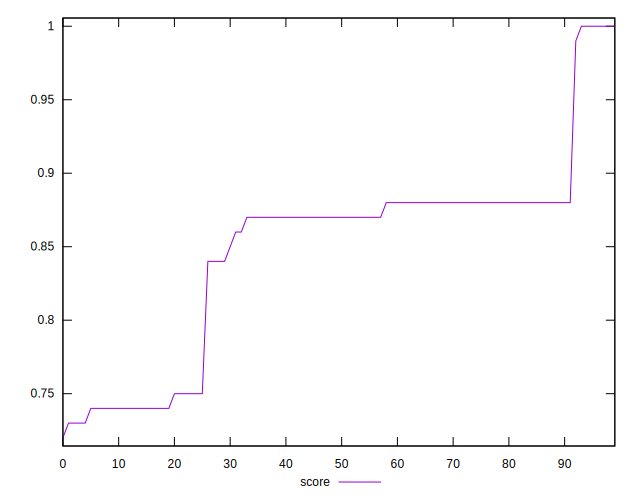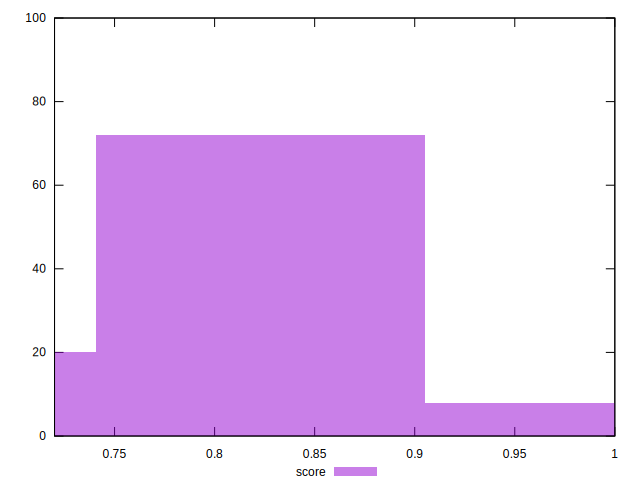
## Raw Estimate

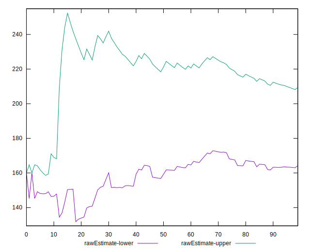
## Score Estimate

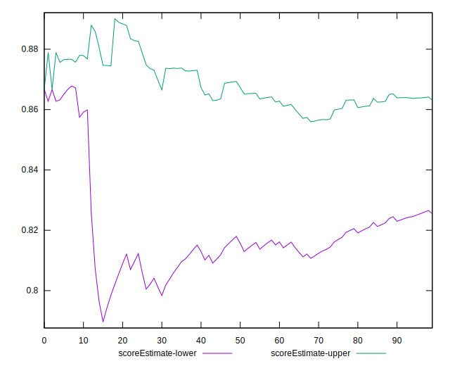
## P Score


```yaml
p90min: 0.7333333333333333
p90max: 1
p90range: 0.2666666666666667
p90mean: 0.8451241134751771
p90median: 0.8666666666666667
p90stdev: 0.06507114341534462
p90skewness: -0.1995881714714242
p90eccentricity: 0.9999999999999997
p90discretization: 8.545454545454545
outlandishness: 1.002666203621425
confidence: 0.02803086686762212
p90confidence: 0.026308894415088234

```

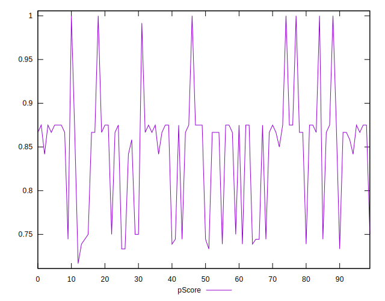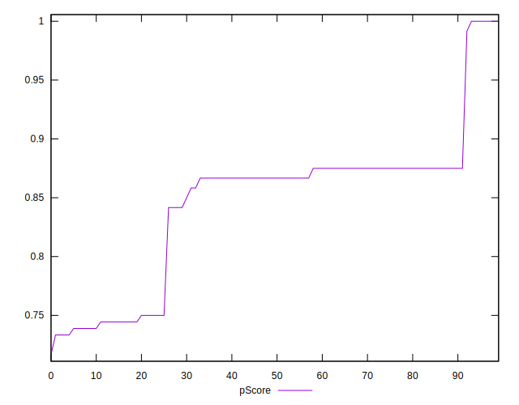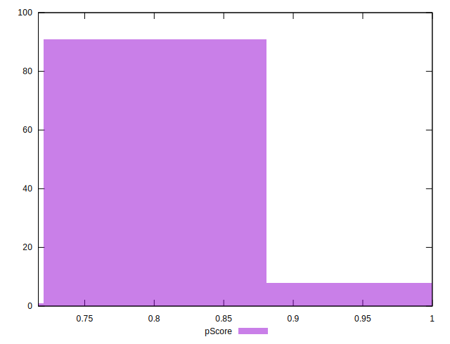
## Score Difference


```yaml
p90min: 0
p90max: 0
p90range: 0
p90mean: 0
p90median: 0
p90stdev: 0
p90skewness: .nan
p90eccentricity: .nan
p90discretization: 94
outlandishness: .nan
confidence: 0
p90confidence: 0

```


## P Score Difference


```yaml
p90min: -0.0050000000000000044
p90max: 0.004444444444444473
p90range: 0.009444444444444478
p90mean: -0.0021631205673758717
p90median: -0.0033333333333332993
p90stdev: 0.0029424790321516095
p90skewness: 0.8666716503864413
p90eccentricity: 0.9999999999999997
p90discretization: 11.75
outlandishness: 0.8981446116635304
confidence: 0.0012194145312360578
p90confidence: 0.0011896728121306168

```

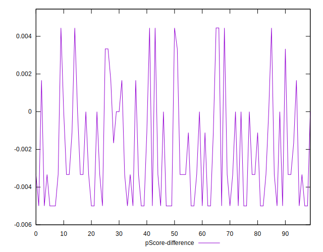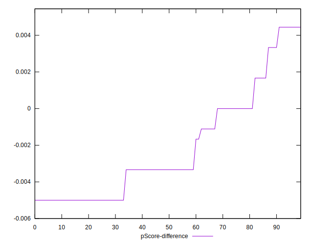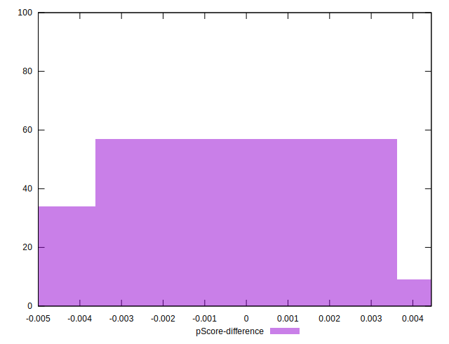