# //offscreen-images/samples/pages

[→ Parent](../..)


## Raw


```yaml
p90min: 0
p90max: 310
p90range: 310
p90mean: 166.06382978723406
p90median: 150
p90stdev: 76.38394179443824
p90skewness: 0.1813468708941324
p90eccentricity: 1.000000000000001
p90discretization: 9.4
outlandishness: 0.9920211044268096
confidence: 32.63876184567124
p90confidence: 30.882768523846725

```

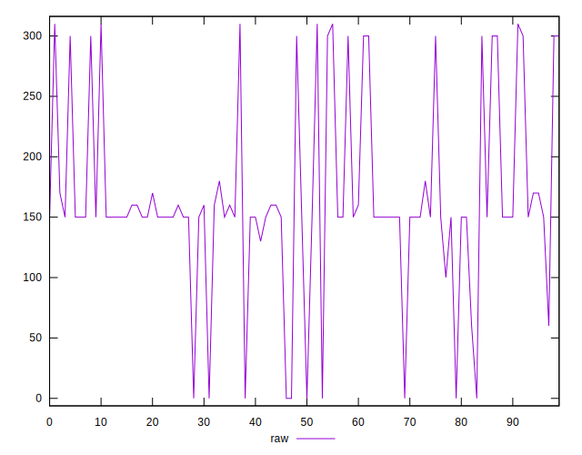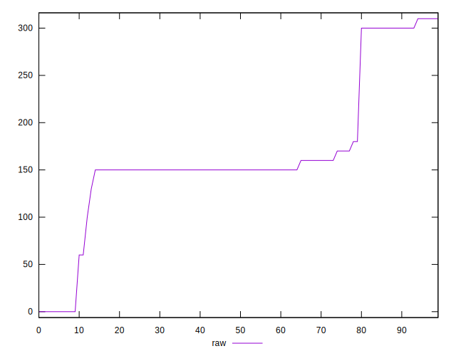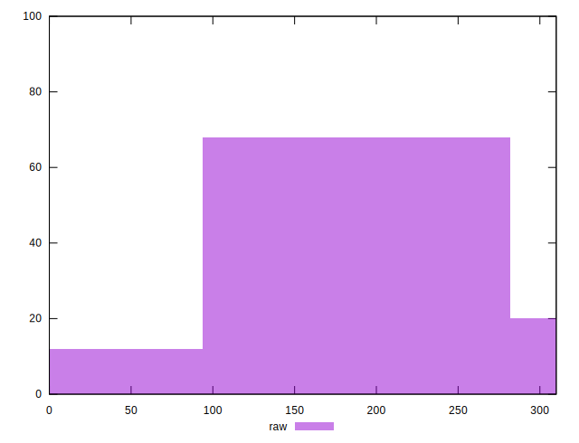
## Score


```yaml
p90min: 0.74
p90max: 1
p90range: 0.26
p90mean: 0.8646808510638297
p90median: 0.88
p90stdev: 0.06440731634896522
p90skewness: -0.31771429566025583
p90eccentricity: 1.0000000000000022
p90discretization: 9.4
outlandishness: 1.000738325207119
confidence: 0.02748146291863784
p90confidence: 0.02604050269361842

```

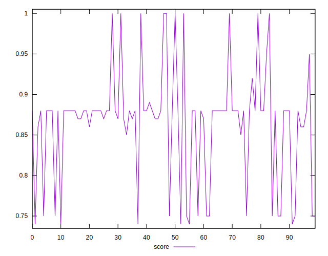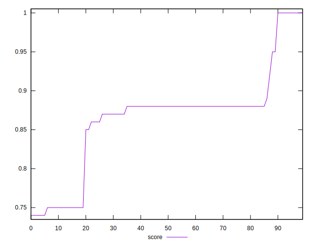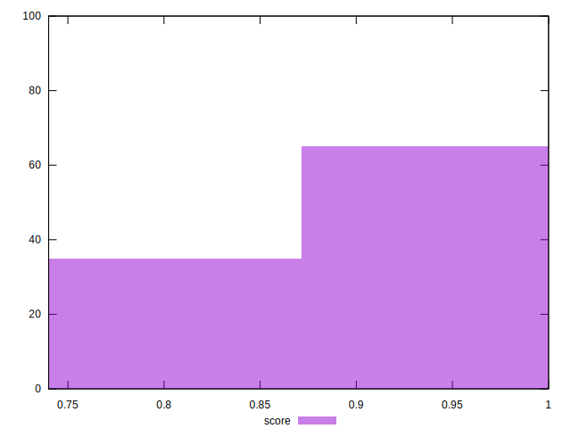
## Raw Estimate

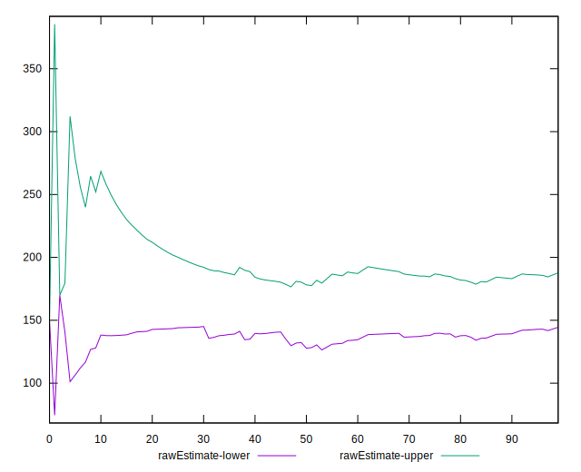
## Score Estimate

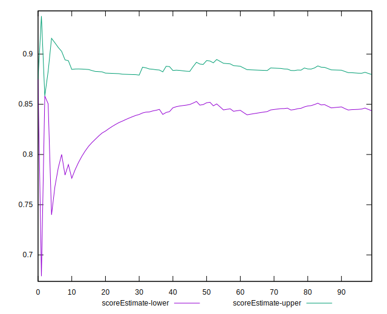
## P Score


```yaml
p90min: 0.7444444444444445
p90max: 1
p90range: 0.25555555555555554
p90mean: 0.8617021276595744
p90median: 0.875
p90stdev: 0.06348788784080361
p90skewness: -0.17234799366902162
p90eccentricity: 1.0000000000000002
p90discretization: 9.4
outlandishness: 1.001465557147454
confidence: 0.027086505817507097
p90confidence: 0.02566876883012922

```

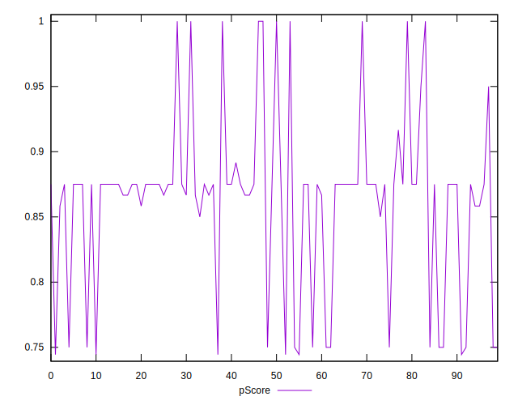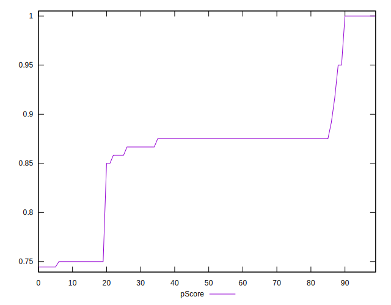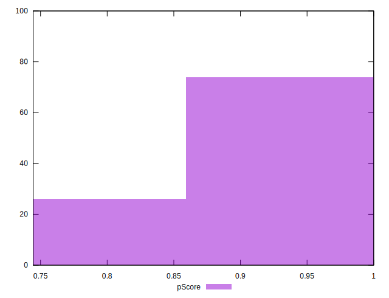
## Score Difference


```yaml
p90min: 0
p90max: 0
p90range: 0
p90mean: 0
p90median: 0
p90stdev: 0
p90skewness: .nan
p90eccentricity: .nan
p90discretization: 94
outlandishness: .inf
confidence: 6.092792000602806e-18
p90confidence: 0

```

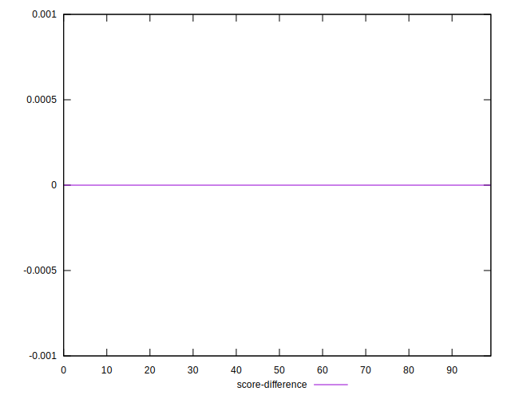
## P Score Difference


```yaml
p90min: -0.0050000000000000044
p90max: 0.004444444444444473
p90range: 0.009444444444444478
p90mean: -0.0028191489361702095
p90median: -0.0050000000000000044
p90stdev: 0.0026035670930927997
p90skewness: 0.8283451087292765
p90eccentricity: 0.9999999999999994
p90discretization: 13.428571428571429
outlandishness: 0.8947494165578888
confidence: 0.0011138442094079366
p90confidence: 0.0010526474280245118

```

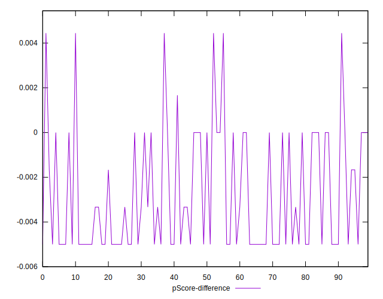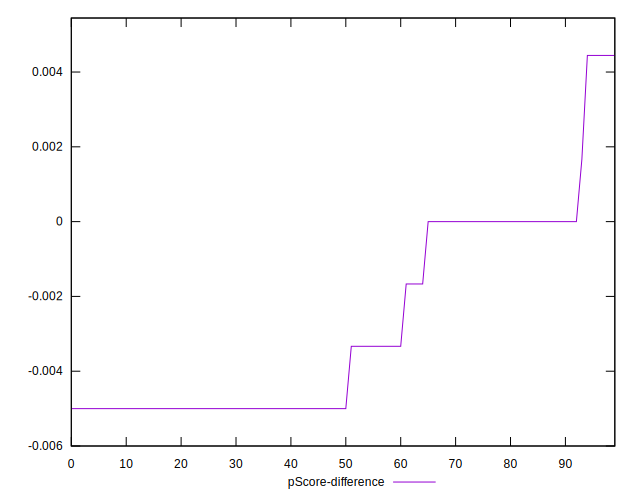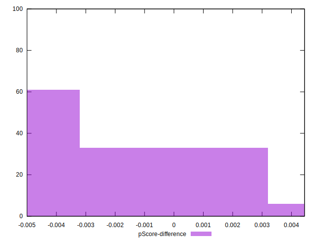