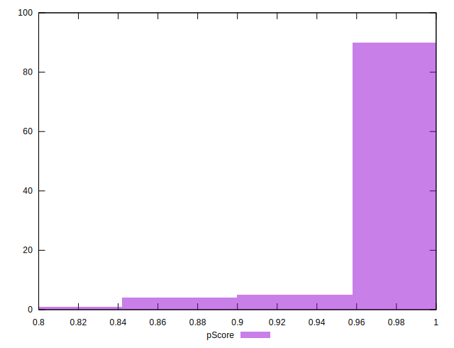

# //render-blocking-resources/samples/pages+cached+noadtech+nomedia+nocss

[→ Parent](../..)


## Raw


```yaml
p90min: 0
p90max: 154
p90range: 154
p90mean: 7.851063829787234
p90median: 0
p90stdev: 28.313953197615785
p90skewness: 3.816932742407175
p90eccentricity: 0.9999999999999966
p90discretization: 10.444444444444445
outlandishness: 2.754430476421295
confidence: 16.379432504248506
p90confidence: 11.447605897980338

```


## Score


```yaml
p90min: 0.87
p90max: 1
p90range: 0.13
p90mean: 0.9934042553191489
p90median: 1
p90stdev: 0.023814584816396984
p90skewness: -3.842367715827147
p90eccentricity: 0.9999999999999979
p90discretization: 11.75
outlandishness: 0.991353106280443
confidence: 0.01369278589392642
p90confidence: 0.00962846762157873

```


## Raw Estimate


## Score Estimate


## P Score


```yaml
p90min: 0.8716666666666666
p90max: 1
p90range: 0.1283333333333334
p90mean: 0.9934574468085107
p90median: 1
p90stdev: 0.023594960998013143
p90skewness: -3.8169327424071757
p90eccentricity: 0.9999999999999982
p90discretization: 10.444444444444445
outlandishness: 0.9913304674606177
confidence: 0.013649527086873756
p90confidence: 0.009539671581650278

```


## Score Difference


```yaml
p90min: 0
p90max: 0
p90range: 0
p90mean: 0
p90median: 0
p90stdev: 0
p90skewness: .nan
p90eccentricity: .nan
p90discretization: 94
outlandishness: .inf
confidence: 6.092792000602808e-18
p90confidence: 0

```


## P Score Difference


```yaml
p90min: 0
p90max: 0.0016666666666665941
p90range: 0.0016666666666665941
p90mean: 0.000044326241134750434
p90median: 0
p90stdev: 0.00025401682237400513
p90skewness: 5.856608956366533
p90eccentricity: 1.0000000000000004
p90discretization: 31.333333333333332
outlandishness: 0.8836000000000941
confidence: 0.00037065550911128265
p90confidence: 0.00010270146502325035

```

