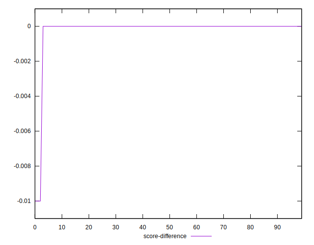

# //render-blocking-resources/samples/pages+cached+noadtech+nomedia

[→ Parent](../..)


## Raw


```yaml
p90min: 441
p90max: 990
p90range: 549
p90mean: 632.7553191489362
p90median: 618
p90stdev: 103.85645639793627
p90skewness: 0.5735861346711969
p90eccentricity: 1.0000000000000002
p90discretization: 1.146341463414634
outlandishness: 1.0357290896564149
confidence: 61.4865141971687
p90confidence: 41.99017263701865

```


## Score


```yaml
p90min: 0.47
p90max: 0.67
p90range: 0.20000000000000007
p90mean: 0.5684042553191488
p90median: 0.57
p90stdev: 0.05114233769878449
p90skewness: -0.02828286909936727
p90eccentricity: 1
p90discretization: 4.476190476190476
outlandishness: 1.001745099065776
confidence: 0.023531944996900946
p90confidence: 0.02067734316684562

```


## Raw Estimate


## Score Estimate


## P Score


```yaml
p90min: 0.4717647058823529
p90max: 0.6716666666666666
p90range: 0.19990196078431371
p90mean: 0.5684621749408987
p90median: 0.5733333333333334
p90stdev: 0.05079453431343542
p90skewness: -0.012293090904949809
p90eccentricity: 1.0000000000000002
p90discretization: 1.146341463414634
outlandishness: 1.0014631952429518
confidence: 0.02340714957093762
p90confidence: 0.020536722884765237

```


## Score Difference


```yaml
p90min: 0
p90max: 1.1102230246251565e-16
p90range: 1.1102230246251565e-16
p90mean: 1.771632486103973e-18
p90median: 0
p90stdev: 1.2679520880987278e-17
p90skewness: 7.612377922141534
p90eccentricity: 1.0000000000000013
p90discretization: 31.333333333333332
outlandishness: 2.867445940125769e+28
confidence: 0.0006686896191274379
p90confidence: 5.126453272267801e-18

```


## P Score Difference


```yaml
p90min: -0.004444444444444473
p90max: 0.004444444444444473
p90range: 0.008888888888888946
p90mean: -0.00001724377694340276
p90median: -0.00011764705882352788
p90stdev: 0.002734451321082321
p90skewness: 0.023992846823392897
p90eccentricity: 1.0000000000000007
p90discretization: 2.292682926829268
outlandishness: 1.6412915972943674
confidence: 0.0011409324225363049
p90confidence: 0.001105565190861374

```

