# //render-blocking-resources/samples/pages+cached+noadtech

[→ Parent](../..)


## Raw


```yaml
p90min: 498
p90max: 1192
p90range: 694
p90mean: 663.2340425531914
p90median: 632
p90stdev: 142.10772251553183
p90skewness: 1.6488701718678171
p90eccentricity: 0.9999999999999997
p90discretization: 1.1325301204819278
outlandishness: 1.0642849233381377
confidence: 85.9959401309279
p90confidence: 57.45553053165115

```

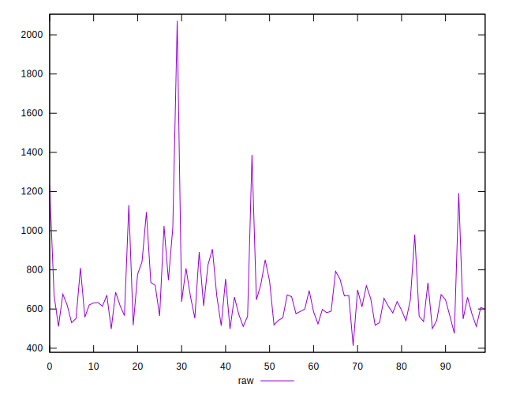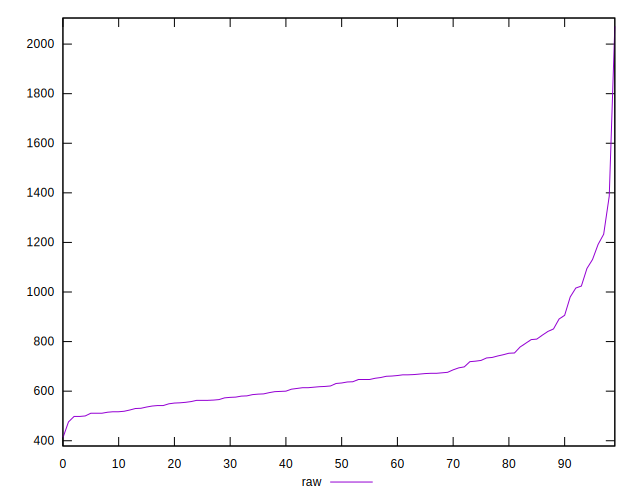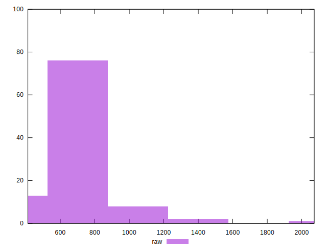
## Score


```yaml
p90min: 0.45
p90max: 0.64
p90range: 0.19
p90mean: 0.5606382978723405
p90median: 0.565
p90stdev: 0.05052508352479854
p90skewness: -0.3571012214049273
p90eccentricity: 0.9999999999999996
p90discretization: 4.7
outlandishness: 0.9938084750098115
confidence: 0.0232230176801242
p90confidence: 0.02042778131748615

```

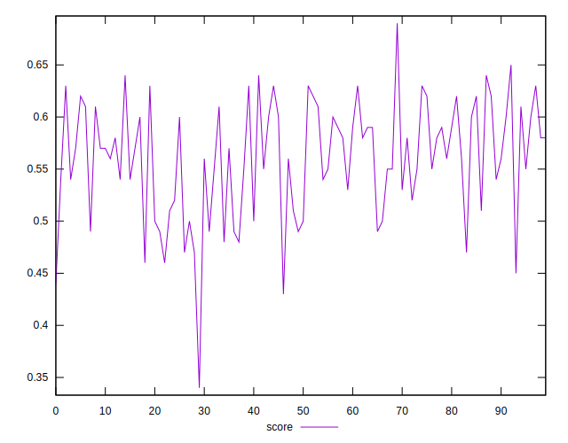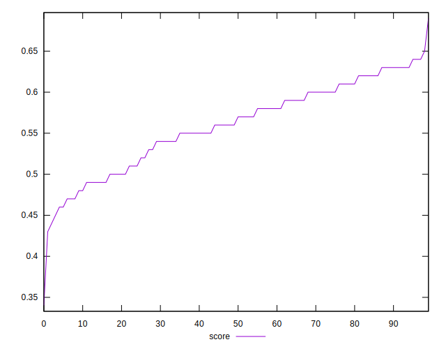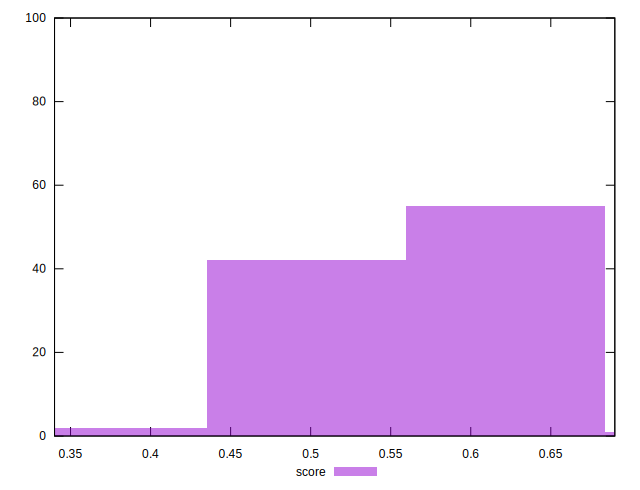
## Raw Estimate

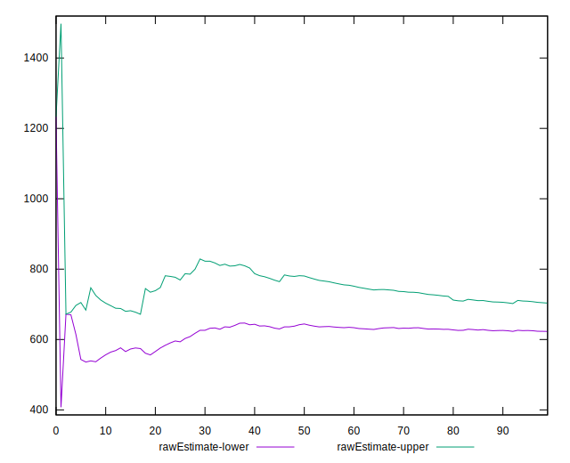
## Score Estimate

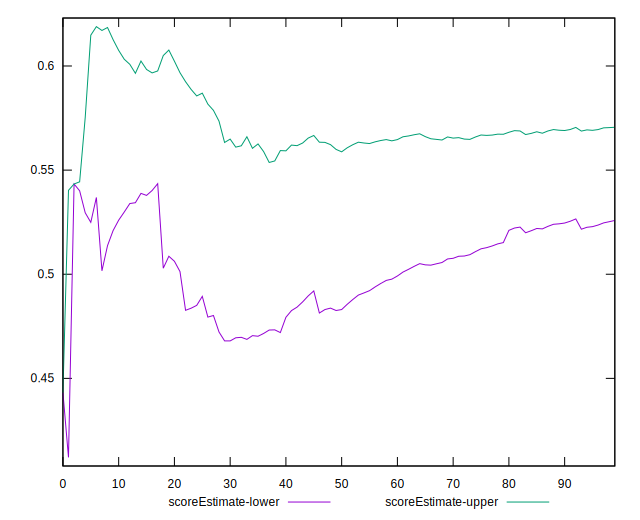
## P Score


```yaml
p90min: 0.448
p90max: 0.64
p90range: 0.192
p90mean: 0.5607768738701153
p90median: 0.5655555555555556
p90stdev: 0.050529343255010316
p90skewness: -0.37126176179288206
p90eccentricity: 0.9999999999999992
p90discretization: 1.1325301204819278
outlandishness: 0.9938766475994285
confidence: 0.02317443107308228
p90confidence: 0.020429503567726368

```

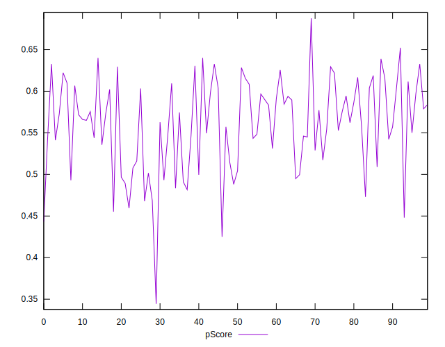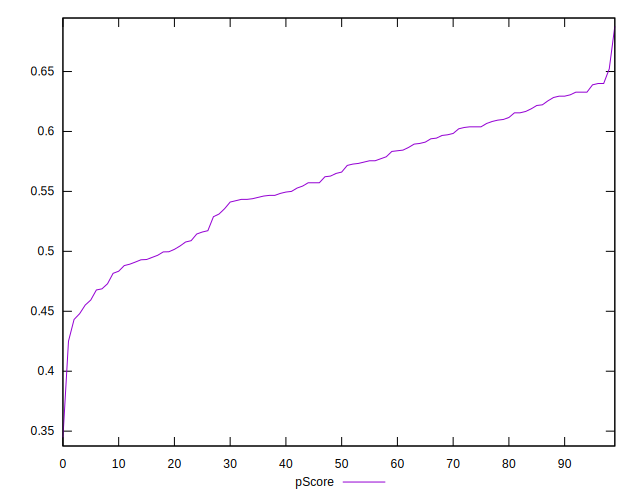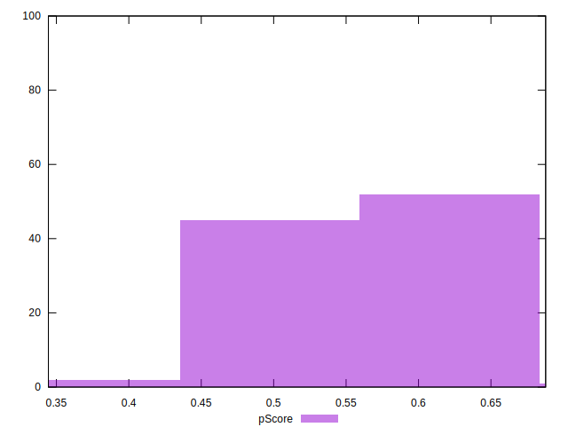
## Score Difference


```yaml
p90min: 0
p90max: 1.1102230246251565e-16
p90range: 1.1102230246251565e-16
p90mean: 5.3148974583119196e-18
p90median: 0
p90stdev: 2.15285545106787e-17
p90skewness: 4.168481617099156
p90eccentricity: 1.0000000000000018
p90discretization: 31.333333333333332
outlandishness: 2.4544444444444444
confidence: 1.0825449102684841e-17
p90confidence: 8.704203396514386e-18

```

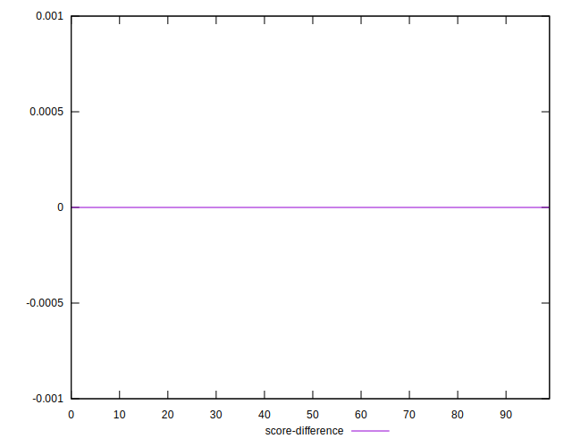
## P Score Difference


```yaml
p90min: -0.004444444444444473
p90max: 0.004444444444444473
p90range: 0.008888888888888946
p90mean: 0.000171116673619809
p90median: 0
p90stdev: 0.0027923530610357472
p90skewness: -0.054689675820858076
p90eccentricity: 1
p90discretization: 2.088888888888889
outlandishness: 0.8452489897087595
confidence: 0.0011597295091703222
p90confidence: 0.0011289754259199661

```

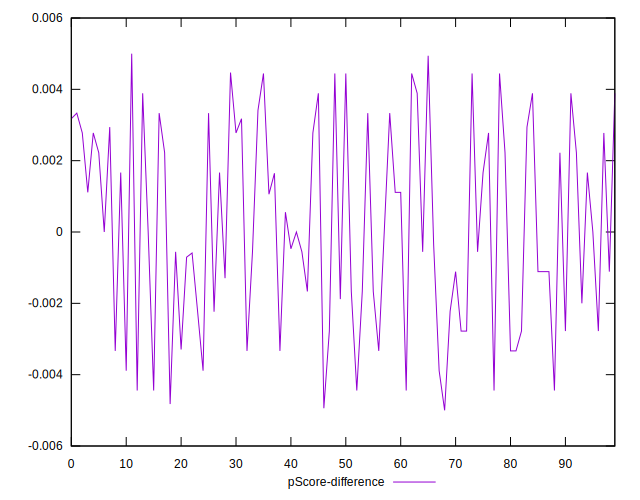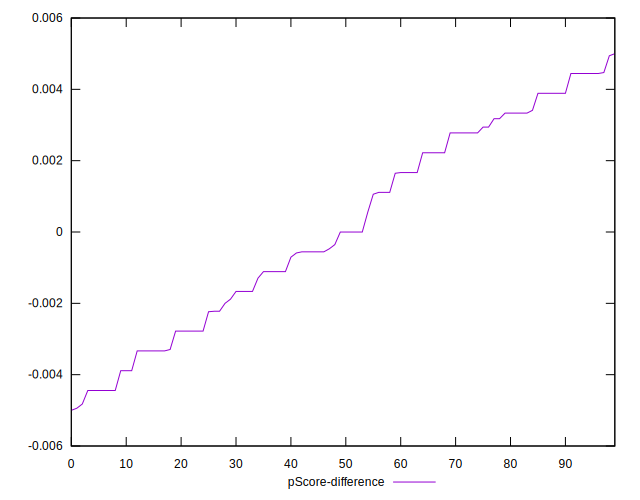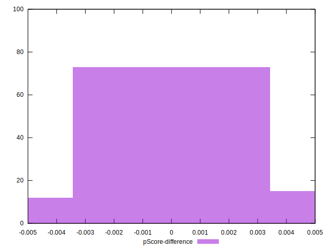