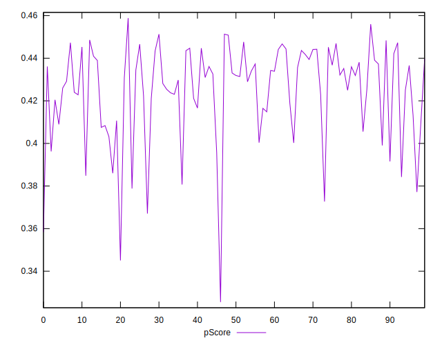

# //render-blocking-resources/samples/pages+cached

[→ Parent](../..)


## Raw


```yaml
p90min: 1164
p90max: 1880
p90range: 716
p90mean: 1383.0744680851064
p90median: 1331
p90stdev: 170.54975185780722
p90skewness: 1.0651594079677795
p90eccentricity: 1
p90discretization: 1.0930232558139534
outlandishness: 1.0195228677675543
confidence: 82.48142300842814
p90confidence: 68.95491885714215

```


## Score


```yaml
p90min: 0.37
p90max: 0.45
p90range: 0.08000000000000002
p90mean: 0.42553191489361697
p90median: 0.43
p90stdev: 0.020191478151690725
p90skewness: -1.0078990522507234
p90eccentricity: 0.9999999999999987
p90discretization: 10.444444444444445
outlandishness: 0.9932813232250001
confidence: 0.00961933071940828
p90confidence: 0.008163610456123085

```


## Raw Estimate


## Score Estimate


## P Score


```yaml
p90min: 0.36705882352941177
p90max: 0.45129411764705885
p90range: 0.08423529411764707
p90mean: 0.425520650813517
p90median: 0.43164705882352944
p90stdev: 0.020064676689153797
p90skewness: -1.0651594079677926
p90eccentricity: 0.9999999999999997
p90discretization: 1.0930232558139534
outlandishness: 0.9925845429789555
confidence: 0.009703696824520958
p90confidence: 0.008112343394957904

```


## Score Difference


```yaml
p90min: 0
p90max: 5.551115123125783e-17
p90range: 5.551115123125783e-17
p90mean: 3.543264972207946e-18
p90median: 0
p90stdev: 1.3569671737421593e-17
p90skewness: 3.5685919470918033
p90eccentricity: 0.9999999999999984
p90discretization: 47
outlandishness: 1.9881000000000004
confidence: 6.227306930844221e-18
p90confidence: 5.486349897196453e-18

```


## P Score Difference


```yaml
p90min: -0.0048235294117647265
p90max: 0.004705882352941171
p90range: 0.009529411764705897
p90mean: -0.00016896120150187958
p90median: -0.0004705882352941393
p90stdev: 0.002944156613373228
p90skewness: 0.0656071201624921
p90eccentricity: 1.0000000000000004
p90discretization: 1.4242424242424243
outlandishness: 0.8967388532235905
confidence: 0.0012132578875958153
p90confidence: 0.0011903510744895641

```

