# //render-blocking-resources/samples/pages

[→ Parent](../..)


## Raw


```yaml
p90min: 1512
p90max: 2384
p90range: 872
p90mean: 1792.6170212765958
p90median: 1707
p90stdev: 228.50997959412175
p90skewness: 1.0294557562956022
p90eccentricity: 1.0000000000000002
p90discretization: 1.1604938271604939
outlandishness: 1.0105070824828806
confidence: 99.72231259202432
p90confidence: 92.38880109363568

```

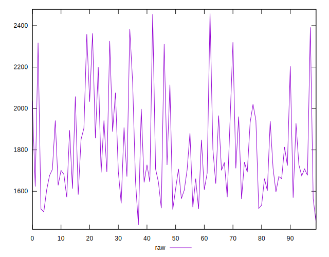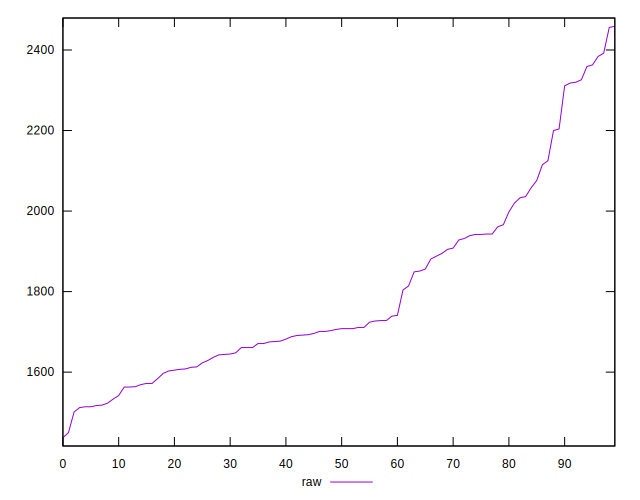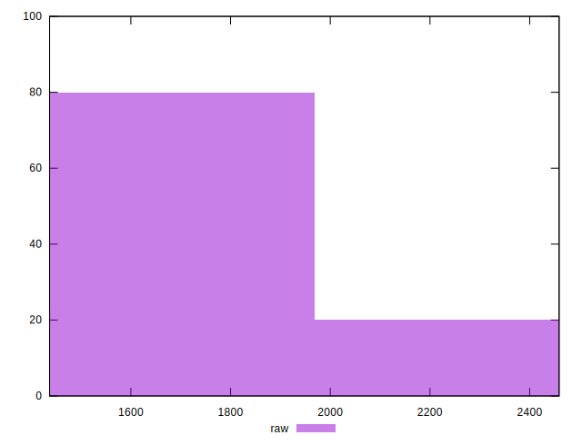
## Score


```yaml
p90min: 0.31
p90max: 0.41
p90range: 0.09999999999999998
p90mean: 0.3773404255319148
p90median: 0.39
p90stdev: 0.026504737911056887
p90skewness: -1.0183475243494913
p90eccentricity: 1.0000000000000002
p90discretization: 8.545454545454545
outlandishness: 0.9944930831687167
confidence: 0.011570827948006145
p90confidence: 0.01071612260984409

```

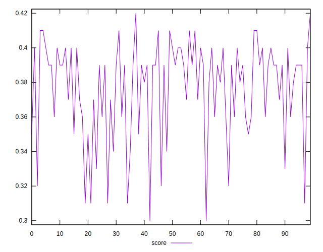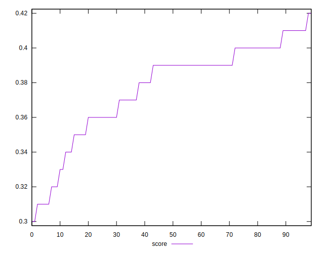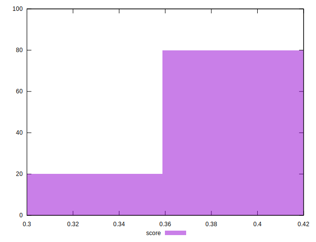
## Raw Estimate

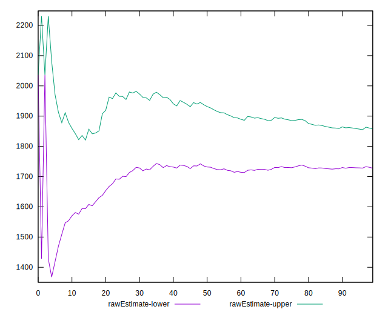
## Score Estimate

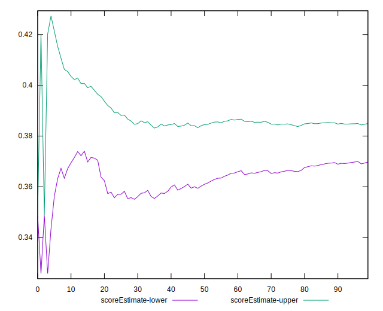
## P Score


```yaml
p90min: 0.30776470588235294
p90max: 0.4103529411764706
p90range: 0.10258823529411765
p90mean: 0.3773391739674595
p90median: 0.38741176470588234
p90stdev: 0.026883527011073143
p90skewness: -1.0294557562955895
p90eccentricity: 0.9999999999999997
p90discretization: 1.1604938271604939
outlandishness: 0.9941514780831261
confidence: 0.01173203677553227
p90confidence: 0.010869270716898315

```

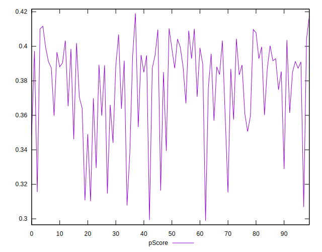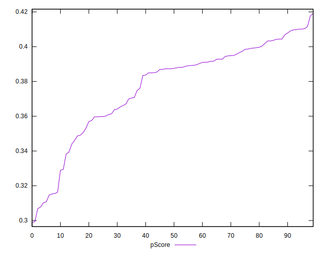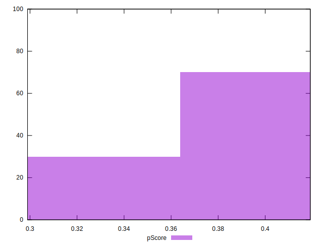
## Score Difference


```yaml
p90min: 0
p90max: 5.551115123125783e-17
p90range: 5.551115123125783e-17
p90mean: 6.495985782381235e-18
p90median: 0
p90stdev: 1.7843817357195922e-17
p90skewness: 2.3828522123573848
p90eccentricity: 1.0000000000000016
p90discretization: 47
outlandishness: 1.4312859504132236
confidence: 7.550427891356825e-18
p90confidence: 7.214428426685423e-18

```

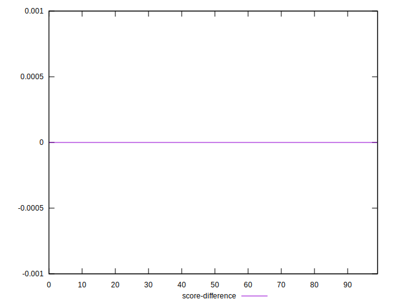
## P Score Difference


```yaml
p90min: -0.004588235294117671
p90max: 0.004823529411764671
p90range: 0.009411764705882342
p90mean: -0.00007509386733417796
p90median: -0.00035294117647058365
p90stdev: 0.002533314860578035
p90skewness: 0.3276587935642838
p90eccentricity: 0.9999999999999999
p90discretization: 1.5666666666666667
outlandishness: 0.7697137777777943
confidence: 0.0010701546196478675
p90confidence: 0.0010242437690345682

```

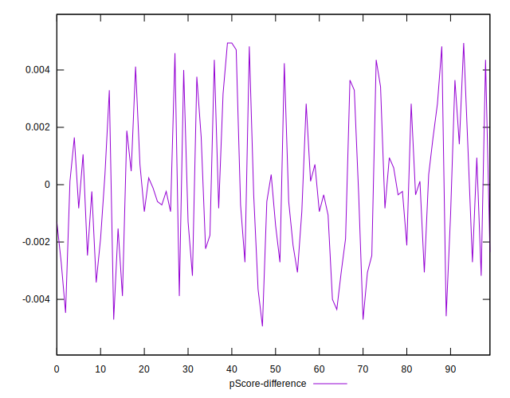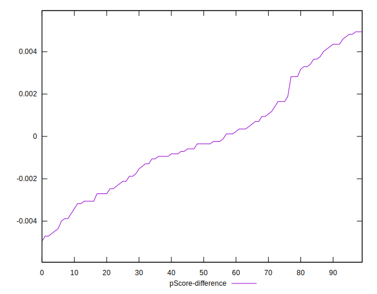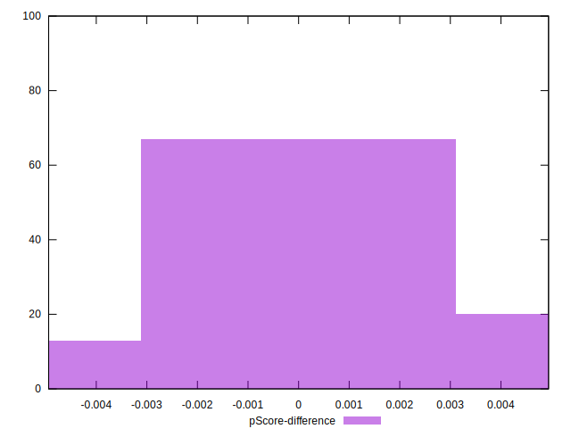