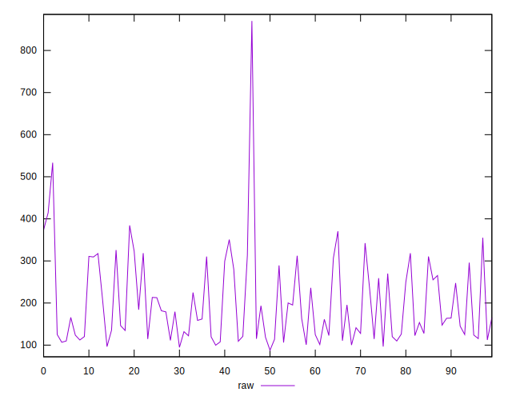
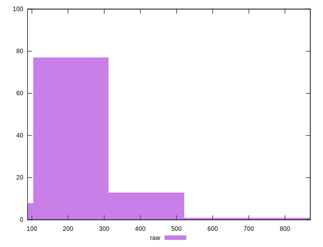
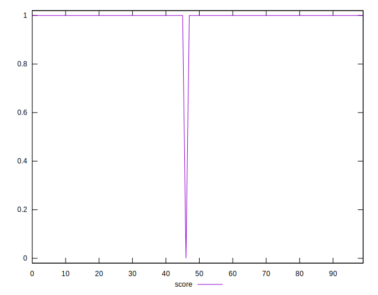
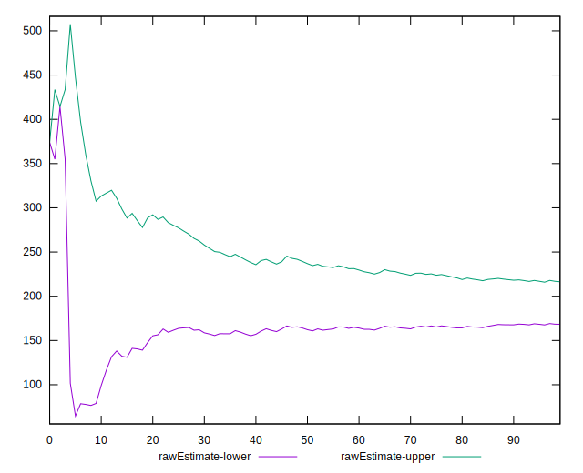
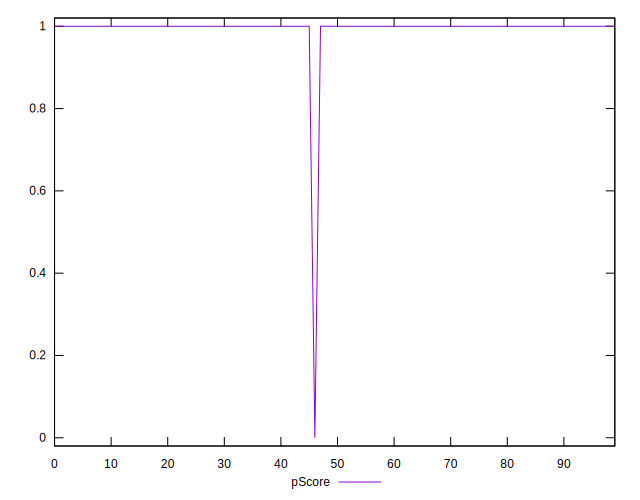
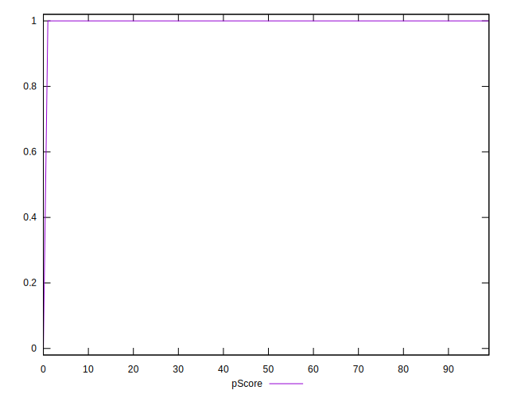
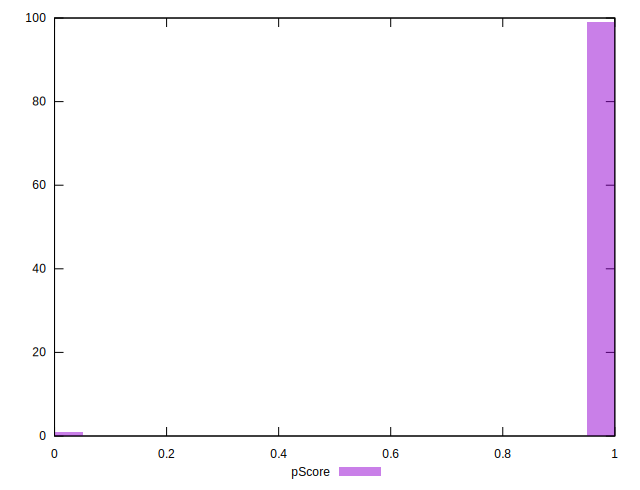

# //server-response-time/samples/pages

[→ Parent](../..)


## Raw


```yaml
p90min: 96.55199999999999
p90max: 384.406
p90range: 287.85400000000004
p90mean: 192.38826595744678
p90median: 162.387
p90stdev: 84.65701409683057
p90skewness: 0.6970688699293386
p90eccentricity: 0.9999999999999999
p90discretization: 1
outlandishness: 1.100392047103789
confidence: 45.024141895757346
p90confidence: 34.22765189715325

```


## Score


```yaml
p90min: 1
p90max: 1
p90range: 0
p90mean: 1
p90median: 1
p90stdev: 0
p90skewness: .nan
p90eccentricity: .nan
p90discretization: 94
outlandishness: 0.9801
confidence: 0.03900279083597574
p90confidence: 0

```


## Raw Estimate


## Score Estimate


## P Score


```yaml
p90min: 1
p90max: 1
p90range: 0
p90mean: 1
p90median: 1
p90stdev: 0
p90skewness: .nan
p90eccentricity: .nan
p90discretization: 94
outlandishness: 0.9801
confidence: 0.03900279083597574
p90confidence: 0

```


## Score Difference


```yaml
p90min: 0
p90max: 0
p90range: 0
p90mean: 0
p90median: 0
p90stdev: 0
p90skewness: .nan
p90eccentricity: .nan
p90discretization: 94
outlandishness: .nan
confidence: 0
p90confidence: 0

```


## P Score Difference


```yaml
p90min: 0
p90max: 0
p90range: 0
p90mean: 0
p90median: 0
p90stdev: 0
p90skewness: .nan
p90eccentricity: .nan
p90discretization: 94
outlandishness: .nan
confidence: 0
p90confidence: 0

```

